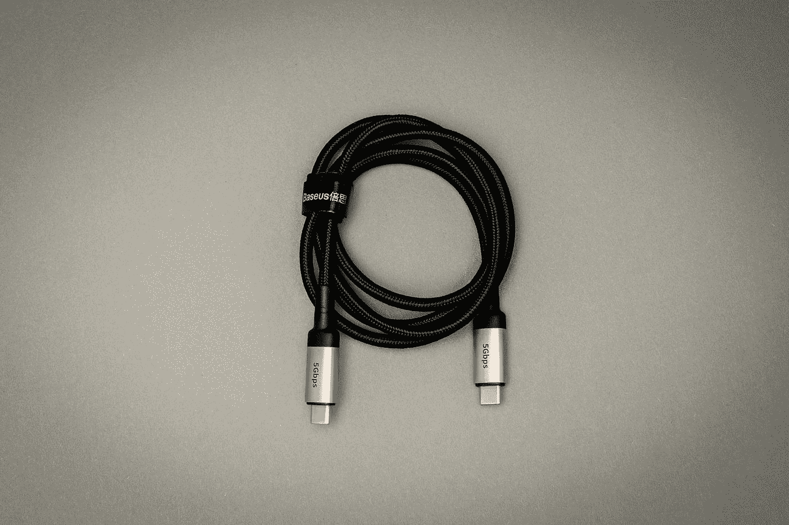

# 欧盟 USB-C 指令对 PC 制造商意味着什么

> 原文：<https://medium.com/codex/what-the-eus-usb-c-mandate-means-for-pc-manufacturers-78608467bbc4?source=collection_archive---------5----------------------->

## 苹果并不是唯一一家受到影响的公司

米卡·鲍梅斯特在 [Unsplash](https://unsplash.com?utm_source=medium&utm_medium=referral) 上的照片

您可能已经听说，欧盟要求电子设备在短期内采用 USB-C 充电。苹果将不得不，不情愿地，服从裁决，把 USB-C 带到 iPhone 上。我认为这是客户的胜利，但从业务角度来看，我有…