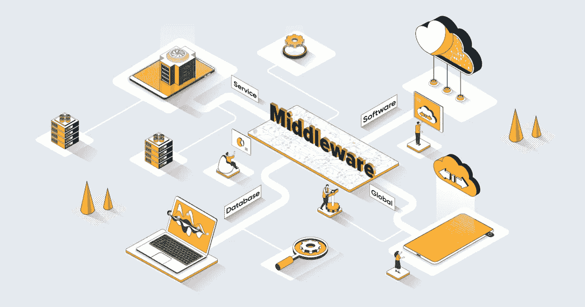
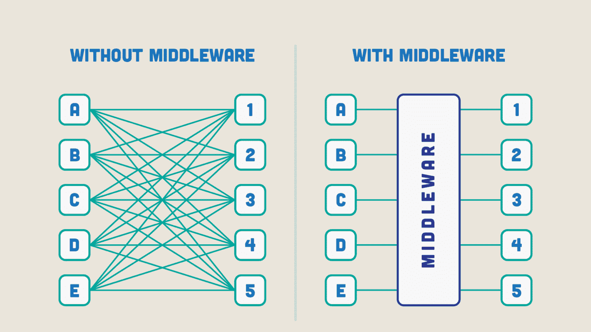

# 什么是中间件(简化为 max)🧐？

> 原文：<https://medium.com/codex/what-the-hell-is-middleware-ebd1a7bdd181?source=collection_archive---------10----------------------->

图片来源:Sunrise 整合博客

你是否曾经浏览过科技论坛、LinkedIn，或者刚刚为你的科技职业做好准备，并注意到某个词让你思考…我也是！中间件是什么，它有什么作用？

## 目录:

*   什么是中间件🕵‍♂️
*   它是怎么工作的，⚙️
*   有不同类型的中间件🤯
*   中间件仍然相关吗🙄

## 什么是中间件🕵‍♂️

中间件是一种充当粘合剂的软件，当本地集成不存在时，它使服务能够相互集成。之所以称之为胶水，是因为它连接了两个没有胶水就无法交流的东西。

提供操作系统无法提供的功能，如“数据管理、应用服务、消息传递、认证和 API 管理” [RedHat](https://www.redhat.com/en/topics/middleware/what-is-middleware#:~:text=Integration%20middleware%20provides%20services%20to,event%20streaming%2C%20and%20API%20management.) ，这些通常都由中间件处理。

想象一下，你正在和一个说不同语言的人交谈，我不能和他们说话/给他们指示，反之亦然。现在想象一下，在我们之间有一个翻译器，也就是中间件，它让我们能够交流，给彼此指令。

## 它是怎么工作的，⚙️

图片来源:联想集团博客

当开发人员创建应用程序时，他们需要找到一种方法将应用程序集成到相关组件中，如设备、云、数据源和其他不同的计算机资源。要做到这一点，他们必须创建定制的集成来使用他们想要的技术(这需要每年花费大量的时间和资源)

在技术层面上，中间件通常由一组编程库或组件组成，如 JSON (JavaScript 对象表示法)、REST(表述性状态转移)、XML(可扩展标记语言)、SOAP(简单对象访问协议)或 web 服务。通常，中间件还提供服务，使用多种语言编写的组件(如 Java、C++、PHP 和 Python)能够相互通信。” [— IBM](https://www.ibm.com/cloud/learn/middleware) 。所有这些有效地允许不同系统之间的通信。

例如:假设一个企业有一个 CRM(客户关系管理)和一个库存管理系统，它们最初并没有相互通信，因此为了交换数据，企业可能会使用中间件在两个系统之间创建一个链接(一个转换器)。当他们需要交换数据时，一个请求将被发送到中间件层，以另一个系统可以理解的格式将数据从一个系统转换到另一个系统，反之亦然。实现有效的通信和数据交换。

## 有不同类型的中间件🤯

图片来源:蒂姆和埃里克·阿森秀

14 种中间件🤕！！？？什么？

1.  **API(应用编程接口):**一个工具集，允许开发者为他们的应用创建和管理 API。**什么是 API？—新博客即将推出！**
2.  **数据/数据库中间件:**允许通信和访问后端数据库。
3.  **设备中间件:**为某个移动操作系统提供集成和连接能力。
4.  **机器人中间件:**众所周知，机器人技术拥有一些日新月异的硬件，机器人中间件帮助控制和管理定义“机器人”的软件和硬件系统

本文旨在简化，因此我只包括最常见的(从我的角度来看，这可能因行业而异)

如果你想了解所有类型的中间件，请点击此链接— [Talend](https://www.talend.com/uk/resources/what-is-middleware/)

## **中间件仍然相关吗🙄**

图片来源:Planview.com

如果像我一样，这是您第一次深入研究该技术，您会非常惊讶地知道，中间件这个术语是从 20 世纪 60 年代末开始引用的，并在 80 年代正式推出，用于将现代应用程序(当时)与遗留系统(过时的计算软件和/或仍在使用的硬件)联系起来。和所有事情一样，中间件自首次采用以来经历了一些重大变化！

它不可能还在生长…不是吗？

随着新技术的出现，理论上应该总是有中间件的用例，无论是嵌入到新的语言和基础设施中，还是遗留技术需要一种与新技术通信的方式。

2022 年市场分析:“制造组织向工业 4.0 的移动，这是最新的革命，专注于自动化、互联性、实时数据和机器学习，预计将在预测期内使中间件软件市场受益。工业 4.0 包括计算机系统和自动化机器(包括机器人)中配备的最新技术，如物联网(IoT)、机器学习、云计算、信息物理系统和认知计算。制造企业需要将他们的业务流程和运营与这些平台/技术相集成，这需要使用中间件软件等来实现。” [— 2022 年中间件市场分析](https://www.thebusinessresearchcompany.com/press-release/middleware-software-market-2022)