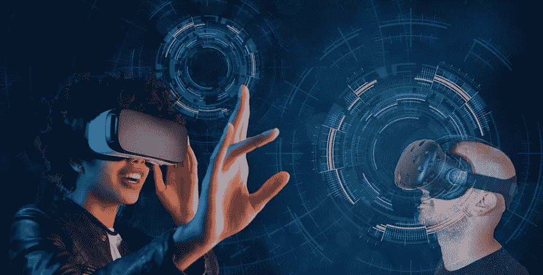

# 疫情告诉我们关于元宇宙的事情

> 原文：<https://medium.com/codex/what-the-pandemic-tells-us-about-the-metaverse-37b75555f55f?source=collection_archive---------11----------------------->

图片来自 [Pixabay](https://pixabay.com/?utm_source=link-attribution&utm_medium=referral&utm_campaign=image&utm_content=6891052) 的[图米苏](https://pixabay.com/users/tumisu-148124/?utm_source=link-attribution&utm_medium=referral&utm_campaign=image&utm_content=6891052)

这是一个常见的重复，是元宇宙想法的好处的最终卖点，旨在让我们所有人都买入并跟随；元宇宙将拉近人类的距离，加深我们的关系。扎克伯格还表示，这将有助于人们“感觉与我们关心的人在一起。”我们都可以戴着眼镜，在另一个现实中度过无尽的时光，人类会相处融洽，打造出这些令人惊叹的新社会和文化。在阅读元宇宙周围的文章和评论时，有一件事很明显。这些人没有一个了解人类的社会行为、社会的文化因素或基本的人类心理学。类固醇治疗时间到了。他们应该看看疫情。

作为一名数字(文化)人类学家，我研究人类、技术、文化和社会行为的交集。我将此用于 UX 公司构建数字产品和服务的战略。我帮助组织建立数字战略，从以人为中心的角度而不仅仅是“用户”的角度来参与。因此，我看到了许多人类如何与技术打交道，以及他们将如何与元宇宙打交道的观点，这些观点忽略了人类社会行为和文化的一切。我并不反对元宇宙，但是我们应该降低人们对它的期望，不要低估将会使用它的人类。

尽管奥米克隆迅速传播，许多学校管辖区让孩子们回到教室。一些人在拖延，但不会太久。为什么？虚拟学习作为一种一致的方法并没有按计划进行。最近的一项研究([此处](https://www.facetsjournal.com/doi/10.1139/facets-2021-0096))，但是渥太华大学的杰斯·惠特利博士和加拿大皇家学会的米里亚姆·h·比彻姆博士表明，长时间的在线学习会导致抑郁、社交焦虑、慢性健康问题恶化和家庭破裂。还有其他研究显示了类似的结果。

成年人已经在 Zoom、Teams、Google Meet 和其他视频会议应用上花费了无尽的时间。通常，许多人报告说他们的大脑似乎很快就关闭了。这被称为“注意力眨眼”，你的大脑确实会关闭一毫秒来重置自己。为什么？因为它处理信息的方式。它必须重置。与计算机不同，大脑没有多个处理器。这就是为什么人类不能一心多用，尽管这是一个普遍的误解。一天下来，我们会感到眼睛疲劳、头痛、精神疲惫。许多员工希望以各种形式回到办公室，有些是全职，有些是一周一两天。关键是，他们希望能够去一个物理空间。为什么？

人类是高度社会化的动物。在科技世界中，我们可以很好地使用文本(语言)、声音(也包括语言)、图像和视频。什么不太管用？非语言暗示。非语言疗法占了我们相互交流的 70%到 90%。眼睛运动和面部表情的微妙变化，腿、胳膊和肩膀耸耸肩的动作。和气味。当我们靠近另一个人时，我们如何移动。所有这些都向我们发送信息，塑造我们如何思考、参与和反应。我们离任何可以复制我们微妙的身体运动的技术都非常遥远。我们必须被传感器覆盖。与服务器的通信必须是即时的，有一个神经连接和一个深度理解个人的人工智能引擎(好像这还不够快！).这在经济上不太可能，更不用说技术上了。

从文化的角度来看，也不太可能建立强有力的、有意义的文化元素，并持续一段时间。我在线研究群体的文化行为，已经做了十多年了。关于在线社交团体的一个关键问题是？它们高度无定形。他们经常变换。有些人可能会参与几年，但即使是集团创始人也会在几年后离开。超过 3 年是不寻常的。就文化而言，在线群体非常肤浅，互惠是一种信息，通常有一个生命周期，因此其价值有限。

社交媒体本该让我们更亲密。这也是扎克伯格在脸书早期所传达的信息，Twitter 和其他公司也是如此。到目前为止，它助长了政治两极分化，并为威权政府监控本国社会带来了巨大好处。社交媒体有很大的好处，但它也有一些强大的缺点。最终，随着我们发展文化规范和社会行为规则、法规/法律和礼仪，社交媒体会变得更好。什么时候？谁知道呢。

如果元宇宙真的出现了，任何一个诚实的有经验的技术专家都会告诉你，它不会是我们今天认为的样子。它确实提供了一些引人注目的好处，如虚拟医疗保健、令人惊叹的游戏、奖励系统(如奖励创作者的社交令牌)、有趣的新协作方式以及测试与技术联系的新方式的机会。但它不会让人类作为一个全球社会走得更近。

疫情教会了我们人类在屏幕和交替现实中的局限性，以及持续使用数字技术对儿童和成人心理的影响。元宇宙应该有所不同，这是无视我们对人类社会和文化行为的一切了解，并期待戴上一副虚拟现实护目镜，从数百万年的进化中立即发生变化。人类并不只是决定在一个阳光明媚的日子里从树上爬下来，用两条腿站起来开始行走。