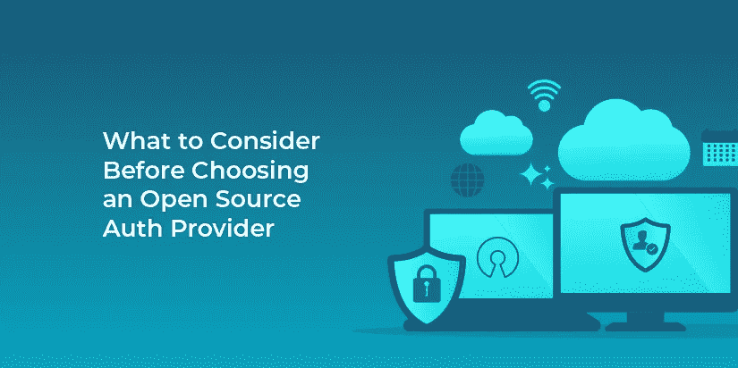

# 选择开源身份验证提供商之前需要考虑什么

> 原文：<https://medium.com/codex/what-to-consider-before-choosing-an-open-source-auth-provider-2f03f591b365?source=collection_archive---------23----------------------->

开源身份认证提供者之所以受欢迎，是因为任何人都可以审查大部分或全部授权给他们的代码。这种可用性尤其有助于评估特定的身份验证提供者是否适合您的用例。此外，如果您出于任何原因想要源代码(例如，提供商可能倒闭或被收购)，开源基本上是为此量身定制的。

但是，尽管开源提供商确实比专有身份验证提供商有一些优势，但也有一些缺点。

*这篇博文摘自* [*开源 vs 商业授权提供商*](https://fusionauth.io/learn/expert-advice/identity-basics/open-source-vs-commercial/) *。*

# 支持

对于真正免费和开源的解决方案，通常唯一可用的支持途径是通过项目的问题跟踪器提交一个详细的问题，并希望其中一个项目维护人员会给你回复。这个时间表非常不明确，许多开源维护者被项目遇到的大量问题弄得不知所措。对于像身份验证提供者这样对应用程序至关重要的东西来说，这可能会有问题，但这是获得完全免费的东西的代价。

有利的一面是，许多开源项目已经开始引入付费支持层，通常由附属公司提供。如果您选择使用这个选项，您不会完全免费获得产品，但是您通常会获得一个 SLA，不仅保证支持，而且保证响应时间。知道有人对产品了如指掌，并且能够及时回答你的问题，你会安心的。

# 发布频率

产品更新的发布频率实际上取决于项目，但是在这种情况下，开源提供者比闭源提供者有两个好处。

首先，您可以回顾整个发布历史，了解过去发布和更新的频率。在过去的两三年中，他们是否每年都发布一个主要版本？这种情况很可能会继续。这个项目在过去几年里一直处于休眠状态吗？历史并不是一个完美的预测器，他们可能一直在开发一个巨大的新版本，但这不是一个好的迹象。

第二，开源项目倾向于“公开工作”，这意味着关于发布频率的讨论，规划会议的记录，以及更多可以公开的内容。根据项目的结构，你甚至可以参加这些会议。一些项目在它们的自述文件或类似的地方有这些信息。你很少能从更专有的提供商那里获得这种透明度。

然而，值得注意的是开源和开放过程之间的区别。一个项目可以是开源的，但不接受社区的反馈；苹果的一些开源项目就是这样。另一方面，商业软件公司，如 FusionAuth，可以“在开放中”开发，甚至可以使用源代码可用许可证来检查源代码，而不考虑对开源许可至关重要的自由。当您评估一个开源项目时，确保您知道社区反馈过程是什么，如果有的话。

# 重新许可

任何规模的大多数开源项目都有公开的项目许可，因此您可以快速确定这些许可条款是否适用于您。仔细审查这一点很重要，因为一些项目规定任何使用它们的项目都必须*也*是开源的，这可能是你和你的团队的一个交易破坏者。一种常见的许可证 GPL 有这种限制。

一些开源项目，尤其是有公司支持的项目，支持双重许可。这意味着您可以选择适合您业务模式的一种或另一种许可证。第一个许可证可能是 GPL 或类似的限制性许可证，而另一个可能是限制较少的商业许可证，需要付费。

在继续之前，请务必查看您正在考虑的任何授权系统的许可证。

# 维护责任

在真正的开源解决方案中，“社区”负责提交他们希望包含在项目中的修复。来自社区的特性请求倾向于由社区本身来贡献。这意味着作为社区的一部分，客户承担了更多的维护负担。为一个新版本所做的测试量根据社区所做的努力而变化。

另一方面，这可能意味着如果您能够以社区可以接受的方式贡献修复，您在产品路线图中就有更多的发言权。见鬼，你甚至可以付钱给一个开发人员，让他花一天的大部分时间为这个系统写代码，这会给你带来很大的影响。考虑你的团队在这个过程中要贡献多少带宽；这可能是一个交易破坏者。

您也可以在自己的项目版本中进行更改。然后您可以将它提交给维护人员。如果它满足项目的质量标准和目标，它可以被集成；这也被称为上游。然而，如果它没有被整合，你就不得不支持一个关键的特性，并确保未来的版本不会破坏它。

# 安全责任

开源项目[可能更安全，特别是随着时间的推移](https://www.infoworld.com/article/2985242/why-is-open-source-software-more-secure.html)，因为更多的眼睛已经检查了代码以发现安全漏洞。一些项目甚至接受特定的安全审计，以确保他们的责任。

然而，也有[个漏洞实例持续数月](https://github.com/keycloak/keycloak/pull/7612)。但是如果 bug 很严重，并且一个开源项目很受支持或者很受欢迎，那么时间线可能会缩短到几天或者几周。

最后，您(和维护人员)最终要对软件的安全性负责。如果您没有时间让您的团队在安全问题被报告和修复时频繁地检查它们，然后升级您的系统，这可能意味着开源不是最好的选择。

# 费用

这是许多开源解决方案真正闪光的地方。如果您运行的是开源身份验证提供程序，那么在很多情况下，提供程序本身的成本是零。拉链。没有。谁不喜欢免费？

对这个价格标签的警告是，你通常还必须在你自己的基础设施上运行这个软件，所以这里有一个隐含的成本。但是，如果您已经在运行自己的基础设施，那么在许多情况下，可以添加一个开源身份验证提供程序，而不会对您产生直接的金钱成本。运营团队可能需要做一些额外的工作来安装和运行提供程序。

虽然这个价格标签很有吸引力，但重要的是不要忘记，与专有解决方案相比，开源提供商承担了额外的维护和安全责任，这一点我们已经讨论过了。

要了解开源和商业授权提供商的利弊，请阅读[开源与商业授权提供商](https://fusionauth.io/learn/expert-advice/identity-basics/open-source-vs-commercial/)。

*最初发布于*[*https://fusion auth . io*](https://fusionauth.io/blog/2021/04/15/open-source-auth-considerations/)*。*