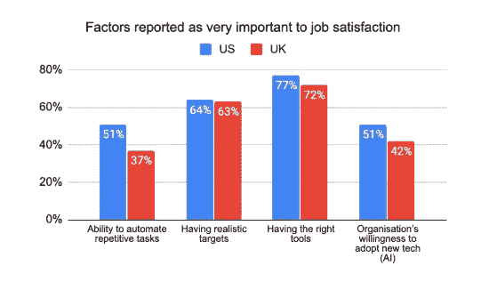
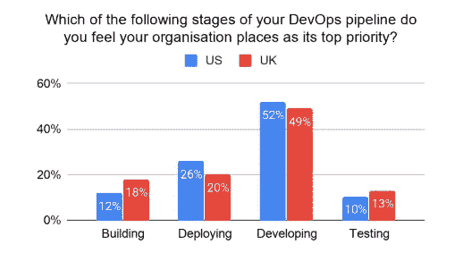
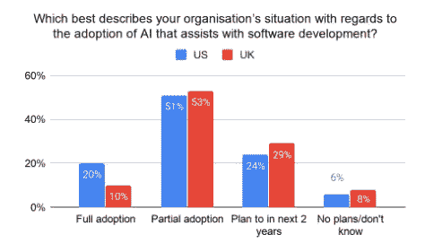

# 美国和英国软件开发人员对自动化的看法

> 原文：<https://medium.com/codex/what-us-vs-uk-software-developers-think-about-automation-ab8be50137cf?source=collection_archive---------2----------------------->

## [法典](http://medium.com/codex)

去年，我们调查了美国和英国的数百名开发人员，了解他们对各种主题的偏好，从[开发](https://www.diffblue.com/DevOps/research_papers/2020-devops-and-testing-report/)，到[测试](https://www.diffblue.com/Education/research_papers/2019-diffblue-developer-survey/)，到他们在工作场所喜欢和不喜欢的特征，以及软件质量对他们意味着什么。在许多事情上，这两个群体是一致的，但对自动化的态度已经成为一个兴趣点-来自美国的受访者倾向于表达对自动化工具的更大需求，报告称其公司对自动化工具的采用程度更高，并且比英国的同行具有更高的整体工作场所满意度。

那么这些结果对英国的开发者意味着什么呢？职场快乐的部分秘密可能与自动化你不喜欢做的工作有关。

## 开发人员工作满意度

平均而言，美国开发人员的工作时间比英国同行更长，但他们的工资也更高。根据我们 2020 年 3 月的调查，32%的美国受访者每周工作 45 小时或以上，而英国受访者的这一比例为 14%。调查结果显示，美国开发人员的收入比英国开发人员高 28%(平均收入为 72，860 英镑，相比之下为 56，938 英镑)。这种差异已经得到了其他研究的证实，这些研究显示美国开发者的收入要高出 30%到 60%以上(来源:T9)。

有趣的是，调查结果表明，美国开发人员的工作满意度也更高，47%的人完全满意，50%的人有点满意，相比之下，英国受访者中有 27%的人完全满意，68%的人有点满意。尽管长时间工作有潜在的负面影响，但高工资有助于提高满意度是有道理的，但更高的工作满意度也可能导致自愿工作更长时间。

那么，怎样才能提高工作满意度呢？我们的调查表明，美国开发人员更重视 1)自动化重复任务的可用性，以及 2)他们的组织采用新技术的意愿(与英国开发人员相比),这与整体工作满意度有关。让我们仔细看看组织和开发人员对工作场所自动化的偏好。

## 开发人员希望看到什么样的自动化？组织想要自动化什么？

当谈到自动化什么时，美国和英国的开发者有相似的经历和偏好。大多数(超过 60%)美国和英国的开发者最希望看到自动化被引入到寻找错误和软件测试的任务中。超过 65%的美国和英国开发人员发现编写单元测试很平凡，超过 80%的人宁愿花时间在创造性的任务上，比如开发新产品功能，而不是重复性的任务。调查结果还表明，人们普遍对使用工具来帮助开发单元测试的过程感兴趣，近 70%的美国开发人员和 60%的英国开发人员对此非常感兴趣。

尽管如此，与 DevOps 管道的其他阶段相比，在这两个组中，测试最不可能被报告为组织的首要任务。

那么，职场满意度剩下的差距在哪里呢？解释可能部分在于不同的人工智能采用率。

## 人工智能在美国和英国的采用成熟度

调查反馈表明，在美国，整个组织采用人工智能进行软件开发的比率是英国的两倍(见下图)，而部分采用率大致相同。在未来预测方面，大多数美国开发人员(53%)强烈预计到 2025 年将使用人工智能来提高软件工程团队的生产率，相比之下，英国开发人员的比例为 31%。

随着组织越来越多地将人工智能集成到他们的运营中，确保合适的人才来支持这些计划仍然是关键。在我们的调查中，美国和英国的大多数受访者都表示难以找到合格的开发人员加入他们的团队，这表明人才缺口可能已经存在。

调查结果还表明，受访者一致认为，缺乏熟练的开发人员会导致延迟和降低软件质量。大多数受访者认为他们的组织生产的软件质量还有改进的空间，平均 77%的美国受访者和 86%的英国受访者给出了肯定的回答。63%的受访者认为编写单元测试的最大好处是代码质量的提高。面对人才缺口，[工具可以让开发人员更快更准确地编写测试代码](https://www.diffblue.com/products/)可以作为一个直接的解决方案。

## 外卖食品

尽管美国和英国开发人员的经验和实践存在差异，但总体而言，他们对重复性任务自动化的态度和对单元测试编写的看法似乎存在共性。回答中最一致的模式之一是同意他们的组织可以改进他们的测试和软件质量，并且对有助于单元测试编写过程的工具感兴趣。提供这些好处的公司可能会发现他们拥有更满意的开发团队。

对于英国的开发人员来说，调查表明，现在可能是时候开始推动你的同辈人目前正在享受的自动化工具了。

## 您可能还会对以下内容感兴趣:

*   先有鸡还是先有蛋？TDD 和自动编写的单元测试
*   [完美敏捷团队的秘诀](https://diffbluehq.medium.com/the-recipe-for-the-perfect-agile-team-bb1b18b1dcd6)
*   [你的开发团队可能想要更多的自动化](https://diffbluehq.medium.com/your-development-team-probably-wants-more-automation-eae2df077ffb)
*   [再次告诉我:为什么我需要另一个工具？](https://diffbluehq.medium.com/tell-me-again-why-do-i-need-another-tool-63347f3a10)

*原载于 2020 年 10 月 26 日 https://www.diffblue.com**的* [*。*](https://www.diffblue.com/blog/software%20development/what-us-vs-uk-software-developers-think-about-automation/)