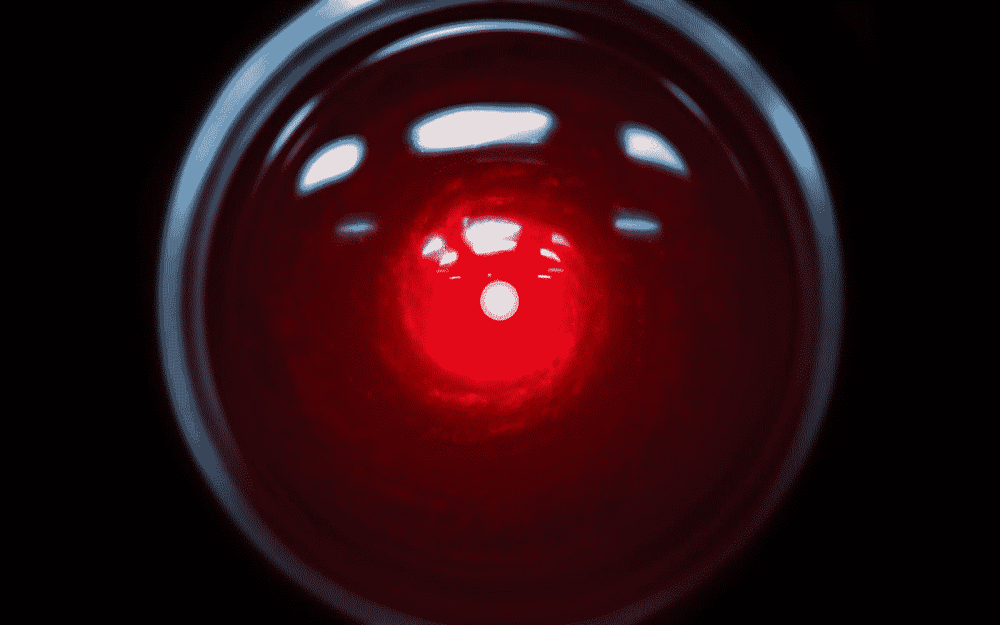

# 我们对人工智能的误解

> 原文：<https://medium.com/codex/what-we-keep-getting-wrong-about-ai-d88d9f93e6ad?source=collection_archive---------14----------------------->

> “什么是 AI？”

这个问题的一个有趣之处在于，如果你向 100 个人提出这个问题，你很可能会得到 100 多个答案。“这有点像机器学习……但它也可能是武器化的……许多公司用它来收集数据……10 年后，它会告诉我们该做什么，”我们想象中的对话者说。我们可以看到，野生飞行的动画…