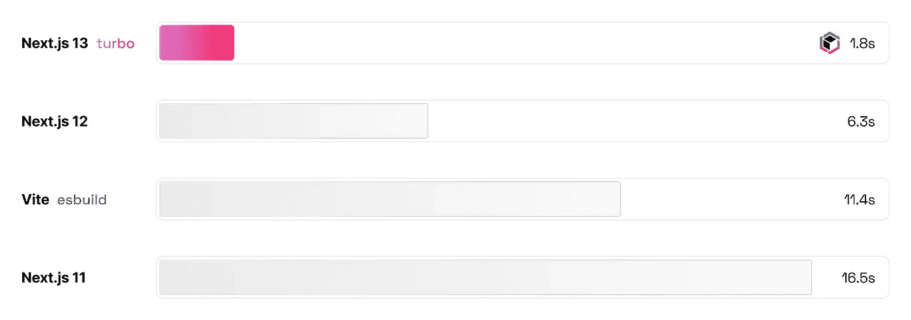
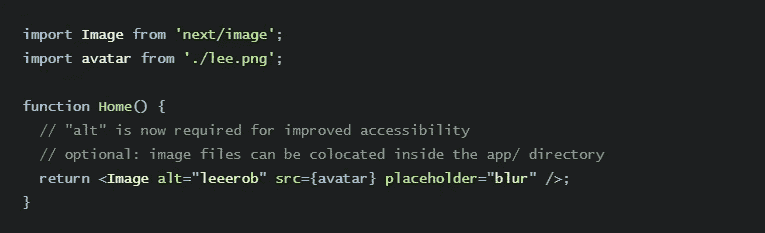
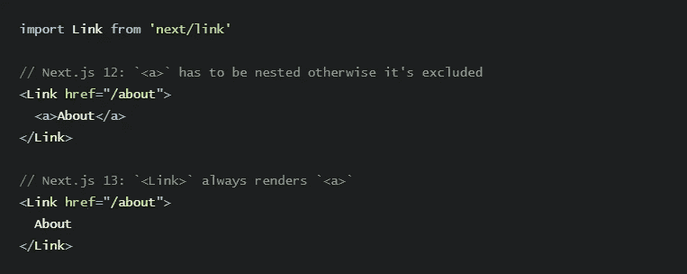

# 关于 Next.js 13 我们需要了解什么？

> 原文：<https://medium.com/codex/what-we-need-to-know-about-next-js-13-7d52cc55b7c3?source=collection_archive---------3----------------------->

对于不了解我的人来说，我是一名 jr .前端开发人员，在工作中同时编写 React、Next.js 和 Svelte 代码。我的主要堆栈是 Next.js，所以我将分享我们需要了解的关于全新 Next.js 13 的信息。

如果你不知道的话，Vercel 是 Next.js 的创造者，他们在 3 天前开了一个发布会，Next.js 13 随之发布。Next.js 是 SSR 界的王者，所以我们必须知道新版本给我们带来了什么。多是 DX(开发者体验)，所以我们会喜欢。🎉

# Next.js 13 有什么新内容？

Vercel 为我们带来了很多细节，让我们更舒适地工作。他们很快；

*   **app/目录(beta) :** 更简单、更快捷、更少客户端 JS。
    **-布局**
    **- React 服务器组件**
    **-流媒体**
*   **Turbopack (alpha) :** 基于 Rust 的 Webpack 替换速度高达 700 倍。
*   **新的下一个/映像(稳定):**具有本机延迟加载的更快的映像。
*   **New @next/font (beta) :** 自动自托管字体，无布局偏移。
*   **改进了 next/link :** 简化了< Link >组件的 API。

# 应用程序/目录(测试版)

Next.js 已经有一个很棒的文件系统，带有自动路由器。当你将一个文件放入一个文件夹中时，它会立即在我们的应用程序中创建路径。不需要任何配置。

有了 Next.js 13，文件系统就更好了。你可以更容易地创建布局，它让你创建用户界面更快。此外，使用新的服务器组件，您可以动态地创建服务器优先的动态应用程序。现在我们有了异步服务器组件，扩展的获取 API 支持组件级获取。

# 涡轮包(阿尔法)

js 13 为我们带来了 Turbopack，它是 Webpack 的基于 Rust 的新继任者。使用 Turbopack alpha 和 Next.js 13 会让你的应用更新速度比 Webpack 快 7**00 倍**，比 Vite 快**10 倍**，比 Webpack 快**4 倍**冷启动。

你明白比 Webpack 快 700 倍是什么意思吗？这是一场革命！😍

# 下一张/图片

Next.js 的新版本引入了一个强大的新图像组件。它使我们能够轻松显示图像而不会改变布局，并优化文件以提高性能。

**新的图像组件；**

*   提供较少的客户端 JavaScript，
*   更容易设计和配置，
*   默认情况下需要 *alt* 标签，
*   与网络平台保持一致，
*   更快，因为原生惰性加载不再需要水合作用。

# 下一页/链接

新的 next/link 组件不再需要手动添加标签作为子标签。很久以前就需要它了！

# Next.js 13 系统要求

Node.js 14.6.0 或更新版本，
支持 MacOs、Windows、Linux。

# Next.js 13 重大变革

*   React 的最低版本已从 17.0.2 升级到 18.2.0。
*   Node.js 的最低版本已经从 12.22.0 升级到 14.6.0，因为 12.x 已经寿终正寝( [PR](https://github.com/vercel/next.js/pull/41482) )。
*   `swcMinify`配置属性从`false`更改为`true`。更多信息见 [Next.js 编译器](https://nextjs.org/docs/advanced-features/compiler)。
*   `next/image`进口更名为`next/legacy/image`。`next/future/image`导入被重命名为`next/image`。一个 [codemod 可用于](https://nextjs.org/docs/advanced-features/codemods#next-image-to-legacy-image)安全地自动重命名您的导入。
*   `next/link`子级不能再是`<a>`。添加`legacyBehavior`道具以使用传统行为或移除`<a>`以升级。一个 [codemod 可用于](https://nextjs.org/docs/advanced-features/codemods#new-link)自动升级你的代码。
*   当`User-Agent`是机器人时不再预取路线。
*   `next.config.js`的弃用`target`选项已被移除。
*   支持的浏览器已更改为不再支持 Internet Explorer，而是面向现代浏览器。您仍然可以使用 Browserslist 来更改目标浏览器。
*   铬 64+
*   边缘 79+
*   Firefox 67+
*   Opera 51+
*   Safari 12+版本

# 最后的想法

所以，当然，我不是一个多年来用 Next.js 编程的人，但我作为一名 jr .前端开发人员，尝试分享关于它的新闻。还有太多像我一样的人，我相信我们必须在这个领域保持更新。

如果你喜欢内容，可以通过下面的提示支持我。还有，不要犹豫，在评论里分享你的观点吧！下期内容再见。