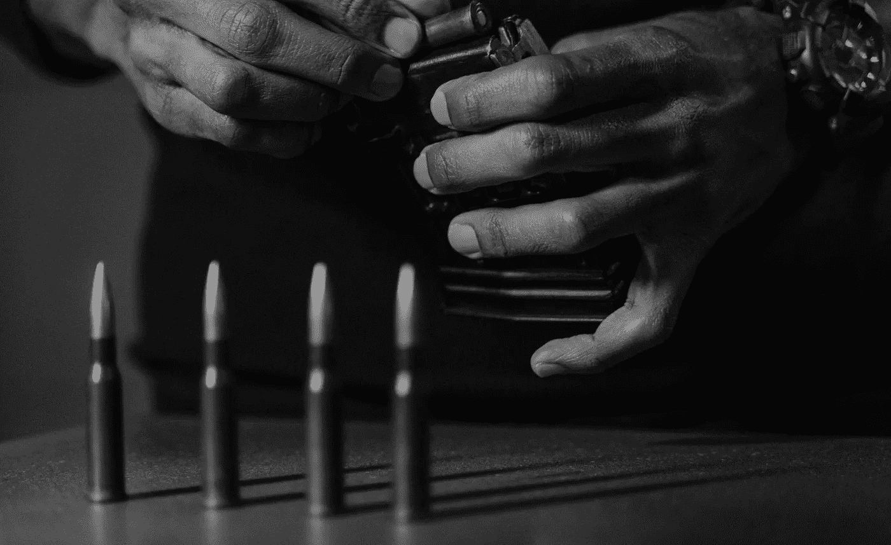

# 如果一个开发者有银弹，他会射什么？

> 原文：<https://medium.com/codex/what-would-a-developer-shoot-if-they-had-a-silver-bullet-ec6bf37f3ff?source=collection_archive---------5----------------------->

## 开枪前你需要瞄准

> 我不是一个伟大的程序员；我只是一个习惯很棒的好程序员。《T1》作者肯特·贝克。

许多开发人员给糟糕的代码添加注释，而不是重写代码。治标不治本。开发人员行动迅速…