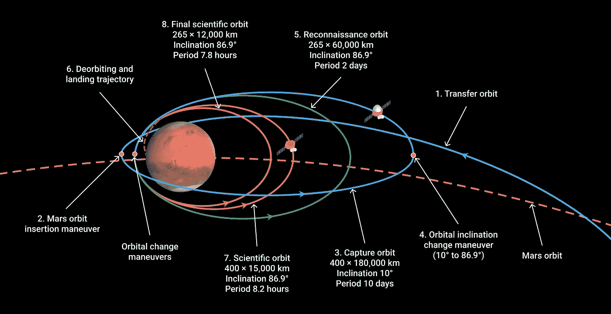
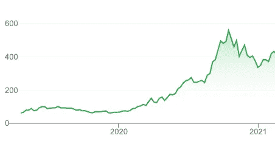

# 作为一名初创公司 CTO，你不能知道的是什么

> 原文：<https://medium.com/codex/what-you-cant-know-about-being-a-startup-cto-80138aceb68f?source=collection_archive---------7----------------------->

《圣诞节的幽灵还没来》| [维基百科](https://en.wikipedia.org/wiki/Ghost_of_Christmas_Yet_to_Come)

我曾经是三家创业公司的早期成员，所以，嗯，是的——把我当成“专家”吧。

最初，我是一名初级程序员。我没有参与决策:不涉及技术，不涉及人员，不涉及文化。我写代码，看着*其他*人做出……假设*大多是*糟糕的决策。如果你正在计算，这已经是这篇文章中的第二个逻辑错误了，所以准备好怀疑我吧。事实证明，用我现在的知识来评估别人过去的决定会适得其反。另外，我当时并不知道这一点，但是不做决定比做决定要容易得多。

在无数次的其他工作之后，我开始忘记自己在做什么，我离开了一家受人尊敬(且有利可图)的公司的轻松工作，共同创建了一家初创公司，担任首席技术官。这个头衔意味着一些严肃的决策。奇怪的是，当你是头奶酪时不做决定实际上和做决定是一回事。

这第一份 CTO 工作是给一个自制的[微软混合现实合作伙伴](https://www.enklu.com/)——当你用 HoloLens 做[比微软](https://www.theunrealgarden.com/)更酷的事情时就会发生这种情况。若干年后，我发现自己又成了首席技术官，这次是一家获奖的社交移动游戏工作室。这一定意味着我在决策方面不可思议。

我需要停下来喘口气——哎呀，别读得这么快。我的头膨胀到几乎爆炸，这让我有点喘不过气来。

来自 [FreeSVG](https://freesvg.org/1342121207) 。

想象一下作者(我)正在接近我们的主角(也是我)，就像某个达菲鸭卡通中的鸭子可能小心而兴奋地踮着脚走向一个房子大小的水球，手里抓着一个尖针。这整个关于“决策”的论述是一个巧妙伪装的长期生存偏见练习。*砰*。

我*认为*我知道我在说什么，仅仅是因为一点点的成功。我*假设*我将要说的事情是真的，但是由于现实是如何运作的(正如我将在下面进一步阐明的那样)，我可能只是某个偶然落入*环境*中的随机者[几个超出平均值](https://en.wikipedia.org/wiki/Normal_distribution)的σ。

有大量的理由让我(和你)抛弃我“屡试不爽”的智慧。

亚里士多德，有史以来最伟大的思想家之一(我想说我们的大脑*可能*不在同一个水平上)，观察鸟类在季节中的自然进程，得出的结论不是鸟类可能来自世界上的其他地方，而是鸟类在一年中[将自己转变为不同的物种](https://www.uh.edu/engines/epi2228.htm)。也许我对导航技术和团队的信心是对现有的、缺乏证据的类似错误描述。

但是我越来越糊涂了——让我们谈谈未来吧。

来自[维基百科](https://upload.wikimedia.org/wikipedia/commons/5/58/Orbital_trajectory_of_Tianwen-1_around_Mars.png)。

# 技术轨迹

“初创公司首席技术官”(相对于其他初创公司领导角色)面临的独特挑战是，为今天的*做出与未来的*技术*相交叉的技术决策*，同时可能实际上*编写*技术，并试图保持同一技术*完好无损。*换句话说，你需要决定一个起点，你需要决定未来的几个点，然后你需要决定如何打击它们。这叫做计算一个*轨迹*天啊，你看到我用了多少次“决定”这个词了吗？累死人。

你可以明白我的意思。初创公司的首席技术官正在左躲右闪，什么是没有因果关系的[相关性](https://en.wikipedia.org/wiki/Correlation_does_not_imply_causation)？如果我着眼于未来，我必须明白什么时候我是对的，什么时候我是对的并不重要，最困难的是——当我只是运气好的时候。

在创业初期，你的技术是一颗围绕完美球形星球运行的卫星。你的计算是有史以来最简单的。起初，“任何旧技术”可能都可以。我知道，这不是你作为一个“具有独特而有价值的洞察力的技术领导者”想听到的，但你需要的只是一个标靶来确定你的技术的起点，因为我们被迫考虑，只是可能，最初的技术选择*根本不重要*。

“为什么——这是异端邪说！我们是毕达哥拉斯派！[整数万岁！](https://en.wikipedia.org/wiki/Pythagoreanism#Arithmetic_and_numbers)

不幸的是，我们面临着大量的非理性。谷歌仍然以某种方式在移动硬件上运行 Java，比如说，取得了相当大的成功。Zynga 在… Flash 上建立了一个帝国？我认为脸书是一个“成功的创业公司”，著名的[通过针眼](https://en.wikipedia.org/wiki/HHVM)推出了糟糕的技术选择。

我知道你在想什么。“[我们不可能都侵犯同学隐私，成功盗取 IP](https://en.wikipedia.org/wiki/Facebook#2003%E2%80%932006:_Thefacebook,_Thiel_investment,_and_name_change) 达到突围成功。”这是真的，但是:(这是你应该强调的一个要点)人们很聪明，能想出办法。我几乎完全相信，几乎任何软件都可以发展成任何其他软件，如果你雇佣合适的人并卷起袖子的话。我目前正在网络浏览器中写这篇文章*。[你知道那些开始是什么样子的吗](https://www.w3.org/People/Berners-Lee/WorldWideWeb.html)？*

就我们的轨迹而言，启动技术几乎无关紧要。然而，*工作流程*非常重要。

来自[维基媒体](https://commons.wikimedia.org/wiki/File:Art_supplies_clutter_(Unsplash).jpg)。

# 比起正确性，更喜欢迭代。

这一论断符合加布里埃尔的“越差越好”设计风格的精神，如果你还没有读过，这是你应该读的，而不是这些废话。

我举个例子。

在后端开发中，通常设置虚拟机或构建/dev/prod Docker 映像，以便每个人都使用尽可能接近生产环境的开发环境。这是一个很好的目标，但是我在这个过程中经常看到的是*增加的开发摩擦*。这对一个创业公司来说，比选择“错误的技术”更致命。如果你在迭代周期中增加 5 秒钟，你就搬起石头砸了自己的脚。想想用这 5 秒乘以你每天需要做的 100 次，然后加上另一个乘数:你要雇佣的工程师数量。偏爱迭代胜于正确性，尤其是在公司生命的初期，意味着在公司的整个存续期内增加速度。

正确是鸟的事。它可以稍后修复，或者更有可能的是，[根本不需要修复](https://decketts.medium.com/it-is-time-to-finally-retire-html-c751a2c9c3cd)。

来自[维基百科](https://en.wikipedia.org/wiki/Metaverse#/media/File:Second_Life_11th_Birthday_Live_Drax_Files_Radio_Hour.jpg)。

# 未来积分

这可能很难回忆起来，因为我已经放弃了所有疯狂的智慧，但我们使用了轨迹的隐喻——到目前为止，我们只谈论了起点！天啊…好吧，接下来是什么…我们需要决定未来的一个打击点。但是我们如何选择这个未来的点呢？

你通过你的望远镜看到一个遥远的星球:一个非常重要的星球，你用你的*敏锐的* *洞察力*(哈！)，被认为是人类将前往的下一个星球，你需要在旅行中幸存下来*和*建立你的太空柠檬水摊位，以便当第一批人类到达时，你已经在那里有一张欢迎桌子和特许经营文件准备签字:这是一个不公平的银河优势。

猜测未来有很多方法。可能最受欢迎的一个就是简单地[在你想做的时候编造东西](https://www.hero-labs.com/blog/the-22-worst-tech-predictions-of-all-time/)。尼尔·斯蒂芬森可以在没有任何责任的情况下对未来做出极其不准确的陈述——但不幸的是，科技领袖却不能。我们应该做得比随机机遇更好。

在《但如果我们错了呢:把现在想成是过去的 T2》一书中，查克·克劳斯特曼评价这个问题，不是从“轨迹”和“计算”的角度(*推高眼镜*)，而是从艺术的角度(*推高眼镜…甚至更远？*).让我用*的书*来重新表述一下未来科技的问题:

为什么高中还在教荷马，而阿普雷却没有？这似乎与工作的质量无关。阿普雷一针见血，[在这头蠢驴身上](https://www.thegoldenmule.com/about.html)。维吉尔的《埃涅阿斯纪》在事实上比荷马的《伊利亚特》更好。

来自杨春:

> 某件事在遥远的未来变得具有追溯意义的原因**与它在创建时具有意义的原因**是分离的——这几乎总是由于后代将接受为规范的社会理想的重新校准。

我们能把这个应用到技术上吗？让我换一种说法。你看到 Zoom 的股价了吗？

来自谷歌财经。

这并不是因为 Zoom 成功地读取了星星并瞄准了这个终点。就像艺术一样，技术严重依赖猜测、运气，显然还有冠状病毒。

阅读今天的茶叶来预测我们的明天是一个有点奇怪的想法。你可能听说过[蝴蝶效应](https://en.wikipedia.org/wiki/Butterfly_effect#Theory_and_mathematical_definition)？从某些方面来说，为被证明是正确的技术猜想而沾沾自喜，就像为自己三年前成功预测了今天的天气而击掌庆祝一样。你真的超越了宇宙，重新定义了气象学吗？或者说，随机性有时会让你对自己的能力产生错觉？

这意味着一个准确的技术预测，事实证明，通常是基于运气的。！)，这并不是建立一家公司的可靠基础。我们需要调整我们对于*我们能对*了解多少关于这个轨迹的想法。无数的局外人教导我们相信一些遥远的未来的乌托邦——他们说，有一个不可动摇的愿景——但事实证明(*明显的鬼脸*)“*这都是关于旅程的*。”

“未知领域的地图”| [比尔·史密斯](https://www.flickr.com/photos/byzantiumbooks/48728444743/in/photolist-2heY1X2-4rdCas-21rkBuQ-2j5D4LT-BiXm1Q-5aUv4W-2metzqq-qw8KaZ-2kKjhFX-KgGM36-5LztEk-xs26s-dwrBXP-LFqL9-7nxi1N-edRbAh-7kzGSa-zmnhi-2mqE2fp-dDzgbE-SVjaR-U7Uau6-24fyHoE-uDksh-29U79uz-fUgBPz-JEvyc-pPmnx-52sD2f-4CUQnm-5Uik6i-egtQz-4w35Yz-49a7XX-cjYaLU-RUGcLc-oJ63W-eVQQHu-edNGmu-FZxi5-gCdQo9-s51sNc-8tYgRF-yLoCt-4moxTW-vNMNTG-3nEw6M-yLoCq-8WPrjV-2gLwkbK)

# 我们如何接触不可知的事物？

哎呦，我们不小心碰到玄学了。让我们再往下走一级。

# 我们如何在不知道科技发展方向的情况下引领科技发展？

好了，这是个更好的问题。

我们需要一个更好的模型来思考科技发展，当我们面对一个不明朗的未来时，坏消息是:朋友们，你们可能不喜欢我的提议。不幸的是，整篇文章仅仅是让你对预测失去信心的一个基础，相反，是根据“唯一不变的是变化”这个老掉牙的说法来构建技术。也许我应该在介绍中分享一个励志海报的链接。那你应该已经读完了。

当在一家初创公司中建立技术时，我倾向于考虑一种总是与不可知的未来打交道的模式:投资。

如果我在 20 世纪 90 年代的某个时候在苹果投资 1000 美元，那不是很棒吗？当然，但事实是，科技独角兽是 T2 的异类。他们不正常。[只看数字](https://nanoglobals.com/startup-failure-rate-myths-origin/):

> 在所有的初创公司中，估值在……1B 以上的公司……极其罕见，只有 0.00006 美元。

"[那么…你是说有机会…](https://www.youtube.com/watch?v=zMRrNY0pxfM)"

将你的财务前景托付给这种投资通常会非常令人失望。这就是聪明的投资者不这么做的原因。他们使用智能投资工具，如指数基金。投资指数基金是一种不把所有鸡蛋放在一个篮子里的奇特方式。有了指数基金，你可能没有机会成为十亿分之六获得疯狂回报的人之一，你将能够建立一些可持续的东西。

这个鸡蛋相关的篮子原理同样适用于初创公司的技术建设。众所周知，在初创公司，你需要坚持尽可能少的不同技术。这是出于几个体面的原因。你不需要雇佣五种不同编程语言的专家。您需要学习的东西会更少，而且有了专注，您的团队可能会在那些特定的技术上发展得更加熟练。这不是指数基金的方法。这种方法一文不值——这是一个*的错误*，还有很多更好的理由(三家初创公司)。

首先，多样化的技术堆栈是一种实用的、内置的方式，可以将*教育*融入到工程师的核心活动中。万岁！事实证明，*教育*是你应对不断变化的科技环境的最佳手段。你和你的团队需要在不同的生态系统中学习一些东西，这些生态系统可以交叉传播思想。我不断地学习一些方法，这些方法在一个领域是常识，但在另一个领域却闻所未闻。就好像不同栈的工程师从来不说话一样。围绕特定技术的熟练程度来发展一个组织远不如围绕学习的熟练程度来发展一个组织强大。有了一群学习者，你可以应对任何挑战。

此外，使用一系列不同的技术可以让你对冲你的技术赌注。回想一下，当 Flash 死亡时，整个工作室必须立即重新培训和重组。当脸书收购 Parse 时，那些只在 Parse 上构建堆栈的公司不得不迅速转向。这经常发生——感谢 HockeyApp，GameSparks，甚至可能是 GitHub？？？多样化的技术堆栈确保您的团队不会受到这些类型的开发冲击。

图片由 Carol VanHook | [Flickr](https://www.flickr.com/photos/librariesrock/45913244875/in/photolist-2cXco7g-5Xs44U-8nogPE-hyYPFd-bwmTa3-5VCA7o-26Nk4mS-2L3ugk-87WR12-9TNji3-bKgyE4-igicE7-83TwSG-252yaS2-6XmEfR-9TNiVC-ZMZ1LV-48yKgA-L1RiF-7EuSRJ-fe5XDU-q55PMD-9Uodtu-vLt2mS-7uvGXV-fiCPbu-8HWBBo-zT8drP-9UdUNJ-7kDwYw-bTp4Gv-fiCP9o-9UdV8E-7PjVQ7-5RABpS-UfjB94-5Zah51-7aPeDj-gdFfSD-df5S9t-yehPjr-Bjp8XW-zGjjUP-5Tfawg-9sokyj-23WmwJc-2U4bCF-FPGed7-7dZwyW-Ce9Ri)

# 最后的想法

希望我已经成功地达到了贬低自己的目的，足以阻止任何读者把我当回事。这是不幸的，因为我真的认为我是对的，所有的事情都是错的。我的最后一个想法是，围绕你对科技未来的猜测建立一家公司是不明智的，你可以称之为我的 TLDR。相反，围绕技术*迭代*和技术*教育*建立一家公司。结合他们的力量，你可能会在创业界犯下禁忌:*可持续发展*。