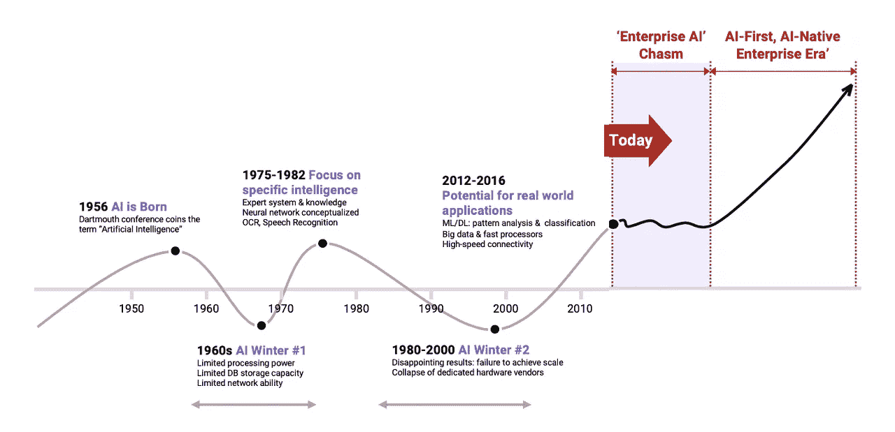
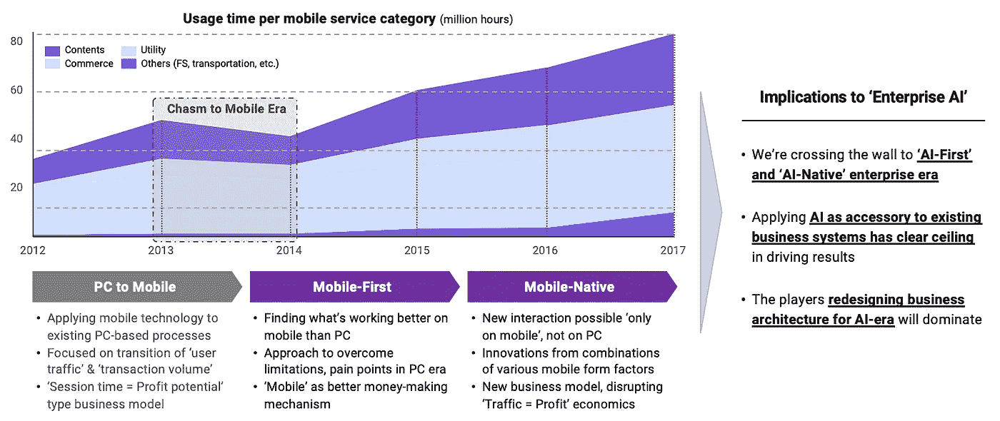
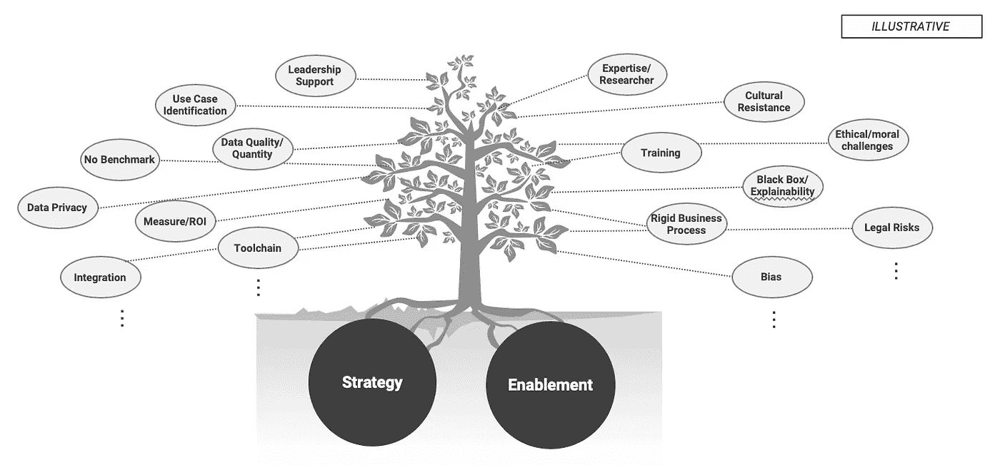

# 在你的人工智能采用之旅中你需要考虑的:第一部分

> 原文：<https://medium.com/codex/what-you-need-to-consider-in-your-ai-adoption-journey-part-i-642b88e2ed9e?source=collection_archive---------2----------------------->

## 企业采用人工智能的现状及典型误区

[Jackman Chiu](https://unsplash.com/@jackmanchiu?utm_source=medium&utm_medium=referral) 在 [Unsplash](https://unsplash.com?utm_source=medium&utm_medium=referral) 上的照片

你已经很清楚，毫无疑问，基于人工智能技术的转型是一个引起任何企业关注的话题，无论它们属于什么类型的行业，包括制造、金融服务、物流和零售。许多国家的公司，如美国、中国、韩国和日本，一直在致力于各种各样的项目，以在他们的企业环境中采用人工智能，并将其应用到他们的商业实践中。然而，由于在实施基于人工智能的转型时，公司应该考虑哪些因素以及应该采用哪些流程的问题没有“正确答案”，同时，市场积累的经验仍然不足，仍处于发展的最初阶段，我想一些企业会遭受试错。

在这篇文章中，基于我在与不同市场参与者讨论和合作的过程中获得的实践经验和专业知识，我想分享我对公司在通过采用人工智能技术推动创新时需要考虑的关键因素的想法。

在前半部分，我将描述人工智能作为商业解决方案的现状，并简要研究企业在开始试验和开发人工智能解决方案时应该面临的不可避免的问题。在下半年，我们将看看企业在开始企业人工智能之旅时应该记住的几个要素。

## 对企业人工智能采用的乐观看法

可以毫不夸张地说，在过去的几年里，我们一直生活在充斥着与基于人工智能的服务、应用程序和现实生活案例相关的新闻的世界中。虽然在早期阶段，对人工智能技术的兴趣和尝试主要是所谓的“产品人工智能”，但专注于将人工智能技术应用于企业商业系统的“企业人工智能”最近吸引了更多的关注。

因此，许多研究机构和咨询公司对企业人工智能市场的增长做出了非常积极的预测，这种情况仍然没有改变。

根据 Gartner，Inc .在 2019 年 1 月的调查，“实施人工智能的企业数量在过去四年增长了 270%，在过去一年增长了两倍。”2018 年，麦肯锡公司公布了一项研究，表明“大约一半的组织正在将人工智能技术应用于至少一个核心业务流程，其中 30%的组织正在计划人工智能技术的试点。”

早在 2017 年，Teradata 就表示，“多达 80%的公司报告称，他们的组织已经在生产某种形式的人工智能，”我认为，这绝对是一个令人难以置信的结果，现在企业领导人迫切需要积极投资人工智能技术，以便在竞争中赶上竞争对手。

## 一个冷酷的现实:我们在企业人工智能采用曲线的哪里？

然而，我在商业领域的经历与新闻报道和调查报告大相径庭。

许多公司已经开展了 PoC，或概念验证，以在他们的商业实践中采用人工智能技术，他们此刻必须做得正确。另一方面，由于大多数 POC 过于重视根据现成的算法和数据提出一次性或单点解决方案，因此它们很难满足应用于组织生产环境的要求，并且在大多数情况下已成为历史。虽然有各种不同的想法和意见，但我个人认为只有 5%到 10%的 POC 会在生产环境中被采用和使用。(根据 VentureBeat 2019 年 7 月的一篇文章，IBM 的数据科学和人工智能首席技术官黛博拉·莱夫(Deborah Leff)和 Gap 的数据和分析 SVP 克里斯·查珀(Chris Chapo)在 Transform 2019 的舞台上发表了一篇演讲，指出“只有 13%的数据科学项目，或者说只有十分之一的项目，能够真正投入生产。”Gartner Inc .的人工智能成熟度研究告诉我们，“8%的人工智能模型可以从实验室出来，并投入生产。”)

通过查看微软在 2019 年上半年对亚太地区客户进行的调查，我们可以看到，将人工智能作为一个组织的关键战略资产，需要比我们通常预期的更多的时间和精力。最重要的是，由于人工智能技术的主要特征从根本上不同于企业在过去几个世纪中采用的无数技术，人工智能推动的创新和变革应该伴随着更大和更广泛的变化，无论是在商业实践还是企业文化方面，都比公司以前面对的那些，过去处理业务绩效和 IT，创造了一个阻碍在生产中采用人工智能的障碍。

看着企业 AI 发展的方式，我们开始想知道我们现在在哪里。

人工智能的历史和企业采用人工智能的现状

自 20 世纪 50 年代人工智能概念诞生以来，70 年过去了，技术经历了几次起伏，最终在 2012 年的 ImageNet 竞赛中，由卷积神经网络(或 CNN)支持的 AlexNet 将图像识别的准确率大幅提高到 85%，当时几十年来一直保持在 75%以下。这引发了人们对在现实生活中采用人工智能技术的兴趣。

尽管我不断听说基于人工智能的新产品和服务，或者更具体地说，基于深度学习技术的新产品和服务，包括自动驾驶、自然语言处理、机器人和游戏等，但我想说，我们最好将这理解为识别和克服一系列障碍的过程的一部分，这些障碍位于在商业实践中采用人工智能技术的道路上。如果你只看前面提到的各种研究机构和咨询公司的介绍和研究论文，你可能会认为人工智能的采用，特别是企业人工智能，已经在爆炸式增长。然而，在接下来的几年里，通过“从鹅卵石中辨别宝石”的过程，那些能够逐一为无数问题提出合理解决方案的组织和那些专注于短期增长的组织将表现出巨大的差异。

## 如何跨越鸿沟:过去的教训

我们如何才能跨越企业人工智能的鸿沟？(一般来说，商业环境中的术语“鸿沟”是指在新产品或新技术进入主流市场之前，市场需求暂时处于停滞或下降阶段的情况，但在这里，我使用这种表达来展示一种现象，即人工智能技术的传播由于发现它们在生产中被采用的先决条件和解决问题的过程而被延迟。)此外，需要什么样的方法来帮助一个领先的公司跨越企业 AI 的鸿沟，成为真正的 AI 优先或 AI 原生组织？

我想，通过研究从个人电脑时代向移动设备时代过渡的方式，我们可能会得到一点提示。

向移动时代过渡以及需要吸取的教训

在移动通信技术出现后，PC 到移动，或者将基于 PC 的流程和业务模型移植到移动环境的尝试大概占了最大部分。PC 和移动环境之间存在的差异以及需要转变的相关条件被完全忽略，移动设备只是被认为是“屏幕更小的 PC”所有这些都促使人们在很长一段时间内将他们的服务转移到手机上。然而，不久之后，这种一维的方法开始明显地显示出它的局限性。正如你从上图中看到的，在公司将他们的 PC 屏幕移植到移动屏幕上后不久，用户在每个服务类别中的会话时间开始减少。

随着移动优先和移动原生业务的出现，它们能够及时认识到这些明显的局限性，并提出在移动设备上更好地工作的方式，此外，结合独特的可访问性和各种形式因素的纯移动服务，全面的移动服务可以首次进入各种行业。而且在这个过程中，一个过去以广告为中心，将用户流量直接转化为利润的移动商业模式被彻底拆解，不愧为一次颠覆性的创新。优步、Grab 和微信是这些领先组织的主要例子。

如果我们将移动的进化过程应用到企业人工智能的环境中，我们就会明白，在努力采用人工智能新技术的同时，许多市场参与者正面临着一系列困难，这些困难源于过去的技术和人工智能之间的根本差异。最终，那些试图利用人工智能作为辅助机制而不对现有业务系统进行任何创新的企业注定会失败，受到明显局限性的阻碍；相反，努力重新设计和重组商业实践并扩大其竞争力的公司最终将收获创新的成果，成为人工智能优先和人工智能本土的公司。

## 观察:开始人工智能之旅的典型错误模式

嗯，我认为现在是时候简要看看大多数公司'开始'他们的人工智能项目或采用人工智能解决方案的方式了。

有几个典型的模式。首先，在没有任何关于在业务中采用 AI 的方向和优先级的考虑或审查的情况下，组织的 IT 部门通常会牵头，随机选择容易访问的用例，并对它们重复实验和试验。这种采用人工智能技术的模式很难引起管理层的注意，因此，很难获得在组织内传播新技术的许可，由于 it 人员和业务人员之间的理解差距，将单个用例应用于业务实践非常困难。

第二，另一个最常见的模式是，关键业务部门的工作组用自下而上的方法收集用例，然后选择看起来有可能开发的用例，主要基于开源库实现程序。当然，这是第一种模式的进步，因为它可以鼓励业务部门的参与，但很可能过于强调可能有助于解决“当前关注效率的问题”的用例，并且说服管理层对许多人工智能系统和过程的可扩展和可持续发展和操作进行中长期投资可能是极其困难的。

第三，公司可能会投资开发人工智能的商业战略和路线图，并进行与采用人工智能技术相关的技术和非技术实验，结合结果将用例应用于商业实践。这种模式最重要的问题是，除了制定自上而下的战略和规划投资路线图以供管理层批准之外，人工智能的“算法”问题，如在人工智能解决方案的开发过程中选择应用于特定用例的人工智能技术，对这些技术成熟度的判断，以及适用技术未来发展的方向和时机，都很难得到全面有效的处理。更糟糕的是，很难找到对各种资源的操作系统进行彻底和完整的审查和规划的情况，以响应诸如数据的准备水平(这是人工智能应用的基本限制)、供应和准备过程、人工智能的可解释性(这是最近特别重要的话题)、从公司角度处理偏见的适当方法以及最后， 一个庞大的系统，包括人工智能解决方案的开发、操作和再培训，用于真实世界，而不是像玩具一样在实验室中使用。 事实上，最大的问题是，很少有该领域的专家和专业人士小组能够审查上述因素。同样真实的是，由于执行这些任务需要大量的时间和资源，除非他或她是一个组织的所有者，否则任何人都很难在对未来没有希望和信心的情况下决定进行投资。自然地，对待人工智能技术的方式是，他们像往常一样看待已经成为某种商品的传统技术，人们建立“一刀切”的策略，开发计划，并进入执行阶段，而没有足够的背景知识，与他们以前一起工作的人一起工作。

因此，自去年以来经常被提及的困难问题，包括“低投资回报率”、“缺乏领导层的支持”、“数据的数量和质量问题”、“由于缺乏适当的工具而导致的开发生产率低下”、“缺乏训练有素的人才”和“人工智能系统的风险”，似乎都归因于缺乏对促进基于人工智能的创新的“战略”和“实施”的考虑和准备，而这些创新被认为需要长期投资和组织本身的改变。

许多问题的根本原因是:缺乏“战略”和“实施”

基于人工智能技术创新业务就像攀登一座非常高且崎岖的山峰，至少在目前是这样。每个人都知道，在没有地图指引、高山服装、登山靴和应急食物的情况下开始徒步旅行是不可取的。

然后，在第二部分，让我们简单看看在企业中开始人工智能之旅时，与“战略”和“实现”相关的主要考虑因素是什么。