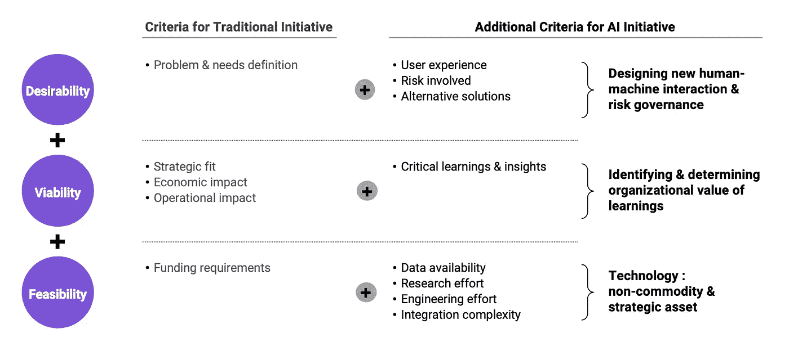
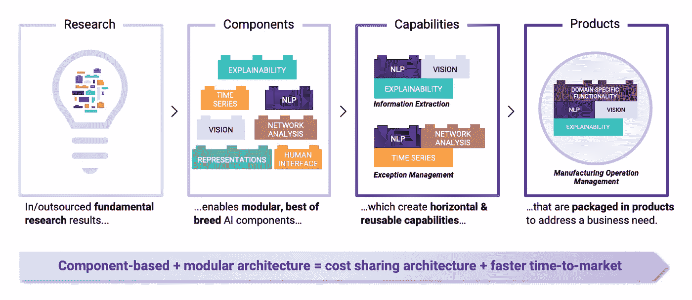
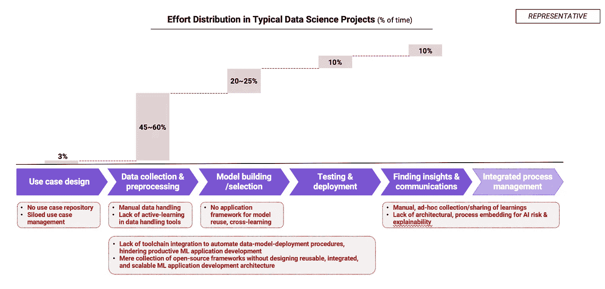
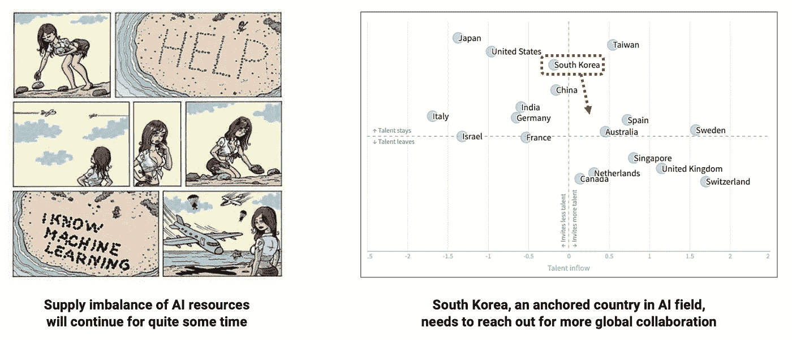
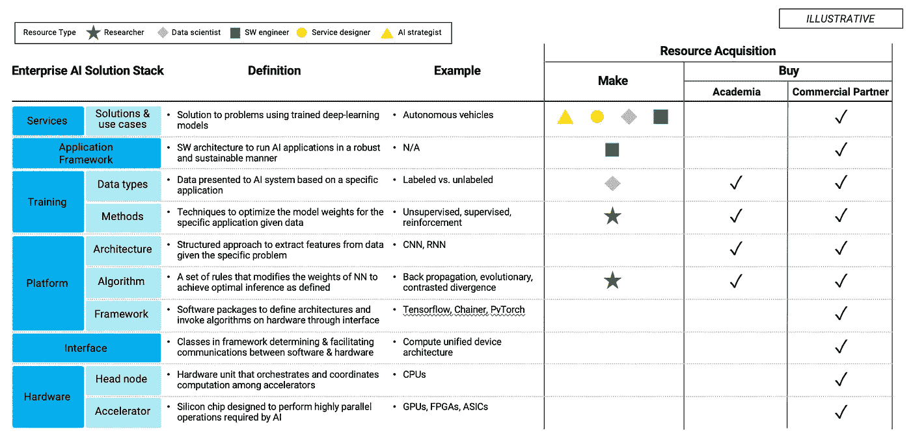

# 在你的人工智能采用之旅中你需要考虑的:第二部分

> 原文：<https://medium.com/codex/what-you-need-to-consider-in-your-ai-adoption-journey-part-ii-240d3e5b6dc8?source=collection_archive---------3----------------------->

## 规划人工智能采用之旅的关键因素

克里斯·劳顿在 [Unsplash](https://unsplash.com?utm_source=medium&utm_medium=referral) 上的照片

在前半部分，我们从“企业解决方案”的角度审视了人工智能技术的现状，在商业中启动人工智能解决方案的实验和开发的常见模式，以及不可避免地随之而来的典型问题。

在第二部分，我将从“战略”和“支持系统和资源”的角度，探讨在企业中成功采用人工智能需要考虑的因素，避免本文第一部分中描述的尝试和错误。企业应该考虑“战略”和“支持系统和资源”的原因是，最终，人工智能解决方案应该有助于创新一个组织的业务流程的本质，并使其能够以可持续的方式超越竞争对手。当企业试图采用人工智能技术时，很少有企业会满足于仅仅在概念验证或其他层面上进行“试验”。由于实验室中发现的发现只有在应用于实际情况时才会对世界产生影响，因此，当对诸如“人工智能能够并将做出什么贡献”和“人工智能这样做需要什么样的工具和资源”等问题以及能够支持采用新技术的相关投资有足够的考虑时，就有可能建立和运行能够对商业实践产生可测量影响的人工智能解决方案。

最重要的是，就“战略”而言，我们需要问的第一个问题不是“采用什么类型的人工智能技术”，而是“通过采用人工智能获得或建立什么能力”。在现实世界中，公司计划采用人工智能技术，通常很可能他们根据非常相似的用例建立自己的人工智能路线图，或者在某些情况下，几乎与其他组织正在试验的用例相同，严重依赖于随时可用的开源 API，因为没有多少人工智能研究人员，同时，他们竞争对手努力应用先进技术的消息通常是主要动机。与此同时，他们往往最终专注于采摘所谓的“低垂的果实”，事实上，这种方法是可以理解的，并不时产生有意义的结果。然而，它也确实有一些明显的局限性。

低挂水果方法中的陷阱:从“重要”计划中分心

> **很难提出自己的优势或独特之处，让你从竞争对手中脱颖而出**

从对采用人工智能技术感兴趣的公司的角度来看，开源无疑是无价的工具，可以让他们获得核心技术，这些技术通常很难独立开发，并进行实验。然而，创造你自己独特的人工智能解决方案和用例，让你比竞争对手更有优势，也是非常困难的。当然，由于两家公司拥有的数据集之间的差异，公司 A 和公司 B 可能产生的人工智能解决方案的质量存在“差异”是很自然的，但这本身永远无法转化为“独特性”。

> **关注短期结果而非收购能力以推动中长期价值创造的陷阱**

如果我们要创建具有“适用的”和“可行的”用例的人工智能解决方案，应用“可行的”开源 API，计划的主要目标应该是在“业务”和“技术”方面“短期和逐步改善现状”尽管并不总是有必要限制人工智能技术适用的领域，但从长远来看，有必要揭示这些技术可以成功应用于哪些任务，从而从根本上改变当前业务运营的结构和系统。也就是说，我们需要理解人工智能技术和传统技术之间存在重大差异，特别是前者主要是让执行“预测”和“预报”任务成为可能，只有人类才能以低得多的成本完成这些任务，并不断学习不同于自然中“预定规则”的新东西。

如果你继续专注于“发展基于具有中长期影响的人工智能技术的商业实践能力”，那么你不可避免地会遇到“目前无法以开源形式获得或无法轻松获得的人工智能技术元素”。这远不是启动基于人工智能技术的创新的障碍，而是提供了获得可持续和差异化竞争力的宝贵机会，做出竞争对手难以想象的新尝试。

> **吸引高级管理层关注公司层面投资的挑战**

当涉及到对业务实践的影响时，专注于“短命和逐渐改善现状”的人工智能计划具有一定的局限性，并且通常对组织中的少数特定部门有影响。此外，除了人工智能技术之外，还有替代技术解决方案。因此，可能需要付出大量努力来吸引高层管理人员的注意，并在企业层面推动适当的投资水平，因为实际上有更具成本竞争力和看似实用的替代方案来采用人工智能技术，这实际上包括相当多的风险因素，并迫使整个组织进行变革和创新。

毕竟，重要的是制定一个蓝图，为人工智能技术的采用提供指导方针，以便从更广泛的角度来看，基于人工智能的战略能力可以有助于加速企业中长期转型的势头，同时，应该努力设计可以帮助在实际商业环境中实现蓝图的计划。这些能力和计划应该以这样一种方式来定义，即它们可以发展成可以帮助企业超越其竞争对手的独特能力，同时它们不断地与组织所属的行业以及各种相关的环境(如数据、组织结构、业务流程和企业文化)进行交互。即使包含技术元素并将其视为核心，也应认真考虑“业务”方面的观点，以便当技术能力是未来构建或获取的主要目标时，可以有许多选项(有机或无机)可用。

我想在另一篇文章的后面讨论我们应该如何定义“机器学习问题”或我们必须通过采用机器学习来解决的问题，这可以作为基于人工智能技术的企业创新的能力和举措的基础。

在基于其所属行业的未来场景定义了战略能力和计划(公司应该通过人工智能技术获得和执行)之后，下一步是从各个维度评估和检查这些计划，并制定一个全面的路线图。为了不重复从计划中随机选择一个项目的模式，对选择的项目进行孤立的实验，并以失败告终，你必须检查人工智能技术的现在和未来，以及它们将在整个组织中带来的可能变化，并为将继续创造商业价值的投资确定优先顺序。这是 AI 路线图开发的核心。

我相信，许多读者可能都有过以“下一代”或“数字”为主题制定计划和发展路线图的经历，无论是靠自己还是在外部组织的帮助下。开发人工智能采用路线图的过程与为我们过去考虑在企业中引入的大多数技术创建路线图的过程截然不同。

人工智能路线图开发与传统 IT 路线图开发的区别

在大多数情况下，“影响”和“可行性”是计划优先级排序的两个维度。影响通常通过财务收益(如增加收入和降低成本)和非财务收益(包括战略价值和提高客户满意度)来评估，而可行性则通过所需的资源量来评估。然而，当你为人工智能计划开发路线图时，有更多不同的视角需要考虑和检查。

首先，我们需要考虑“学习”和“洞察力”在一个组织中的含义和价值，即“特定的人工智能计划或用例将会创建”。由于人工智能的本质与“学习”和“适应”交织在一起，因此应仔细检查给定计划将产生何种新学习、新见解，该见解将如何以及在何处对组织的实际业务流程产生影响，以及当计划完成并应用于业务实践时，是否有潜力推动进一步创新，以及财务和非财务收益的传统审查。

现在我们来看可行性方面。可以毫不夸张地说，当你在“数字化转型”的背景下评估一项人工智能计划时，可以实现该计划的基本技术元素已经被假定为处于“商品化曲线”的后半部分，或者这是开始检查可行性的先决条件；因此，在计算可行性时，最重要的因素是财政资源，或者在许多情况下是“投资成本”。然而，当涉及到人工智能计划时，应该从“技术可行性和可见性”的角度进行额外的考虑，因为人工智能技术的成熟度相对较低，特别是作为企业的技术解决方案，技术进步的速度非常快，并且需要额外的努力来协调与遗留企业系统的数据/接口。在过去的几年中，出现了许多基于 AutoML 的产品和服务，这些产品和服务使不熟练的开发人员能够创建和应用机器学习模型，相对容易地利用架构搜索和超参数优化，市场肯定会继续增长，但仍需要从不同角度对新的人工智能模型本身进行广泛的研究，并分析企业内外的数据集，涉及对任何给定任务至关重要的更高复杂性的用例。

在采用人工智能解决方案时，合意性是一个非常有趣的因素。与通常根据程序员预先确定的规则计算并产生有限答案的传统解决方案完全不同，人工智能解决方案似乎很难理解，因为人工智能模型的内部机制，或者人工智能模型得出答案的方式本质上对我们来说并不清楚。因此，人工智能的可解释性已经成为另一个被广泛采用的持续和广泛研究的主题。除了人工智能解决方案本身可以提供的结果之外，用户需要如何以及在多大程度上理解底层机制，以及在人机交互过程中可能出现什么类型的风险以及如何控制这些风险等问题，都是任何人工智能解决方案成功采用和传播的非常重要的考虑因素。

一旦对每个计划的彻底审查完成，对人工智能系统架构的探索和评估应该随之进行，以确保作为一个企业系统的可扩展性和可持续性。如前所述，如果人工智能解决方案的建立没有公共架构的坚实基础，随着解决方案及其模型数量的增加，从开发到维护的整个解决方案生命周期所需的资源和投资可能会呈指数增长。

可重复使用的人工智能组件架构，用于可持续性、可扩展性和持续学习

为了比竞争对手更快地有效和广泛地将基础人工智能研究中的最新突破应用到自己的人工智能解决方案中，企业应该重复安排将在各种人工智能用例中普遍使用的人工智能技术和组件的过程，并相应地调整预定义的路线图。基于组件的模块化架构将有助于从人工智能解决方案的投资中获得最大收益，缩短上市时间，并提供基本结构，可以在整个组织中传播和传播从人工智能解决方案中获得的新见解。

在保险公司众多的业务领域中，让我们以“承保”和“索赔处理”为例。简单来说，核保和理赔可以定义为在保险价值链的上游决定是否以保险单的形式获取风险的过程，以及在下游负责支付保额的过程。虽然这两个过程中的每一个都需要不同类型的经验和专业知识的不同人员和资源，但从人工智能技术和组件的角度来看，它们看起来非常相似。换句话说，这两个过程都是由光学字符识别或 OCR、自然语言处理或 NLP、决策和可解释性等关键要素组成的。由于这两个过程是基于学习作为核心输入的“客户”、“保险单”和“合同”的共同实体，开发和改进作为共享组件的四个组件不仅与负责这两个业务过程的 AI 解决方案的增强直接相关，而且有助于建立结构以共享在用一个解决方案操作另一个解决方案时发现的新见解，给予另一个业务过程及时响应市场变化的能力，并帮助促进连贯的业务绩效增加。

举一个简单的例子，对索赔处理模式变化的认识可以触发对风险偏好的修改，该风险偏好作为判断是否获取特定保险单中的风险的标准。

关于“支持系统和资源”，我们必须考虑哪些方面

首先,“企业级”人工智能解决方案开发、管理和维护的结构和流程应该考虑到可持续性和可扩展性。

开发人工智能解决方案的大部分时间和精力都消耗在收集和预处理数据上

与那些永远不会走出实验室的解决方案相比，在开发可以在实际商业环境中采用的人工智能解决方案的过程中有很多困难。如上图所示，许多行业专家都认为，在开发过程中，用于训练、测试和验证人工智能解决方案模型的数据收集和预处理消耗了大部分时间和精力。(另一方面，我认为“最重要”的部分是用例设计，或者换句话说，是“用例定义”。)

除了用于数据收集和预处理的工具之外，如果一个组织为自己配备各种工具，例如可以加速 AI 模型开发的实验框架、允许方便地管理基线和数据版本的基准工具、管理开发过程中创建的模型的模型库、性能监控和警告系统以及自动分发工具，那么通过为研究人员和工程师提供专注于他们擅长的和他们应该做的事情的环境，大量的生产力提高是可能的。

目前，市场上有各种各样的工具支持人工智能解决方案的开发。虽然有些工具适用于基于世界上已经众所周知的基本人工智能模型可以轻松处理的问题，但其他工具提供的功能可以支持研究人员设计和测试新的模型和架构，以满足定制的要求。对于一个组织来说，根据公司人工智能路线图的方向以及与其他组织的合作关系，考虑创建自己的工具组合来开发高效的人工智能解决方案是非常合理的。

“人力资源”的话题出现在每一次关于人工智能采用过程中的困难的谈话中。

任何寻求开发人工智能解决方案的组织都必须感受到对有能力的“人工智能研究和开发人员”的需求。我一直被告知，这些公司正苦于缺乏“能够开发人工智能解决方案的经验丰富的研究人员和开发人员”。许多公司正在努力弥合现实与对人工智能研究人员和开发人员的迫切需求之间的差距，从外部招聘人才，并在组织中培训程序员和数据工程师。

开发人工智能领域的人力资源不仅被视为单个公司层面的问题，也是与一个为未来做准备的国家的竞争力有关的问题，韩国政府已经认识到了这一点，并于 2019 年启动了一项计划，以支持人工智能领域高素质人才的教育。2019 年 3 月和 9 月，5 所大学和研究机构被选为“人工智能研究生院”，将有助于培养在不久的将来能够引领行业发展的研究人员。

根据 Element AI 在 2019 年发布的“全球人工智能人才报告”，对 21 个世界知名会议上发表的论文和论文数量的调查表明，2015 年至 2018 年，人工智能研究人员的数量增加了 30%以上，但美国、中国、英国、德国和加拿大仍占研究人员的 70%以上。我认为，这种现象的部分原因是，博士学位持有者相对容易移居到他们获得学位的国家以外的国家，其中三分之一的人现在在他们没有上过研究生院的地方工作。在一些北亚国家，如韩国和日本，这种“迁移趋势”相对不那么强烈，这似乎证明了该地区的人工智能研究人员，在人工智能研究生态系统尚未完全成熟的情况下，与全球研究社区隔离开来。

我认为，对于北亚国家来说，与全球人工智能生态系统建立强有力的联系，并在国家和企业层面鼓励和建立合作模式似乎是极其重要的。

全面的资源计划不限于技术专业人员

回到公司领域，正如追求创新的任何其他挑战一样，资源计划应该根据公司的战略进行定制。根据行业面临的动荡和公司应对策略，需要在组织内形成和培养或通过合作伙伴关系获得与人工智能相关的多样化技能组合。

在资源规划期间，有必要仔细检查公司需要哪些关键技能。对于大多数公司来说，不仅很难获得足够数量的研究人员来进行基础甚至应用研究，而且很难在应用研究成果和获得商业成果方面实现“规模经济”。关键要素是可以积累和建立与战略上需要的人工智能技术相关的内部能力、知识和经验的结构和伙伴关系。

需要记住的更重要的一点是，除了“研发”，还有许多“其他技能”将在开发、运营和改进企业人工智能解决方案的整个过程中发挥关键作用。数据分析师、业务开发人员、产品经理、服务设计师、UX 设计师等各种技能。对人工智能技术有深刻理解并能产生与人工智能研究人员和开发人员一样大的影响的人也应该受到审查和鼓励。我认为这是一项从现在起必须进行的任务。

我们讨论了通过克服人工智能技术的现状和大多数公司在构建“企业人工智能解决方案”时面临的问题来成功推动基于人工智能的创新所需的“战略”，以及根据我的个人经验从“支持系统和资源”的角度考虑的要素。

通过应用人工智能技术来创新业务是非常困难的，因为它具有与构成运营公司的业务系统的大多数技术非常不同的特征和潜力。现在开始合适吗？我不想只说“现在就开始是正确的”，而是说“我们必须现在就开始”，原因如下:

> **人工智能技术和能力的投资和创新需要大量准备**

正如我在本文的第二部分中几次提到的那样，基于人工智能技术的业务创新需要对战略、数据、组织和治理进行全面的审查和准备。特别是组织文化和治理，是需要很长一段时间才能通过一次精心的修炼来改变的领域，你必须从现在开始准备成为一个真正的 AI 优先/AI 原生的组织。

> **人工智能解决方案需要长时间的微调才能达到卓越的效果**

AI 解决方案本身的性能，也就是模型，也需要长时间的微调，才能满足所有利益相关者的需求。然而，更重要的是，为了成为基于人工智能技术的以知识为中心的组织，该组织必须通过人机交互的各种试错来创建自己的知识生产、传递和共享系统。

> **基于人工智能的创新可能会产生“赢家通吃”的效应**

在人工智能时代，用‘快速跟随者’策略成为赢家是非常困难的。与传统的商业操作系统不同，在传统的商业操作系统中，系统的规则一旦定义就不会随着时间的推移而改变，基于人工智能的系统会继续适应不断变化的市场条件，并通过不断的学习进行反馈，从而扩大“先行者”和“追赶者”之间的差距，最终在市场上形成“赢家通吃”的效应。

正如我在第一部分所说的，在人工智能技术的基础上创新一项业务就像攀登一座非常高且崎岖的山峰，至少现在是这样。我希望越来越多的公司能够用更好的地图和改进的设备爬上这座崎岖的山。