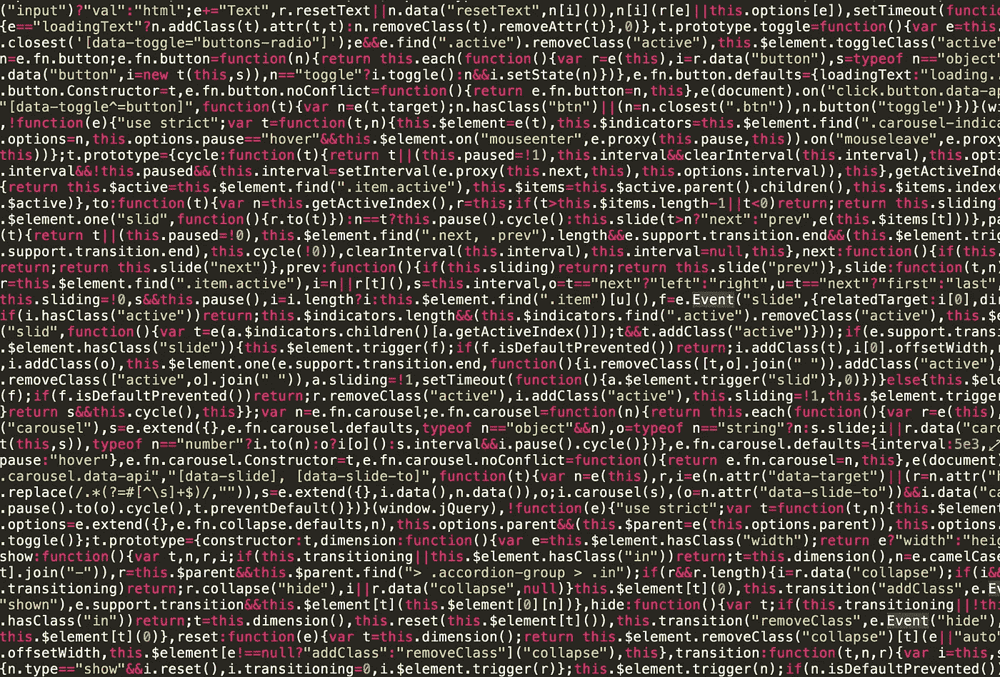

# 关于二维码你需要知道什么

> 原文：<https://medium.com/codex/what-you-need-to-know-about-qr-codes-5e1c7ede1882?source=collection_archive---------6----------------------->

## 概观

## 2021–2022 二维码时代

照片由[萨布丽娜·盖尔巴特](https://www.pexels.com/@sabrina-gelbart-65954?utm_content=attributionCopyText&utm_medium=referral&utm_source=pexels)从[派克斯](https://www.pexels.com/photo/full-frame-shot-of-abstract-pattern-249798/?utm_content=attributionCopyText&utm_medium=referral&utm_source=pexels)拍摄

# 二维码

二维码是 1994 年日本创造的不同图案的方块。自此，二维码对所有人开放源代码。GitHub 托管了一系列 Python 代码。他们本质上是给你创造和解码任何二维码的权力。