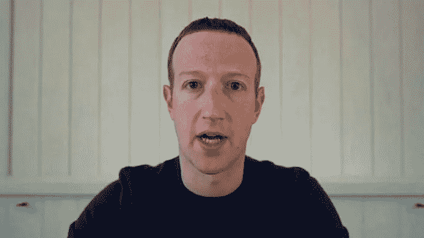

# 扎克伯格所说的编程对所有爱好者来说都是一个很好的信息

> 原文：<https://medium.com/codex/what-zuckerberg-said-about-programming-is-a-great-message-to-all-enthusiasts-5108e85642b8?source=collection_archive---------4----------------------->

## [法典](http://medium.com/codex)

## 旧的但是每个人几乎忘记它

马克·扎克伯格途经 ft.com

今天，每个程序员都陷入了一个黑洞。似乎没有回头路了。

每个人都在学习一切。