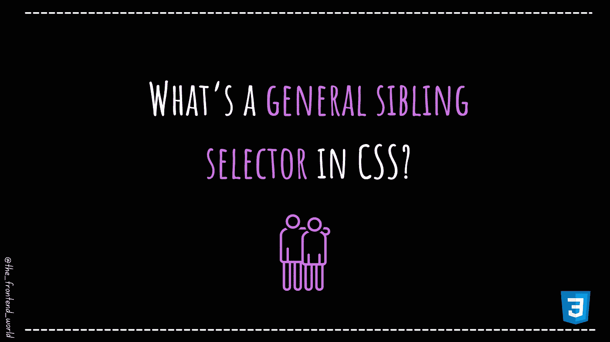

# CSS 中的通用兄弟选择器是什么？

> 原文：<https://medium.com/codex/whats-a-general-sibling-selector-in-css-6c3b1f0cdde5?source=collection_archive---------8----------------------->

## 直观地了解 CSS 组合子！

作者:FAM

# 首先，什么是 CSS 组合子？

> "组合子解释了选择器之间的关系."— w3schools