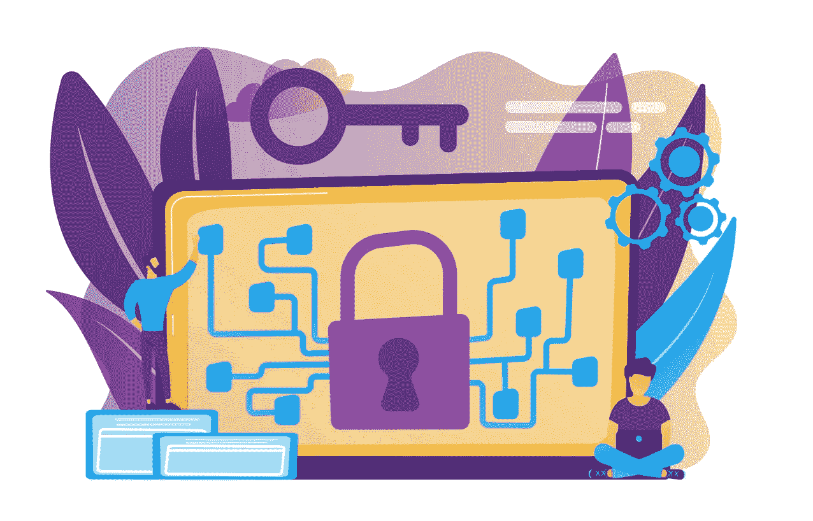

# 端到端加密宣传是怎么回事？

> 原文：<https://medium.com/codex/whats-all-the-end-to-end-encryption-hype-about-dbea4ffff139?source=collection_archive---------12----------------------->

端到端(E2E)加密现在有点流行。每个人都想要它，每个公司都争先恐后地宣称他们拥有它。有道理。谁不想要一个完全不可破解的应用呢？然而，端到端加密(尤其是对于浏览器中的媒体)是非常新的，一些限制经常被忽略。

# **什么是端到端加密**

[视频会议](https://www.liveswitch.io/professional-services)中的端到端(E2E)加密是一种保护数据的方法，可以防止第三方或中间服务器(sfu、TURN 服务器、网关等)访问数据。)在沿着媒体管道的每一跳访问或篡改它。

认为真正的 E2E 加密的一个简单方法是，假设所有的视频数据从被摄像机捕捉到显示在屏幕上的时间都是双重加密的。内容首先在应用层加密，然后在网络层再次加密。视频平台提供商一般负责网络层，但应用开发者负责加密应用层。

由于其本质，真正的端到端加密永远无法在 SDK 中得到开箱即用的完全支持。为了充分保护摄像机和所有中间服务器之间的数据，应用程序开发人员必须在数据发送到服务器之前在应用层对数据进行加密，并在显示在观众屏幕上之前的适当时刻对数据进行解密。

# **网络加密—第一层**

即使不保护应用层，网络层的 WebRTC 加密也是非常安全的。加密是 WebRTC 安全体系结构的一个强制性部分，在建立和维护连接的所有方面都强制执行。

以下是三种不同的终端，它们暴露在公共互联网中，可以受到保护:

1.  网关
2.  管理控制台和 Rest API
3.  媒体服务器

# **应用加密——第二层**

要被认为是端到端加密，应用层也必须加密。这意味着在将消息发送到 WebRTC 服务器之前，您必须首先自己加密消息。根据发送的媒体类型以及您使用的是本机堆栈还是 web 浏览器，这可以通过许多不同的方式来实现。

## *本地堆栈与浏览器*

在讨论 E2E 加密时，区分针对本地应用的 E2E 加密和针对 web 应用的 E2E 加密非常重要。当你看到公司说他们支持 E2E 加密时，他们通常指的是本地应用中的 E2E 加密。

也就是说，到目前为止，在浏览器中执行真正的 E2E 加密仍然完全依赖于浏览器供应商的堆栈，因此目前还不可能安全地做到这一点——只有一个例外。2020 年 5 月，谷歌在 Chrome 的一个标志后面添加了一个实验性的 API，如果被其他主要浏览器供应商采用，可能会为广泛的 E2E 加密支持铺平道路。

## *端到端加密—在本机堆栈中*

要对您的本机堆栈进行 E2E 加密，您需要在应用层进行加密。根据所发送的消息类型，这可以通过不同的方式实现。音频、视频和数据通道流量等流媒体在通过媒体服务器之前需要加密，聊天消息需要通过网关加密。

## *本地堆栈中消息和聊天的端到端加密*

基于文本的消息的 E2E 加密相当简单。对于任何要进行 E2E 加密的应用层消息，您必须首先拥有一种生成密钥并与环境外部的参与者共享密钥的方法。有几种不同的方法可以做到这一点。

最直接的方法是使用相同的密钥加密和解密每条消息。这允许任何拥有密钥的人解密来自会议中任何人的消息。另一种方法是给每个参与者一个唯一的密钥。

不管您选择如何管理您的密钥，要被认为是端到端加密的，在您调用 API 将消息发送到网关之前，必须首先在应用程序端加密[消息。](https://www.liveswitch.io/features)

## *本地堆栈中数据通道的端到端加密*

在应用层加密数据通道与加密基于文本的消息非常相似。主要区别在于消息通常通过媒体服务器数据通道发送。

如果您想要对您的音频流进行端到端加密，您首先需要在压缩后访问音频帧/包，以便在将其发送到媒体服务器之前对其进行加密。

## *本地堆栈中视频的端到端加密*

端到端的视频聊天加密比音频更复杂。这是因为压缩视频帧通常依赖于其他压缩视频帧，而压缩音频帧可以彼此独立地解码。

视频流中的关键帧充当后续帧的基础。它首先被发送出去，然后是“增量”帧，这些帧包含关于自前一帧以来的变化的压缩信息。

为此，帧的前几个字节需要保持不加密。确切的字节数取决于所用的编解码器(VP8、VP9、H.264)。例如，对于 VP8，我们需要保留 3–10 个字节不加密，因为这些字节构成了帧头。

## *浏览器内的端到端加密——当前事态*

虽然本地堆栈中的端到端加密已经存在了一段时间，但浏览器中的 E2E 加密则完全不同。从历史上看，web 浏览器没有为开发人员提供任何在发送或回放音频或视频之前修改它们的方法，因此在浏览器中进行 E2E 加密是不可能的。

在过去的几年里，已经有几个 [IETF](https://www.ietf.org/) 草案试图创建一个解决端到端加密问题的标准。

最有希望的是:

*   [隐私增强型 RTP 会议(PERC)](https://datatracker.ietf.org/doc/draft-ietf-perc-private-media-framework/) —草稿已过期
*   PERC Lite
*   框架标记——谷歌浏览器已经停止支持

然而，所提出的方法都没有获得在现实世界中可用所需的牵引力或浏览器支持。对这些草案的支持现已停止。这使得每个需要在浏览器中进行 E2E 加密的人都别无选择。

# RTCRtpScriptTransform——一种有前途的新模式

然而，随着 RTCRtpScriptTransform 的出现，这种情况可能会很快改变，这是 WebRTC 的一个新特性，目前处于 2021 年 4 月的规范草案中。

RTCRtpScriptTransform 试图通过允许应用程序级代码访问和操作 RTCPeerConnection 中的底层 RTP 流数据来解决浏览器中的 E2E 加密问题。暴露的数据分组被编码，但是还没有被网络层加密，这使得这是使用只有终端用户知道的密钥来应用额外的加密层的理想时机。此处执行的加密可以完全定制，并根据特定的编解码器、媒体服务器或安全要求进行定制。

听起来很有希望，对吧？是的，但是规范仍然是一个早期的草案，还没有在任何主流浏览器中实现。谷歌 Chrome 包括一个类似于 RTCRtpScriptTransform 的实验性功能，名为[WebRTC Insertable Streams](https://www.chromestatus.com/feature/6321945865879552)，但该 API 已经被弃用，取而代之的是 W3C 官方草案。

# **包起来**

那我们该怎么办？端到端加密是一个复杂的话题。虽然本地堆栈中的 E2E 加密技术已经发展成熟并已存在多年，但浏览器中的 E2E 加密技术还是全新的，还处于试验的早期阶段。今天，没有一家公司可以诚实地宣称在浏览器中完全支持 E2E 加密。

这个行业现在正处于浏览器 E2E 加密的悬崖边上。这是一个激动人心的时刻，各家公司都在竞相将它加入自己的产品阵容。然而，这种环境正在快速变化，视频平台提供商必须能够与时俱进。