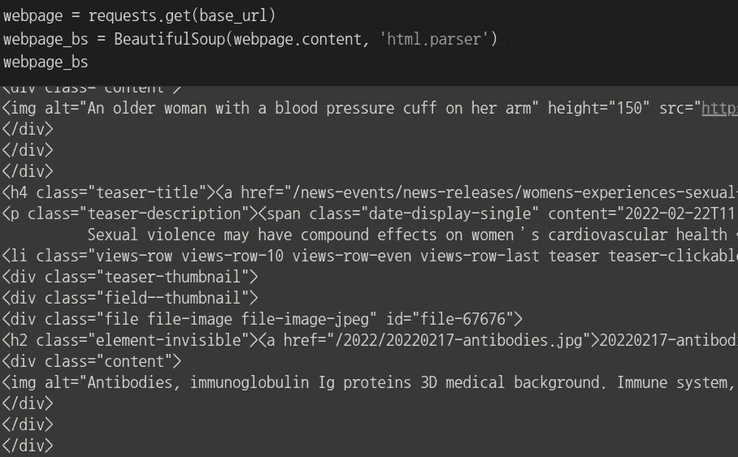

# web 抓取介绍和 Python 中的例子

> 原文：<https://medium.com/codex/whats-and-how-s-about-web-scraping-baaf9b619ec2?source=collection_archive---------5----------------------->

自从互联网出现以来，数据的范围随着时间的推移而扩大，其数量呈指数级增长。这是因为与过去不同，任何人都可以将任何类型的数据上传到互联网上。这样做的好处之一是任何人都可以下载任何数据，其中一种方法就是网络抓取。

香农·波特在 [Unsplash](https://unsplash.com?utm_source=medium&utm_medium=referral) 上的照片

# 什么是网页抓取？

顾名思义，它是一种从网页上自动读取和保存信息的数据收集方法。你可能听说过有些人将网络爬行和网络抓取互换使用。它们的工作原理相似，但用途不同。

当您事先知道要从网页中提取哪些数据时，通常会使用 web 抓取。相比之下，网络爬行下载整个网页并存档。因此，当您想要整个网页供以后使用时，您可以使用 web 爬行。总之，网络抓取是如何实现的？这个问题引出了一个网页的结构。

# 网页是如何形成的

因为这不是这篇文章的主题，我将只提供一个简单的解释。所以如果你知道它的基础，你可以跳到下一个街区。

你在网页上看到的一切都是用 HTML、CSS 和 JavaScript 代码编写的。其中，HTML 构建网页内容，CSS 设计内容，JavaScript 将交互应用于网页。

只有 html 的网页/有 html 和 css 的网页

由于大多数人的主要关注点是网页的内容，所以网页抓取一般只关心网页的 HTML 代码。

## HTML 由什么组成？

HTML 代码的主要组成部分是标签，标签有很多种。大部分都是由看起来像<tag_name>和</tag_name>的开合部分组成。每个标签都有一个独特的用途，所有这些结合起来定义了一个网页的内容。没有必要知道它们所有的用途，但是知道一些常见的用途会有所帮助。

> body 标签:显示在网页上的所有内容的父标签
> div 标签:在网页中设置一个分部
> p 标签:包含一段文本
> a 标签:包含到其他网站的链接
> li 标签:通常在有一个事物列表时使用

要查看标签列表，请访问[途径 2 指南](https://way2tutorial.com/html/tag/index.php)。

## 标签里面有什么

我们可以把它分成两部分。首先，<>里面的东西被称为属性，它们通常定义标签的特征。Class、id、href 都属于这一类。简单地解释一下，这个类始终如一地应用相同的风格。所以每个类名应该是唯一的，但是同一个类可以应用于多个元素。与类不同，id 是网页中元素的唯一标识符。因此，一个网页上应该只有一个唯一的 id。但是大多数网站对此都很宽容。href 包含一个到另一个网页的链接。如果你想了解更多关于属性的知识，请访问 [w3schools](https://www.w3schools.com/tags/ref_attributes.asp) 。

第二，在<>和>之间有东西，这是一个标签持有的实际内容。它可以是文本或其他标签，这样它们就可以嵌套。

标签外观的一个例子

# 网页抓取是如何工作的

正如我上面提到的，网络抓取是从网站上读取信息。所以基本过程是

> 1.找到基础网址
> 2。打开一个网页
> 3。读取它的 HTML 文件
> 4。定位元件
> 5。提取它们
> 6。保存数据

这个过程的细节根据您试图提取的内容和位置而有所不同。在这篇文章中，我将举例说明两种方法:使用 BeautifulSoup4 和 Selenium。

# 在 python 中使用 BeautifulSoup4

假设你想从美国国立卫生研究院网站上摘录文章。您首先需要找到文章所在的位置，并获得该页面的 URL。

一旦确定了基本 URL，就可以使用 python 中的 requests 包来获取网页。但是，您还不能使用返回的结果，因为它的内容是字节格式的，很难从中提取信息。

仅使用请求库

因此，您应该用 bs4 包中的 BeautifulSoup()解析内容。这样做的好处是，它允许您使用标签、类或 id 来定位元素。您还可以在嵌套标签之间上下移动，以到达您的目标标签。

使用 requests 和 bs4 库检索网页内容

因此，在开始提取数据之前，您需要查看网页的源代码，并找出可以用 tag、class 或 id 定义的标记的独特之处。它们有唯一的类名吗？他们是某个标签的孩子吗？它们在唯一的标签中吗？使用网页上的“右键单击→检查”将帮助您找到此类问题的答案。

如何在网页上使用 Inspect

当您找到一种提取标签的独特方式时，您现在可以使用 find()或 find_all()并将这种独特方式作为其参数。在我的例子中，使用标签和类名就足够了。

从网页中提取我想要的标签

最后，将提取的数据保存为自己选择的格式，可以是 CSV、JSON、SQL 等。

将提取的数据保存在 csv 文件中

# BeautifulSoup4 不够用怎么办？

根据具体情况，您可能需要与网页进行交互，例如滚动或单击按钮来获取您想要的信息。或者有时，BeautifulSoup4 根本不起作用，因为网页需要运行它的 JavaScript 代码来显示它的 HTML 代码。在这些情况下，您需要实际打开一个 web 页面并与之交互，而不是使用 request 和 bs4 包。硒可能是个不错的选择。

华盛顿邮报网页显示 BeautifulSoup 不工作的例子

# 在 python 中使用 selenium

因为 selenium 打开一个网页，所以它的工作方式与 BeautifulSoup4 略有不同。您需要首先设置一个 web 驱动程序。而且由于不能在云环境下下载 selenium，所以必须在 Google Colab 中使用以下设置。

在 Google Colab 中使用 selenium 的 webdriver 选项

使用'- -headless '选项，你可以在不显示网页的情况下运行你的代码，你需要这样做是因为 Google Colab 不支持 GUI。你应该添加的下一个选项是'--无沙箱'，这意味着 webdriver 移除了防止每个选项卡影响其他选项卡的安全层。最后，'- -disable-dev-shm-usage '选项让你的代码将共享内存文件写入/tmp 而不是/dev/shm，这个选项太小了，可能会导致 Chrome 崩溃。

设置驱动程序后，使用 driver 元素上的 get()打开您选择的 web 页面。与 BeautifulSoup4 的请求不同，您有一个实际的 web 页面，因此您不需要解析它，并且可以立即定位元素。与 bs4 类似，您可以在 find_element()或 find_elements()中使用标记、类或 id 名称。如果这些还不够，您还可以使用 xpath，这是一种 XML 路径表达式，用于查找 web 页面上的任何元素。

打开网页并提取标签

如前所述，您还可以与网页进行交互。在我的例子中，我还想获取在我点击 WashingtonPost 页面上的“Load more”按钮后显示的信息。

加载更多按钮的相对 xpath

我需要做的就是找到按钮并发送 Enter-key 值，这样我的代码就可以代替我点击。然后，因为处理与 load 按钮相关的 JavaScript 代码需要时间，所以我应该等到页面加载。有两种方法可以做到。

首先，有一个隐式等待，在它继续或崩溃之前等待一段指定的时间。缺点之一是，如果网页加载速度很快，剩下的几秒钟就是浪费时间。因此，第二种方法，称为外部等待，就出现了。此方法等待，直到满足预期的条件或指定的时间。因此，只要满足预期的条件，它就停止等待，或者等到指定的时间并抛出一个错误。并且预期条件可以是直到特定元素出现、可点击、被定位等。更多条件可以在这里找到[。](https://selenium-python.readthedocs.io/api.html#module-selenium.webdriver.support.expected_conditions)

对 selenium 使用点击和显式等待

最后，当您完成 web 抓取时，您可以像以前一样保存提取的数据。

# 网页抓取的利与弊

有了网络抓取，你可以从几乎任何网站收集几乎任何信息。最重要的是，因为这是一个自动化的过程，你可以节省大量的时间和金钱。然而，你应该小心使用它。

因为它很大程度上依赖于网页的结构，而这种结构随时都可能改变，所以你的代码随时都可能出错。因此，您需要定期监控该过程，以确保您的代码正常工作。此外，你正在使用其他网站的资源来收集数据。如果你盲目地发送大量的请求，你可以让他们的网站超载，给他们一个错误的见解，或者你的活动看起来可疑，最终导致禁止你的 IP。所以如果一个网站提供了 API 的话，最好使用 API。但是如果没有，试着使用请求率有限的网络抓取，代理，以及尊重他人作品的心态。

# 参考

[1]马丁·佩雷斯。“网页抓取 vs 网页抓取:有什么区别？:ParseHub。 *ParseHub 博客*，ParseHub 博客，2021 年 3 月 24 日，[https://www . parse hub . com/Blog/web-scraping-vs-web-crawling/。](https://www.parsehub.com/blog/web-scraping-vs-web-crawling/.)

[2]菲尼克斯，詹姆斯。"网络抓取数据的优点和缺点是什么？"*刚刚了解数据【2021 年 2 月 18 日[https://Understanding Data . com/the-advantages-missions-of-web-scraping-Data/。](https://understandingdata.com/the-advantages-disadvantages-of-web-scraping-data/.)*

[3]龙格塔，克里希纳。" Selenium WebDriver 中的隐式、显式和流畅等待."*guru 99*2022 年 3 月 12 日[https://www . guru 99 . com/implicit-explicit-waits-selenium . html](https://www.guru99.com/implicit-explicit-waits-selenium.html.)

[4]龙格塔，克里希纳。" Selenium 中的 Xpath:如何查找和编写文本、包含、或和." *Guru99* ，2022 年 3 月 12 日，【https://www.guru99.com/xpath-selenium.html. 

[5]途径 2 指南。所有 HTML 标签列表、[https://way2tutorial.com/html/tag/index.php.](https://way2tutorial.com/html/tag/index.php.)