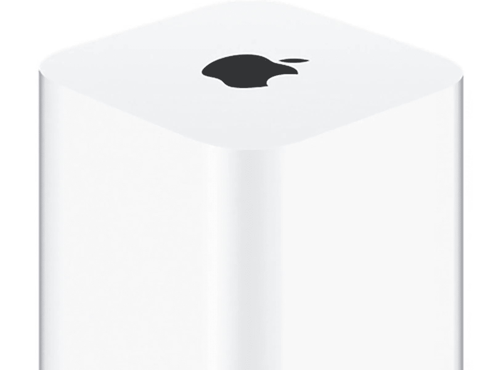
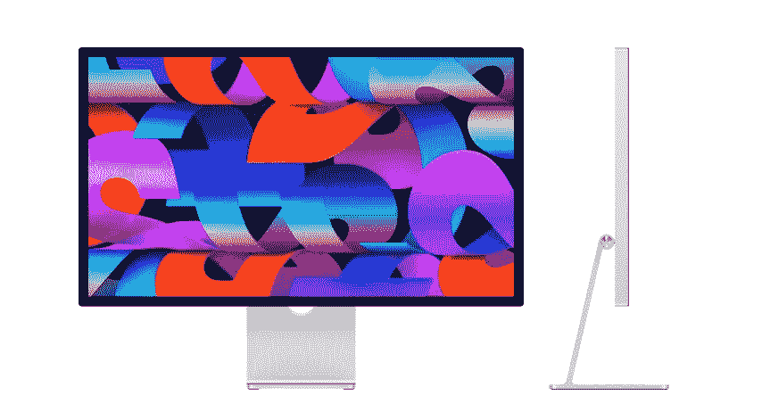
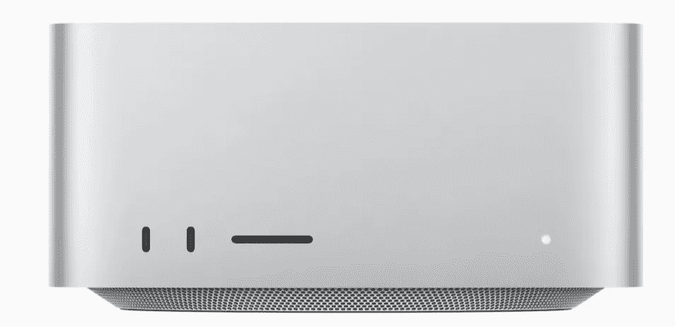

# 苹果公司将会推出什么产品？

> 原文：<https://medium.com/codex/whats-coming-down-the-apple-pipeline-cb95005e0563?source=collection_archive---------8----------------------->

## 今年有这么多传言，让我们看看营销计划

对苹果公司来说，特别是对 Mac 电脑来说，今年将是最忙碌的一年。每个推特、博客和记者都这么说。预计今年，Mac Pro 将过渡到苹果芯片的最后阶段，然后我们将开始下一个芯片，我们假设它将被称为 M2。但是，你和我，消费者实际上是一些决策的核心，你会发现。

 [## 为什么我们就不能满足呢？

### 苹果工作室的展示才刚刚开始两周，但我们似乎已经不满足了。

medium.com](/codex/why-cant-we-just-be-satisfied-f70e6490095b) 

## 苹果杀死了 iMac

嗯，算是吧。当苹果公司去年撤回 21.5 英寸的 iMac 时，王冠的直接继承者以内置 M1 的 24 英寸 iMac 的形式诞生了。然而，一年后，事情就有点不同了。27 英寸的 iMac 被迅速而简单地从苹果网站上撤下。在多年的忠诚服务和众多粉丝之后，它甚至没有得到最后一次欢呼的好机会。没有——一眨眼的功夫，它就不见了。然而这一次，没有明显的替代者。那么，苹果的计划是什么。我想如果我们仔细观察，我们也许能绘制出前方的道路。

 [## iPhone 怎么了？

### 在上周发布了另一款 iPhone 之后，让我们来看看今年晚些时候会有什么

medium.com](/codex/whats-up-with-iphone-307a15caac26) 

## 会吗，不会吗？

我最近写了一篇关于大型 iMac 的未来的文章，这篇博客绝不是对它的重复，而是着眼于整体的市场前景。关于 iMac 的巅峰表现，现场一片震耳欲聋的沉默。事实上，唯一提到的未来 Mac 是 Mac Pro。这是唯一被挑选出来作为下一台机器的机器。从历史上看，公司的文化一直受到衡量和关注，消费者通过销售，当然还有 this 和 Twitter 等平台告诉他们他们想要什么。数字对苹果来说很重要，在利润最大化方面，数字是一台运转良好的机器。

27 英寸的 iMac 消失得如此之快，几乎与他们的正常做法背道而驰。事实上，在过去的许多时候，该公司已经坚持了太长时间的模式，不再工作。想到的是 AirPort 和 HomePods 之类的路由器。他们鞭打他们到死，直到他们尴尬的明显不去工作。

关于大型 iMac 继任者的传言不会消失。供应链顾问公司的罗斯·杨几次改变了他的观点。去年，他报道了新款迷你 LED 27 英寸 iMac。然后，今年年初，他改变了立场，现在是一个迷你 LED 显示屏，目前又说 iMac 将会卷土重来，但要到明年。郭明志认为我们也将在 2023 年看到一个。但是彭博的马克·古尔曼和 9–5 Mac 的菲利普·埃斯波西托都认为大型 IMAC 的新时代的到来是一个遥远的愿景。

## 为什么会困惑？

因为苹果在考验我们。它就在那里，让我们看得见。iMac 消失了，但我们得到了一台配备全新 Studio 显示器的 iMac 显示器，新的“iMac 替代品”的核心是配备 M1 Pro 或 Ultra 芯片的 Mac Studio。这两款产品的基本配置价格为 3498 英镑，相当于一台像样的中端 iMac Pro 的价格。

我们看到的是聪明和精明。我们正在接受考验。如果低端 Mac Studio 卖得好，那就证明了高端消费者 Mac mini 的发布，当然还有苹果硅 M2。那个模型坐在那里等着发生。它几乎不需要原型。将这种模式推向市场可能会在眨眼之间发生。如果 Mac Studio/Studio 显示器的同步销售进展顺利，那么你猜怎么着，大型 iMac 也将很快与我们同在。

他们的营销方法涉及到了每一个方面。低端消费者用户有 Mac mini、iMac 24 英寸和 MacBook Air。中级用户拥有配备 M1 Pro 和 Studio 显示器的 Mac Studio。而且，似乎这还不够，我们预计今年还会为这些用户推出一款 13 英寸的 MacBook Pro，可以说是一款入门级的 MacBook。高端用户拥有内置 Ultra 芯片的 MacBook Pro 14 和 16 英寸或 Mac Studio。超高级的专业用户很快就会拥有最高规格的 Mac Studio 的*或*即将推出的 Mac Pro。

## 我们在控制中

所有未来的决策都将由…创造的数据引导。我们！苹果将查看他们目前提供的所有产品的销售情况，然后将船驶向美元符号的方向。苹果真的不在乎你买什么，有两个重要的告诫。第一，这不是微软，第二，这是苹果。你如何花你的苹果美元或英镑是不相关的，只要他们创造了一个机器来诱惑你。

随着他们现在回到显示器市场，我说的回来是指*买得起的*，他们把我们买进了生态系统，甚至进一步扩大了我们的支出。为什么？好吧，现在当他们发布你觉得你*需要*的下一款模块化台式机时，你已经有一台可爱的显示器坐在你的桌子上，只是渴望一个新的苹果输入。几乎会出现好像是便宜货！

我相信，M2 将会变得更加精彩。单核和多核功能都将变得更快，其衍生产品也将紧随其后，就像去年 M1 的基本版本一样。

## 幸运，我们是幸运的

无论出于什么原因，你碰巧成为了苹果的用户、粉丝或奴隶，这都是一个难忘的时刻，让你置身于铝包美人的掌握之中。我们正看到伟大的新机器的曙光，而我们却不知道，我们是控制者。苹果需要我们的数据，我指的不仅仅是钱。我们支出足迹的方向同样重要。

未来，我们的未来是光明的。*非常亮*。你怎么想呢?让我知道。

## 在你走之前

## *你订阅《灵媒》了吗？*

我只是高端博客网站 Medium 的众多作者之一。这是如此好的价值，你可以在这里加入 https://medium.com/membership

[**加入我的幕后邮件列表**](https://www.talkingtechandaudio.com)

**原载于 2022 年 3 月 24 日 https://www.talkingtechandaudio.com/blog******。****