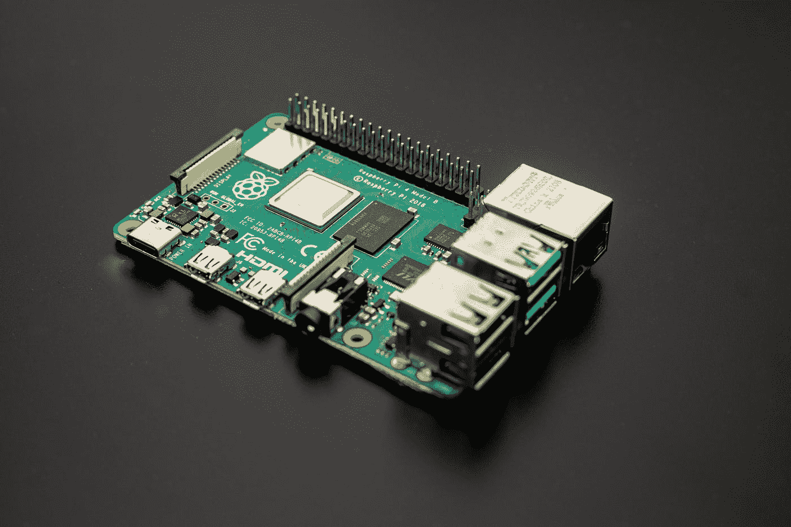

# Dapr 是什么，它如何帮助开发更好的微服务？

> 原文：<https://medium.com/codex/whats-dapr-and-how-can-it-help-to-develop-better-microservices-692775f41e2a?source=collection_archive---------6----------------------->

Jainath Ponnala 在 [Unsplash](https://unsplash.com?utm_source=medium&utm_medium=referral) 上拍摄的照片

软件系统的开发已经有了一个相当清晰的方向。它正在向云的方向发展，因此微服务变得越来越重要。对可伸缩性和效率的需求也伴随着这种发展。然而，开发人员应该主要关心业务逻辑，而不需要成为分布式…