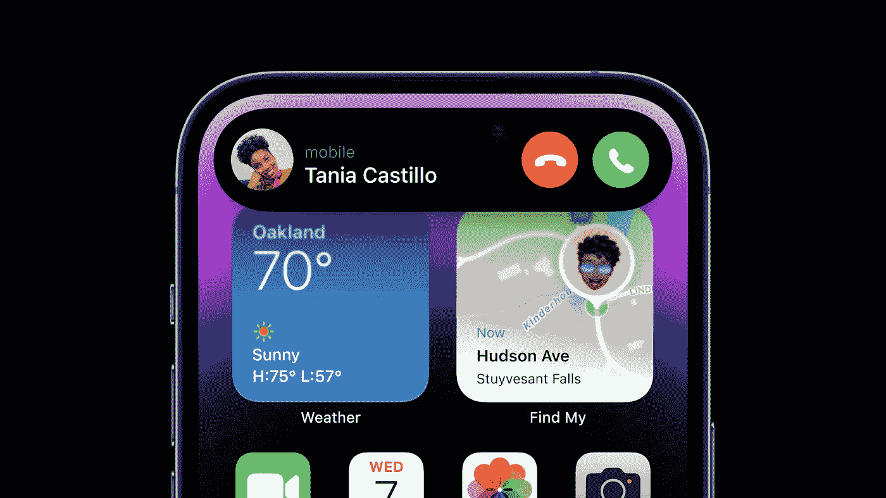

# iPhone 14 Pro 有什么「Pro」？

> 原文：<https://medium.com/codex/whats-pro-about-the-iphone-14-pro-adccb2ce4ff1?source=collection_archive---------3----------------------->

## 额外的功能更专业吗？

信用苹果

从 iPhone 11 开始，苹果给了我们两大家族的 iPhone:普通 iPhone 和 iPhone Pro。普通的 iPhone 是基本款，非常适合普通人。Pro 面向那些更有可能使用设备完成专业内容创作任务的人。