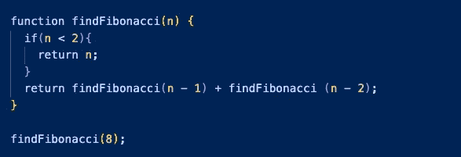

# 什么是大毒品管制局？

> 原文：<https://medium.com/codex/whats-the-big-o-dea-d058a3e2059e?source=collection_archive---------10----------------------->

## 大 O 符号的分解

照片由[像素](https://www.pexels.com/photo/2-women-sitting-on-brown-wooden-chair-4101137/?utm_content=attributionCopyText&utm_medium=referral&utm_source=pexels)的[皮克斯拜](https://www.pexels.com/@pixabay)拍摄

你好。今天，我将写关于大 O 符号的概念。想象一下，你遇到了一个编码挑战，你用你所知道的最好的方法解决了它！然后一个更有经验的程序员告诉你“那很好，但是很慢，你能让它更快吗？”我知道你在想什么…慢？他们错过了控制台显示的 3 ms 吗？嗯，有一些好消息，你可以让你的算法更快，我们将一点一点地分解它。我希望你不介意我一路上的双关语，我们走吧！

## **大 O 符号是什么？**

首先，作为程序员，我们想确保我们写的是好代码。好的代码应该是两件事，可读性和可伸缩性。我们将重点关注可伸缩性方面。大 O 符号是我们用来谈论一个算法需要运行多长时间的语言。作为程序员，我们可以比较算法和它们的可伸缩性，看哪种算法在算法处理的输入量方面更快。例如，您的算法可能以 0 ms 运行，输入 3 项…但是如果输入增加到 3，000 呢？它会跑得一样快，还是会慢下来？这就是“可伸缩”的含义。在下面的例子中，我将展示说明各种大 O 符号的代码片段。阅读完本文后，您将更好地理解如何使用大 O 符号作为工具来帮助您创建更具可伸缩性的算法。

## 示例:

**大 O 符号:O(1)**

函数 compressFirstBox 接受任何项目数组，我只希望将数组中的第一个项目记录到控制台。我通过使用它的索引来定位那个项目。这是我们第一个大 O 记号的例子: **O(1)** 。这个算法执行一个步骤，不管项目数组有多大(在这个例子中，数组是“盒子”)，它总是获取零索引。O(1)被翻译成**“常数时间”**，是所有符号中可伸缩性最好的一种。

**大 O 符号:O(n)**

现在，我们有一个名为 compressAllBoxes 的函数，它仍然接受一个项目数组。这次我们遍历整个数组，并将每个元素打印到控制台。您会注意到，我们不再只运行一个操作，而是五个，因为我们必须遍历数组五次才能获得所有元素。这是 **O(n)** 的大 O 记号。您可以将“n”视为需要处理的项目数。O(n)翻译成**【线性时间】**，随着“n”的增加，完成算法的时间也增加。如果我们的数组从 5 个元素增加到 10，000 个元素，这个算法将需要更长的时间来处理这 10，000 个元素。

**大 o 批注:O(n^ 2)**

对于下一个函数，我们将对元素进行压缩和配对，因此我们的输出应该是这样的:[(0，0)，(0，1)，(0，2)，(0，3)，(0，4)…等等]。为了做到这一点，我们创建了一个嵌套的 for 循环，这意味着我们使用了下一个大 o 符号**o(n^ 2)**；“n”仍然是需要处理的项目数。如果我们取 5 项，将其提升到 2 次方，这个函数运行 25 次，称为**“二次时间】**。二次时间对于可伸缩性来说是可怕的，因为它随着每个输入呈指数增长，但是在第一次尝试解决问题时，它可能是一个很好的“暴力”解决方案。想象一下，我们的元素数组从 5 项增加到 10 项，10 = 100 次计算…嗯，升级很快(双关语)。

**大 O 符号:O(log n)**

在下一个例子中，我们将讨论**对数时间**，也称为 **O(log n)** 符号。首先，你会注意到没有声明的基地。然而，在普通的微积分课上，你会看到以 10 为基数的对数。在计算机科学中，它最有可能总是以 2 为基数的*(*因为我们希望能够除以二而不是十分之一)；因此它是隐含的，没有显示在我们的大 O 符号中。当您进入更复杂的数据结构(如树)并开始执行二进制搜索和排序算法(我们将在以后详细讨论)时，您会更多地看到这种符号。但是现在，我们将检查上面创建的名为“ologn”的函数。

函数“ologn”将接受三个参数，并猜测用户在最小和最大值之间设置的数字。当调用该函数时，正确猜测的数字将是 75，范围将是 0–100。如果我们要使用 O(n)符号，我们就必须创建一个 for 循环，遍历每个元素，直到找到 guess_number。相反，我们将为每个操作将范围除以 2，并重置最小值和最大值，直到找到我们的 guess_number。这极大地缩短了我们的搜索时间，并减少了我们必须进行的总体操作量。O (log n)的时间复杂度几乎和我们的 O(1)一样快，这是相当惊人的，因为我们仍然在使用一个具有对数时间的循环，而不仅仅是针对一个特定的元素！

**大 O 符号:O(n log n)**

我们就要到了，我们已经为下一个符号做好了准备，**O(n log n)**；也称为**线性时间**时间。让我们快速检查一下这个函数。首先有两个循环:while 循环和 for 循环，也就是说这个记法是…O(n)。第二，我们的外循环在每次迭代中将原始输入减半，这意味着外循环采用 O(log n)行为。最后，我们的内部循环使用一个简单的 for 循环遍历整个原始输入，其运行时复杂度为 O(n)。所以，如果我们有 O(n)和 O(log n)这就产生了 O(n log n)。线性时间比 O(n)快，但比 O(n)慢，因为仍然存在嵌套循环。但是使这种符号强大的是仍然有 O(log n)因子，它将数据一分为二，这使得迭代次数成倍减少。例如，我们经常在合并排序算法中使用这种方法。我鼓励你真正挑出这些符号的模式，因为肯定有一个重复出现的主题可以找到！

**大 o 符号:O(2^ n)**

在下一个函数 findFibonacci 中，我们将覆盖我们的倒数第二个大 o 符号**o(2^ n)**；**指数时间**。时间复杂度随着每“n”次增加而呈指数增长，你只能想象这种算法会变得多么低效。如果可能，我们通常应该避免指数时间；然而，它经常在递归算法中使用(调用自身的函数，如上例所示)。这个例子实际上是一个非常流行的面试问题，所以如果你需要一个学习 O(2^的理由，这就是了！

在我们的函数调用中，我们希望接收斐波那契数列的指数，指数为 8，2^ 8 等于 21 次计算…如果我们将 n 改为等于 9，计算量将指数增加到 34 次。但是，您可以使用运行时复杂度为 O(n)的算法，而不是使用这种算法；作为开发人员，您可以选择这种方法是否必要。使用 O(2 ^n)和递归的两个好处是，它保持代码干燥和可读性，而不是几个可能有点混乱的 for 循环。但是如果你不想使用特定的大 O 符号，这可能是你的选择。

**大 O 批注:O(n！)**

就时间复杂度而言，我把最差的留到了最后。**的大 O 批注 O(n！)**以**阶乘时间**运行，这是所有记数法中最慢也是最陡的。说实话，如果你的算法是 O(n！)，你做错了。我们在野外不会看到太多这种符号，但知道它的存在是件好事。O(n！)基本上是为每个元素创建一个循环…呀，或者我应该说 O(不！).

## 最坏的情况

我喜欢认为我是一个乐观的人，你也可以这样认为。然而，作为一名程序员有时需要我们身兼数职，有时还包括一个“悲观”的角色。当我们创建算法时，我们需要考虑最糟糕的情况，并在此基础上优化我们的结果。假设我们有另一个数组…

我们想要得到“cupcake”的索引(从一个假想的甜点数组中)，如果“cupcake”在零索引处，这应该很容易；那是 O(1)的一个漂亮的 O 记号！然而，事情从来没有这么简单，“cupcake”实际上是一个包含 100 个条目的数组的最后一个索引。为了找到我们选择的糖果，我们从使用 O(1)到 O(n)。所以请记住，首先考虑最坏的情况。即使最坏的情况永远不会发生，我们构建的代码也能承受这些情况。

好了，这就结束了我们的大 O 符号之旅，我希望你已经发现它有用。大 O 符号在面试中是一个非常受欢迎的话题，如果你知道这些并且知道如何在你的代码中实现它们，你将会非常出色！它不仅在采访中被讨论，而且大 O 符号让我们更清楚地认识到我们创造了什么以及我们是如何创造的。我们可以智能地决定哪些数据结构最适合我们的项目——完全知道我们决策的时间复杂性。感谢阅读，更多关于数据结构的博客即将发布！！

💕👩🏾‍💻*快乐编码！*👩🏾‍💻💕

参考资料:

[掌握编码面试:数据结构和算法](https://www.udemy.com/home/my-courses/learning/)

[大 O 记数法系列#5: O(n log n)为初学者讲解](https://www.youtube.com/watch?v=K3NluEdHkao)