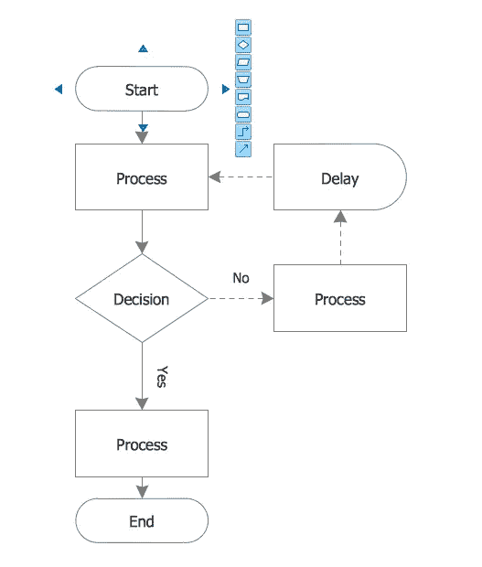

# 你的技术生涯流程图是怎样的？

> 原文：<https://medium.com/codex/whats-the-flowchart-of-your-tech-career-67b574769b4?source=collection_archive---------14----------------------->

照片想象职业生涯:从小到大

几个月前，当我在回忆自己作为一名软件开发人员取得了多少成就时，很多我无法回答的问题出现了，但重点是**“什么流程图指引了我的技术生涯？”**我沉思了几个小时，但显然我像正常人一样听之任之。后来，在同一周，我开始了一个项目，要求我设计一个流程图，这花了我很多时间来研究符号，草图的形式，包括所需的工具，然后这个问题再次出现在我的脑海中**“什么流程图指导了我的技术生涯？”**这一次，我无法放手，我不得不试着画出我的科技职业流程图，相信我，这一切都很糟糕，没有一点是直接的。

维基百科将流程图定义为**“算法的图解表示，解决任务的一步一步的方法”。它包括使用表示不同步骤/过程的形状，以及最重要的决策。流程图直接影响项目在解释编程语言中的算法的速度。**

如果你想获得速度和准确性，特别是由于这个行业的顽强性，在科技行业发展职业生涯需要一个现成的流程图。明确你的目标的能力完全取决于你对解决这个问题的准备程度。每天，我都会遇到这样的人，他们会说“我想编码”、“我想编程”、“我想拥有一个有很多屏幕的黑屏 IDE”以及一大堆其他短语，但通常我只会得到一个回答*“你对这一切的最终计划是什么？”突然，一个严厉的眼神出现了，然后我笑着让他们重新思考。设计和建造流程图的美妙之处在于，你每次都被小心地指引着要做什么，这正是你在这场技术之旅中无论是新手还是高级专业人士都需要做好的。没有人能一次做完所有的事情，而是根据之前的计划一点一点地做。*

`And the Lord answered me, and said, Write the vision, and make it plain upon the tables, that he may run that readeth it - Habakkuk 2:2`

作为一名开发人员或软件工程师，每个项目在完全实施之前都可以用流程图或伪代码来描述。这可能与科技行业有关，因为学习的每个阶段都描绘了一个项目；这意味着每个阶段都可以有一个流程图来指导它。基本流程图包括以下过程:

*   **开始:**在这里，你已经决定了你要做什么，收集了相关的材料，当然马上就开始。
*   **输入:这里:**是时候输入时间，学习，研究，最重要的是，提问。
*   **数据处理:**这里非常简单，但每个研究过的概念都要重新审视、处理，还要寻找更好的选项。
*   决策:决策过程相当棘手，因为在这里你要决定你想用获得的知识构建什么。
*   **过程调用(即定义的子过程):**在这一部分，根据决策步骤中决定的项目，你收集所有获得的知识，并开始将 a 和 b 放在一起。
*   这是最好的一步，因为你可以展示你用学到的知识做了些什么，尽管这可能会受到审查。
*   停止:在建筑行业，你并没有真正停止，因为只要达到世界级的标准，你就必须继续工作。

在遵循了所有步骤之后，你将足够大胆地学习一个更新的概念，这将有助于构建更好的项目，获得认证，当然在你的职业生涯中达到一个欣喜若狂的高度。你可能会从一个堆栈跳到另一个堆栈，直到你最终做出决定，但完成的美妙之处会激励你做两件事:

*   一致性
*   连续性

当你在思考这一切的时候，道路肯定不是一帆风顺的；它有弯道和坑坑洼洼，但你需要的就是能开过去。您必须参与以下活动，以最佳方式确保通过流程图模型达到您期望的峰值。

> 与足智多谋的人交往，尤其是在你的领域。亚马逊的 CEO 杰夫·贝索斯说过 ***“人生苦短，不应该和没有资源的人在一起”*** *。*
> 
> *做好犯错的准备，回头重做这一步。*
> 
> 总是重温基础知识，这样你就不会忘记每次该做什么。
> 
> 拥抱失败，因为那是延伸学习的途径。*谷歌 CEO 桑德尔·皮帅说 ***【把你的失败当作荣誉勋章】*** *。*

# 现在，“你职业生涯的流程图是什么？”

此时，你应该尝试回答这个大问题。这篇文章详细描述了软件流程图和推动成功的技术职业之间的关系，不管你在哪里。

*   花些时间想想你到底想做什么。
*   在纸上粗略地草拟一个计划。
*   根据现成的计划画出流程图
*   明智地遵循计划。
*   衡量你的进步，做更多的项目。
*   最后，观察你的速度。

`For the vision us yet for an appointed time, but at the end, it shall speak, and not lie: though it tarry, wait for it; because it will surely come, it will not tarry - Habakkuk 2:3`

总之，职业流程图的想法不仅仅对开发人员开放，也对其他职业开放，如设计、教育、研究、会计、个人研究、工程等等。永远记住，没有时间可以浪费，我们必须像《圣经》鼓励的那样，数着我们的日子，用心去获得智慧。