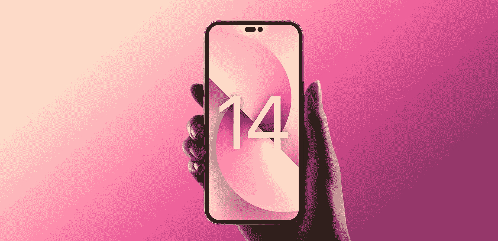
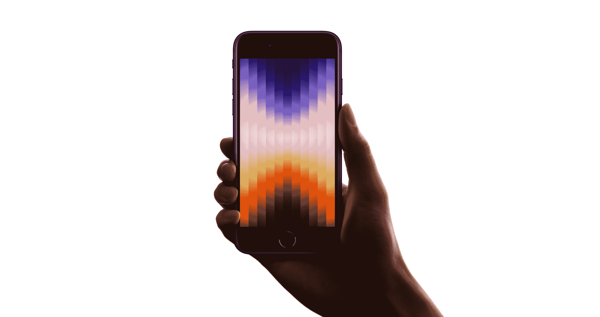
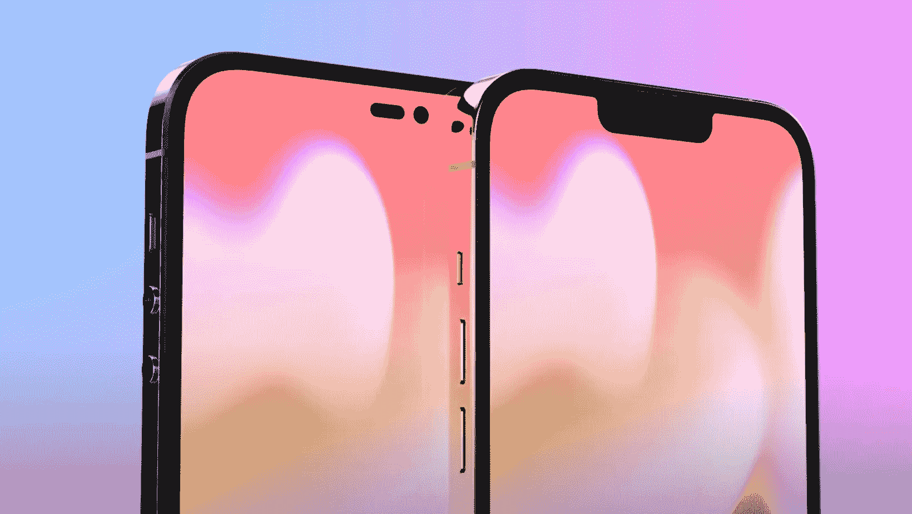
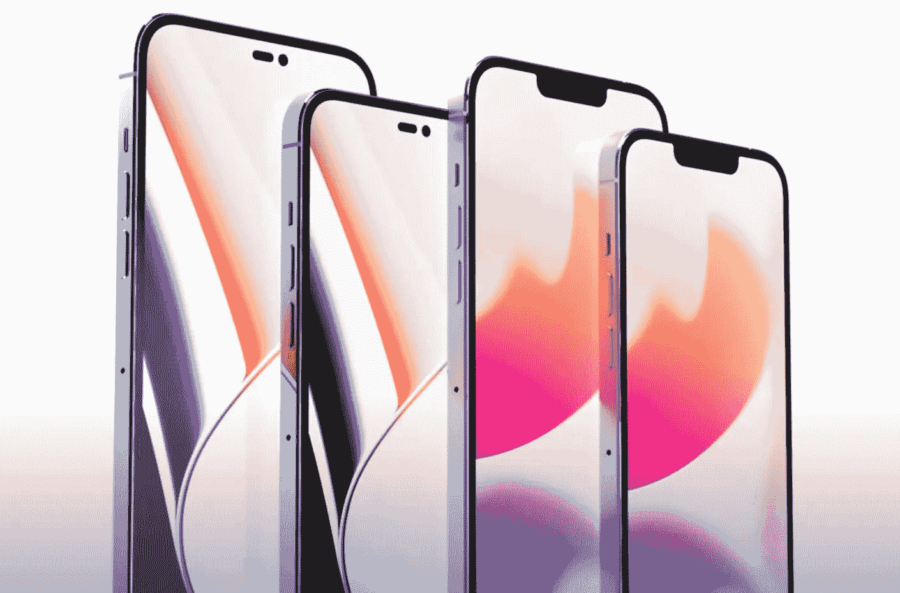
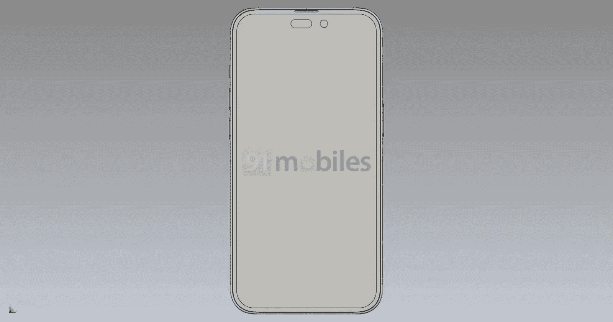
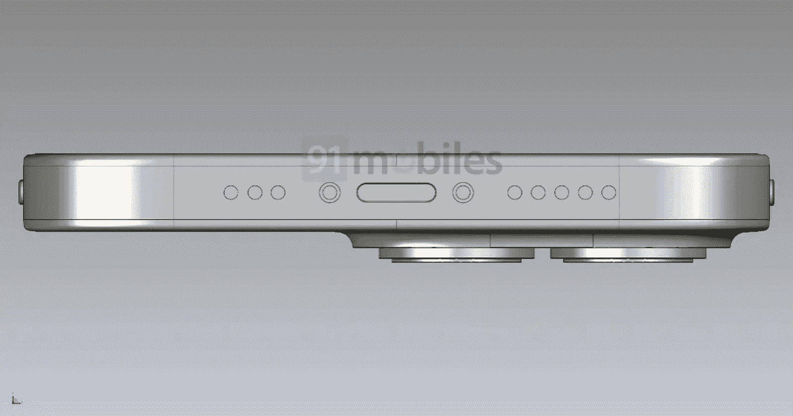
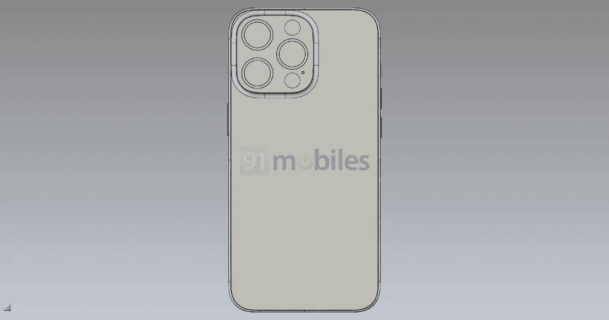
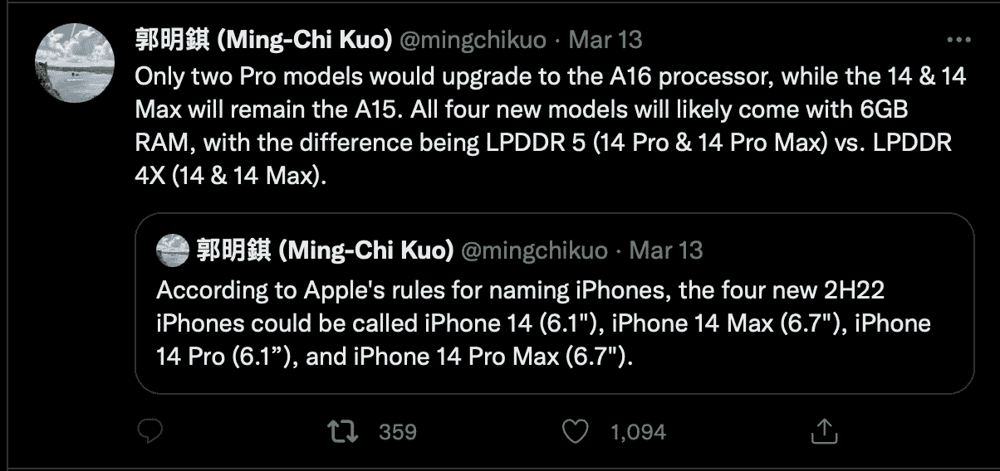

# iPhone 怎么了？

> 原文：<https://medium.com/codex/whats-up-with-iphone-307a15caac26?source=collection_archive---------4----------------------->

## 在上周发布了另一款 iPhone 之后，让我们来看看今年晚些时候会有什么

上周，在 Peek 性能活动上，发布了 iPhone 5SE。对于苹果来说，这是一款重要的手机。这是他们的入门手机，售价 419 英镑，据认为，这将为他们赢得许多安卓用户。基于带有 Home 键的 iPhone 8，外形很旧，但内部结构很强。

## iPhone 5SE

SE 据称代表特别版，但如果它被称为*简单版*会更贴切。它将做你想要手机做的一切，但没有你可能已经习惯的铃声和口哨声。它拥有该价位手机中最快的芯片，现在内置 A15 仿生芯片。与当前 iPhone 13 和 13 Pros 系列中的芯片完全相同。坦率地说，相机实际上很不错。同样，作为一款低端手机，它没有夜间模式或 2x 按钮，只有一个后置摄像头。但是，它有一个 4.7 英寸的视网膜高清显示屏，具有真实的色调，奇妙的触觉，甚至还有基本的 5G 功能。摄像机在这个价位上也是一流的。它是针对某一类用户的，对他们来说，它拥有他们想要或需要的所有功能。

因此，5SE 将会非常出色地完成它的工作，并且在市场上巧妙地占据了一个合适的位置，这是苹果公司近期不想放弃的。

*但是，今年激动人心的手机发布还没有发生。iPhone 14。*

 [## iPad 丢了吗？

### 有这么多可选择的，真不知道该挑哪一个

medium.com](/codex/is-ipad-lost-31e14f61c1d6) 

## iPhone 14 和我们所知道的

手机事件本身，可能还有大约六个月的时间，但从备受尊重的消息来源来看，我们似乎已经有了一个公平的想法，我们可以期待什么，好的，坏的&丑陋的。

目前，14 款手机的研发代号为 D27、D28，而专业版手机的研发代号为 D73 和 D74，我们预计今年的产品线中只有四款手机。我们会有 iPhone 14 和 14 Pro，然后是 14 Max 和 14 Pro Max。你可能已经注意到，那里完全没有提到迷你。没错，如果你是喜爱 iPhone 13 Mini 的狂热粉丝之一，那么你最好赶快购买，因为 13 将是苹果售出的最后一款 Mini。人们已经用他们的信用卡投了票，他们只是不喜欢他们，所以再见！

## 显示

今年将只有两种尺寸的屏幕。6.1 英寸和 6.7 英寸的屏幕。这些显示屏将与普通 14 手机上的当前手机尺寸相同，但在专业手机上要高一些。这样做的原因是为了适应在显示器顶部谈论很多的凹口和药丸设计布局。

两款手机之间的一些变化之一将在手机正面清晰可见。许多传言表明，由于没有凹口，新的孔将用于 Face ID 投影仪，而药丸形状的切口显然将用于容纳前置摄像头和 Face ID 红外摄像头。扬声器格栅将保持嵌入顶部挡板。说到挡板，最新的渲染建议 t go 它们可以更薄，甚至更不明显。

这两个常规的 14 将坚持与我们现在有相同的缺口。缺口和药丸是严格的最大手机。

 [## 我们看到了最后一台大型 iMac 了吗？

### 这些伟大的机器现在已经成为历史了吗？

medium.com](/codex/have-we-seen-the-last-of-the-big-imacs-5d63bb4bf839) 

## 摄像头碰撞

去年九月，*乔恩·普罗瑟*曾报道今年的 14 度会更深。这将有利于更大的电池，也意味着背面的摄像头凸起不再突出。然而，根据这里显示的最新 CAD 文件，它会建议不再是这种情况。现在看来，这款设备看起来与 iPhone 13 Pro 没有太大变化，三镜头阵列位于从机箱伸出的摄像头凸起中。

## 炸薯条

本周有传言称，今年在 14 款 iPhones 中，这两种芯片有明显的区别。

这是近十年来第一次，两种不同的芯片可以用于 14 和 14 Pro，而不是 14 Max 和 Max Pro。上一次我们看到在同一年发布的 iPhone 中使用两种芯片是在 iPhone 5S 和 5C 上——一种采用 A6 芯片组，另一种采用 A7 芯片组。

如果消息来源是可信的，那么标准的 14s 将与目前的 A15 仿生芯片保持不变。只有 Max 手机才会有最新的芯片。然而，在这一点上，值得注意的是，先例确实存在。苹果目前有两个不同版本的 A15 芯片，其中一个有额外的 GPU 核心和 6 GB 的 RAM，用于 13 款 Pro 机型。所有*今年*的 iPhone 都将有 6 GB 内存，这意味着苹果可以在入门级 iPhone 14 型号中使用其 A15 仿生芯片的高端版本。有理由认为该公司可能会把这种芯片称为 A15X。早在 2020 年，他们就在 iPad 上这样做过，当时他们把平板电脑中的芯片称为 A12Z。苹果在 Apple Watch Series 7 上也做到了这一点。这款手表的 CPU 与 Apple Watch Series 6 相同，但由于内部 SOC 略有改动，芯片命名为 Apple S6 和 Apple S7。

相信这些建议的人包括马克·古尔曼和 T2。至于苹果改变方向背后的真正文化，原因其实并不清楚。有人可能会说，这是由于持续的芯片短缺，*或*，如果你是一个更邪恶的想法，这家加州公司只是想赚更多的钱！不过，通过走这条路线，有一件事似乎是肯定的，那就是我们将首次看到一款 6.7 英寸的大手机售价低于 1000 英镑。它的价格可能在 800 英镑左右，这对我们消费者来说是个好消息。

## 卫星谣言

你可能还记得，去年，就在秋季 iPhone 发布会之前，有报道称苹果一直在为即将推出的 iPhone 型号开发卫星通信功能。直到现在，那些谣言已经不了了之。9–5 Mac 报道称，苹果仍在致力于 iPhone 的卫星通信，但目前尚不清楚这项技术是否能在今年秋季的手机活动中及时开发出来。

在内部，鉴于代号为“Stewie”，这项卫星创新最终将意味着 iPhone 能够在没有数据或 GPS 可用的情况下通过卫星发送短信。

所以，这就是我到目前为止听到的所有谣言和传言。那你呢？你听到我错过了什么吗？你对今年晚些时候的 iPhone 14 有什么期待？

## 免费壁纸

最后，如果你想为你的 iPhone 设计一些可爱的新壁纸，直接取自我们之前提到的手机 5SE，那么就给你吧！从这个链接获取它们。我在我的 Mac 电脑和手机上安装了这些软件，它们看起来非常壮观！[https://www . Dropbox . com/sh/yqzxzli 2 hvg 9 rjs/aabsbt 5 jey 3 df 6 ohy 5 o 7 f-BGA？dl=0](https://www.dropbox.com/sh/yqzxzli2hvg9rjs/AABsBT5jEY3Df6OHy5O7f-bga?dl=0)

## 在你走之前

## 你订阅媒体了吗？

我只是高端博客网站 Medium 的众多作者之一。这是如此好的价值，你可以在这里加入[https://medium.com/membership](https://medium.com/membership)

[**加入我的幕后邮件列表**](https://www.talkingtechandaudio.com)

**原载于 2022 年 3 月 16 日**[**https://www.talkingtechandaudio.com/blog**](https://www.talkingtechandaudio.com/blog)**。**