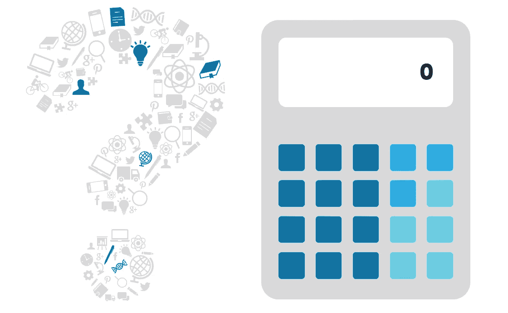

# 这个代码有什么问题？

> 原文：<https://medium.com/codex/whats-wrong-with-this-code-9c03d26bdb0e?source=collection_archive---------8----------------------->

## 每个工程师最喜欢的游戏节目时间到了

该玩每个工程师最爱的游戏节目了，*这个代码*怎么了？今天的节目是由 Java 语言带给你的。

考虑在餐馆使用的销售点终端，顾客在这里输入小费金额。后端服务接受用户输入的小费金额字符串，并…