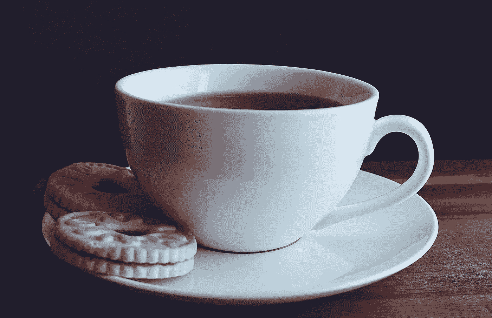

# 想喝点什么——软件工程中的桌面饮料指南

> 原文：<https://medium.com/codex/whats-your-poison-a-guide-to-desktop-drinks-in-software-engineering-f888a6f360b3?source=collection_archive---------14----------------------->

刻板印象的存在是有原因的，没有什么比在计算世界里更强烈的了，在那里你白天的饮酒真的可以定义你。

照片由来自 [Pexels](https://www.pexels.com/photo/close-up-photography-of-cup-of-coffee-near-biscuits-1143760/?utm_content=attributionCopyText&utm_medium=referral&utm_source=pexels) 的苏西·黑兹尔伍德[拍摄](https://www.pexels.com/@suzyhazelwood?utm_content=attributionCopyText&utm_medium=referral&utm_source=pexels)

# 工人们，清理你们的杯子

让我们弄清楚，我不会谈论酒精饮料，因为那真的是一个完全不同的[锅鱼](https://idioms.thefreedictionary.com/kettle+of+fish) …