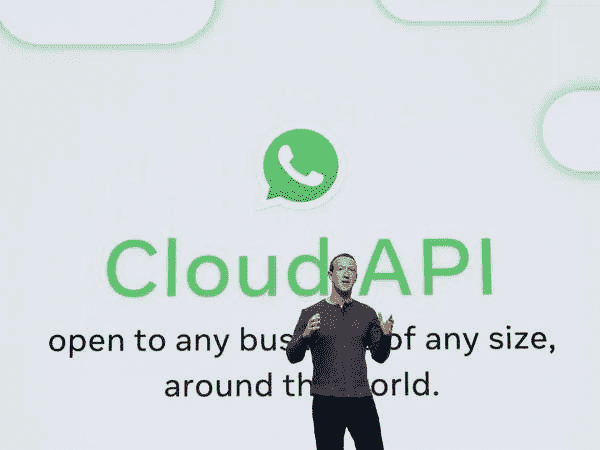
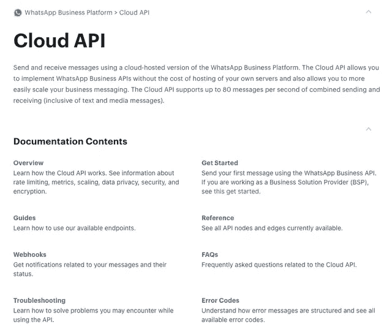
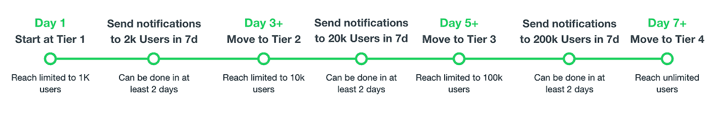

# Whatsapp 商业云 API 来了。这是什么意思？

> 原文：<https://medium.com/codex/whatsapp-business-cloud-api-is-here-what-does-it-mean-bfb5239895d5?source=collection_archive---------14----------------------->

## *先睹为快新公布的 Whatsapp 商业云 API。这对企业意味着什么。*

> *今天，我很兴奋地宣布，我们将通过 WhatsApp Cloud API 向全球任何规模的企业开放 WhatsApp。
> ~马克·祖克伯格在 2022 年 5 月 19 日 Meta 的对话主题演讲中*

这是一个令人愉快的惊喜，Whatsapp Business API 自 2018 年 8 月以来一直存在。然而，它只对几百个服务提供商开放。这意味着使用该服务的企业必须与服务提供商合作。然而，这项功能引发了一场风暴，许多企业——尤其是规模较大的企业——能够利用另一个渠道进行销售和客户服务——Whatsapp。

# Whatsapp 商业 API 是什么？

Whatsapp Business API 是由 Meta(前脸书)提供的工具，Meta 拥有 Whatsapp，允许企业在 WhatsApp 上与客户互动。企业可以:

*   主动与客户对话，如营销内容、发送销售发票等
*   与客户信息互动，例如通过 WhatsApp 销售，通过 WhatsApp 提供客户服务等

用户将在手机上使用他的 WhatsApp 应用程序，而企业将通过编程来响应这些应用程序，即通过编写程序来处理消息。这为企业提供了一个机会:

*   使用一个号码，通过许多客户服务代理可能使用的应用程序与客户互动。
*   通过机器人自动回复。
*   通过机器人实现销售流程自动化。

如前所述，Whatsapp Business API 并没有直接面向商业开放。访问权限仅限于数百家 Meta 服务合作伙伴，如 Twilio。企业必须从他们那里购买产品并使用。

# 有什么变化？

重要的变化是 API 现在可以直接用于业务。企业可以利用 Meta 自己托管的新 API 来构建新的应用程序。这将有助于为每个企业带来更好的定制解决方案。如果你有一个能够从头开始编写应用程序的技术团队，这也将是经济有效的。

# 这是免费的吗？

是，也不是。Whatsapp 商业云 API 提供大量免费使用。除此之外，你必须使用信用卡支付。自由层限制如下。

*   在 24 小时的信息窗口内，对客户发起的无限制对话做出响应。
*   在连续 24 小时内，通过每个电话号码向 50 个不同的客户发送业务对话。
*   最多注册 2 个电话号码。
*   您的企业每月进行的前 1000 次对话是免费的。这些对话可以是用户发起的，也可以是业务发起的。如果您超过每月 1000 次对话的免费等级，则每次对话将向您收取[费用](https://www.facebook.com/business/help/2225184664363779)。

您可以通过在 meta business 上验证您的业务来提高您的限额。

# 从哪里开始？

*   如果你还没有元商业帐户，你应该先建立一个。然后在其中启动一个应用程序，并选择 Whatsapp Business
*   有一个干净的电话号码。干净的意思是，它没有被 WhatsApp 阻止，也没有任何 WhatsApp 个人或商业账户。如果该号码已经在手机上作为个人或商业帐户使用，那么您必须删除该帐户。
*   遵循 Meta 提供的文档:[https://developers . Facebook . com/docs/whatsapp/cloud-API/overview](https://developers.facebook.com/docs/whatsapp/cloud-api/overview)
*   四处游玩，发现事物，构建基于 app 或终端的解决方案。

祝你探索新工具好运。