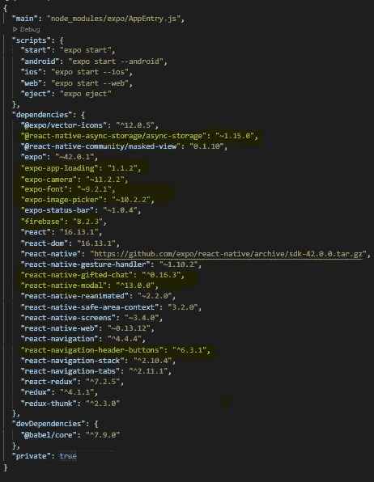

# WhatsApp 克隆版 React Native —第 1 部分

> 原文：<https://medium.com/codex/whatsapp-clone-react-native-part1-8054ba362884?source=collection_archive---------1----------------------->

使用 react-native (Expo)和 FireBase 制作的无与伦比的 WhatsApp 克隆版


由 [AARN GIRI](https://unsplash.com/@_giri_) 上 [Unsplash](https://unsplash.com/)

怎么了伙计们！首先很抱歉这么晚才摆姿势，现在我保证会更频繁地发布更多的项目。那么，你看过标题了，对吗？首先，让我向你介绍一下克隆和它的特性，然后我们当然可以看看如何构建它

# 注意

查看该项目的[部分 2](/codex/whatsapp-clone-react-native-part2-286a3279bb04) 。此外，如果你想检查 [Github 代码](https://github.com/harsh317/WhatsApp-Clone-React-Native) **直到 Part2 only** 检查[这里](https://github.com/harsh317/WhatsApp-Clone-React-Native)。另外，[试试最后的应用程序](https://expo.dev/@harshvardhanjain/Whatsapp-Clone-React-Native)，如果发现问题，一定要告诉我。

# 我们要建什么

这个项目的主要目的是在没有 firebase mobile SDK 的帮助下，仅通过 HTTP 请求使用 firebase 实时数据库来实现以下概念(为了使用最少的包):

1.  注册
2.  自动登录
3.  注销
4.  自动注销
5.  签约雇用
6.  与其他用户私聊(废话)
7.  轮廓屏幕
8.  实现所有 Imp 主题，如 React-Navigation、Redux、Redux-Thunk、Firebase 等

# 几个音符

有趣吧？*。在这篇文章中，我将只谈论 firebase 结构和我们在这个项目中使用的所有模块。这将是一个 2 部分的项目，其中第二部分将是所有的代码及其解释。我个人更喜欢使用 Visual Studio 代码，但是你也可以使用你选择的任何 IDE。下面是我们的应用程序的 firebase 结构*

# 火基结构

```
{
  "Users": {
    "-Mmk7JylgX2SMdkXt8hq": {
      "UserId": "U3n9RMAbFpZUEE0v2UM1niDKRw22",
      "description": "Just testing while making",
      "name": "Developer",
      "profileImageUrl": "[https://firebasestorage.googleapis.com/v0/b/{MyProject}.appspot.com/o/UserProfile%2F1635042532659?alt=media&token=46f2a93a-8700-4cac-b869-26e2e6c5cff6](https://firebasestorage.googleapis.com/v0/b/MyProject.appspot.com/o/UserProfile%2F1635042532659?alt=media&token=46f2a93a-8700-4cac-b869-26e2e6c5cff6)"
    },
    "-Mmkfa6uUFtzkfIyF0l-": {
      "UserId": "HUCgN6jpjwYDY9CwBNesd8w0ztu2",
      "description": "Fake user hehe hitting people ",
      "name": "Sapna Jain",
      "profileImageUrl": "[https://firebasestorage.googleapis.com/v0/b/{MyProject}.appspot.com/o/UserProfile%2165051780881?alt=media&token=7dec06a0-9191-4178-95f4-cbb0e5db27dc](https://firebasestorage.googleapis.com/v0/b/MyProject.appspot.com/o/UserProfile%2165051780881?alt=media&token=7dec06a0-9191-4178-95f4-cbb0e5db27dc)"
    }
  },
  "ChatRooms": {
    "HUCgN6jpjwYDY9CwBNesd8w0ztu2|U3n9RMAbFpZUEE0v2UM1niDKRw22": {
      "Chats": {
        "LeCadTFGGAWpFRKgDrSx": {
          "_id": "U3n9RMAbFpZUEE0v2UM1niDKRw22",
          "createdAt": "October 24, 2021 at 1:42:44",
          "sentBy": "U3n9RMAbFpZUEE0v2UM1niDKRw22",
          "sentTo": "HUCgN6jpjwYDY9CwBNesd8w0ztu2",
          "text": "Helo Sapna Jain",
          "user": {
            "_id": "U3n9RMAbFpZUEE0v2UM1niDKRw22",
            "avatar": "[https://firebasestorage.googleapis.com/v0/b/{](https://firebasestorage.googleapis.com/v0/b/whatsapp-clone-react-nat-cfe33.appspot.com/o/UserProfile%2F1635042532659?alt=media&token=46f2a93a-8700-4cac-b869-26e2e6c5cff6)[MyProject](https://firebasestorage.googleapis.com/v0/b/MyProject.appspot.com/o/UserProfile%2F1635042532659?alt=media&token=46f2a93a-8700-4cac-b869-26e2e6c5cff6)}[.appspot.com/o/UserProfile%2F1635042532659?alt=media&token=46f2a93a-8700-4cac-b869-26e2e6c5cff6](https://firebasestorage.googleapis.com/v0/b/whatsapp-clone-react-nat-cfe33.appspot.com/o/UserProfile%2F1635042532659?alt=media&token=46f2a93a-8700-4cac-b869-26e2e6c5cff6)",
            "name": "Developer"
          }
        }
      }
    }
  }
}
```

这是我们的基本 Firebase 格式，将有助于你理解这个项目。我可以找到一种方法来实现使用 HTTP 请求在 Firebase 存储中存储图像。为此，我使用了 firebase mobile SDK(我试图将图像转换为 base-64，但这使得数据库太慢了)

# 初始化我们的项目

首先，让我们快速从 Expo 应用程序开始。我将使用“Expo CLI ”,但使用任何你想使用的东西完全是你的选择。

```
npm install --global expo-cli
```

现在，让我们通过以下方式初始化我们的项目并运行开发服务器:

```
expo WhatsApp-Clone-React-Native #Choosing blank template
cd WhatsApp-Clone-React-Native
code . # Open VsCode (Optional)
expo start # or npm start
```

这样，我们就可以安装我们需要的包了

# 主包安装

*   [**反应-导航**](https://reactnavigation.org/docs/4.x/getting-started)

顾名思义，react-navigation 用于原生应用中的路由和导航。保持这篇文章简短，让我们只安装`React-Navigation`和它的核心实用程序。

```
npm install react-navigation
```

> React Navigation 由一些核心工具组成，导航器使用这些工具在应用程序中创建导航结构。现在不要太担心这个，很快就会清楚的！
> ~来自文档

```
expo install react-native-gesture-handler react-native-reanimated react-native-screens react-native-safe-area-context [@react](http://twitter.com/react)-native-community/masked-view
```

所有这些东西都来自于医生，我不会解释太多，因为我假设你知道所有这些东西。所以，现在让我们安装`StackNavigator`和我们的`TabNavigator`

*   [**堆栈导航**](https://reactnavigation.org/docs/4.x/stack-navigator)

堆栈导航是任何应用程序(web 或移动)中最基本和最常见的导航形式。其工作原理是，它的屏幕是在一个堆栈上管理的。当你打开一个屏幕时，这个屏幕将被推到栈顶。当你打开或离开屏幕时，它弹出或推动屏幕，只有顶部的屏幕是可见的。所以，这很简单，让我们现在安装它

```
npm install --save react-navigation-stack
```

*   [**物料顶部标签导航器**](https://reactnavigation.org/docs/4.x/material-top-tab-navigator)

`MaterialTopTabNanvigator`用于在屏幕顶部添加标签，并允许我们使用位于屏幕顶部的标签栏选择不同的屏幕。我们将把我们的 TabNavigator 放在一个主`Stack Navigator`中，这个主【】进一步放在一个`SwitchNavigator`中，用于我们稍后将讨论的 Auth 工作。现在，让我们安装它

```
npm install react-navigation-tabs
```

*   **Redux 和 Redux-Thunk**

*Redux*

```
npm i --save redux
```

*React-Redux*基本上，这个库充当 React 和 Redux 之间的绑定器。它提供了各种 react 挂钩，允许我们的组件从 redux 存储中调度(useDispatch)和读取数据(UseSelector)。

```
npm i --save react-redux
```

*Redux-Thunk*我们通常在我们的动作创建器中返回一个动作，但是使用 Redux-Thunk 作为一个[中间件](https://www.metaltoad.com/blog/overview-redux-middleware-react-applications)我们可以将函数返回给它，该函数将商店的分派方法作为参数，并且随后用于在任何异步代码之后分派动作，例如进行 API 调用或任何其他需要一些时间的事情。现在，让我们安装它:

```
npm install --save redux-thunk
```

*   [**反应-原生-矢量-图标**](https://docs.expo.dev/guides/icons/)

不需要告诉我们为什么需要这个包。是的，当然，我们需要它在我们的应用程序中有图标。默认情况下会安装此库，但如果没有安装，您可以通过以下方式安装:

```
expo install @expo/vector-icons
```

# 安装其他软件包

好了，上面我们已经安装了我们需要的所有主要软件包，但是现在让我们也安装我们需要的其他软件包。我不会解释下面的每个包，而是把我的`package.json`和它们的文档一起粘贴在下面，你可以在那里安装它们。



正如我所说，我找不到一种方法来实现使用 HTTP 请求在 Firebase 存储中存储图像。所以，如果你找到了一个使用`fetch()`的方法，请回复。您需要安装上面用黄色突出显示的*软件包。请参见下面的文档链接来安装和了解它们:*

1.  ***AsyncStorage(用于 app 重启离线时存储数据)* 【https://docs.expo.dev/versions/latest/sdk/async-storage/】**
2.  ***应用加载(用于显示闪屏，直到应用加载字体)*** [https://docs.expo.dev/versions/v43.0.0/sdk/app-loading/](https://docs.expo.dev/versions/v43.0.0/sdk/app-loading/)
3.  ***摄像头(用于获取摄像头权限)*** [https://docs.expo.dev/versions/v43.0.0/sdk/camera/](https://docs.expo.dev/versions/v43.0.0/sdk/camera/)
4.  ***【世博字体】* 【https://docs.expo.dev/versions/latest/sdk/font/】**
5.  ***【世博拾音器】(用于访问或点击照片)*** [https://docs.expo.dev/versions/v43.0.0/sdk/imagepicker/](https://docs.expo.dev/versions/v43.0.0/sdk/imagepicker/)
6.  ***Firebase(赋予多种 Firebase 功能)*** [https://docs.expo.dev/guides/using-firebase/](https://docs.expo.dev/guides/using-firebase/)
7.  ***React-Native-Gifted-Chat(内置*聊天 UI 设计，用于在应用中实现聊天功能*)*** 【https://github.com/FaridSafi/react-native-gifted-chat】T21
8.  ***React-native-Modal(用于显示情态动词但也可以使用 React-native 中内置的一个)*** [https://www.npmjs.com/package/react-native-modal](https://www.npmjs.com/package/react-native-modal)
9.  ***React-navigation-header-buttons(用于在我们的导航栏中呈现按钮，没有任何样式和对齐问题)*** [https://www . NPM js . com/package/React-navigation-header-buttons](https://www.npmjs.com/package/react-navigation-header-buttons)
    注意:我使用的是这个包的 vs6

至此，我们已经完全初始化了我们的项目，并且安装了所有的包。在下一部分，我们将从代码开始，实现所有的功能，并完成我们的应用程序。不用担心，在下一部分会有单独的视频来实现所有的事情。

如果你对这个克隆感到兴奋，并准备制作自己的 WhatsApp，那么不要忘记鼓掌并给出你的反馈。

在那之前保持安全，保持健康

# 谢谢你