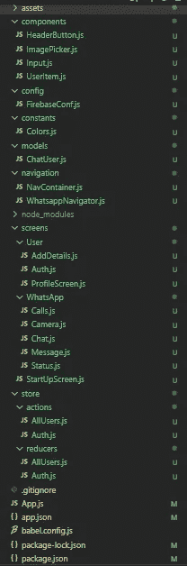
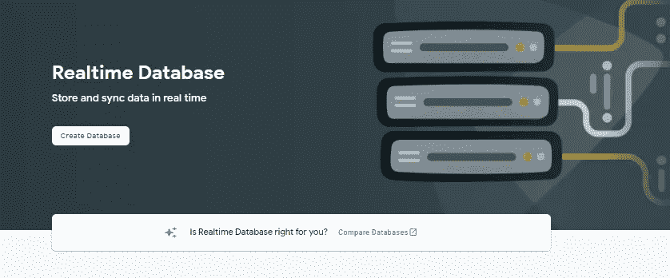
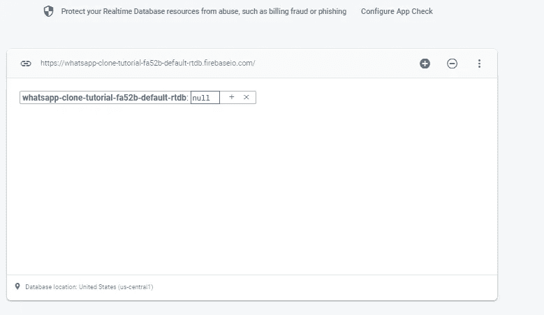
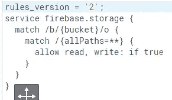
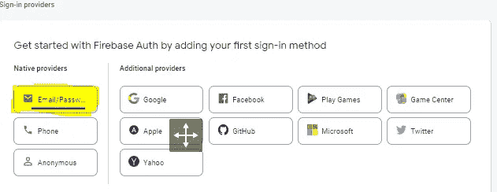

# WhatsApp 克隆版 React Native —第二部分

> 原文：<https://medium.com/codex/whatsapp-clone-react-native-part2-286a3279bb04?source=collection_archive---------0----------------------->

使用 react-native (Expo)和 FireBase 制作的无与伦比的 WhatsApp 克隆版

通过 [AARN GIRI](https://unsplash.com/@_giri_) 上[的 Unsplash](https://unsplash.com/)

在[之前的部分(第 1 部分)](/codex/whatsapp-clone-react-native-part1-8054ba362884)中，我们安装了我们需要的所有包，并且检查了 firebase 的结构，如果你没有任何疑问的话。现在，让我们从真正的工作开始👨‍💻👨‍💻

首先，让我们看看应用程序的文件结构，然后我们可以从导航开始，并借助视频休息。

# 文件结构

这将是我们的应用程序的最终文件结构，你可能会对一些文件有一些疑问，但一旦我们开始构建，这些就会变得更加清晰。导航中的`NavContainer.js`文件和屏幕文件夹中的`StartUpScreen.js`文件将在以后被用来实现自动登录/注销功能。其余的文件是清楚的，我想，但这些将很快成为任何疑问。如果对代码有任何疑问，请检查 [Github 链接](#4afa)

# 添加字体

首先，在进一步讨论之前，让我们给应用程序添加字体。然后，我们可以在应用程序中添加导航功能。如果您有任何疑问，请查看该项目的[第 1 部分(模块安装)](/codex/whatsapp-clone-react-native-part1-8054ba362884#6eaf)，我在那里详细解释了所有这些事情

 [## 字体- Google Drive

### 在这里下载字体](https://drive.google.com/drive/folders/1wADl1_QIpVzQ72JNKkrdVm0yJUpLjCtW?usp=sharing) 

向我们的应用程序添加字体

# 添加导航

这样，我们就可以为应用程序添加导航了。因此，创建一个 header 和 Toptabnaviagator，就像在 WhatsApp 中一样。

如果你对`AppLoading`或`HeaderButtons`有任何疑问，你可以查看我的[Youtube-Clone-React-Native-part 1](/codex/full-stack-youtube-clone-using-react-native-part-1-12fd7ed771e2)，我在那里详细解释了所有这些事情。

# 致力于认证

现在，让我们继续进行认证工作，为此，我们还需要添加 redux。所以，现在让我们添加两者+我们还需要添加 firebase。所以，这会很长。让我们开始吧

## 移至授权屏幕(切换导航器)

在开始之前，让我们在应用程序中添加一个切换导航器。什么是`SwitchNavigator`？

SwitchNavigator 主要用于向我们的应用程序添加身份验证功能。基本上，它将路由重置为默认状态，剥夺了我们的备份功能。这就是我们想要的。如果用户没有登录，我们希望用户导航到授权屏幕，而不要让用户返回主屏幕。

所以，让我们稍微修改一下我们的`WhatsAppNavigator.js`屏幕，下面是整个文件的代码:

## 创建和初始化 Firebase 项目

首先，快速进入 [Firebase 控制台](https://console.firebase.google.com/)，点击添加项目/创建项目。给出项目名称→接受条件→禁用/启用 Google Analytics →创建项目

***添加实时数据库*** 我将为这个应用程序使用实时数据库，但使用 fireStore 数据库或实时数据库是你的选择。

在[https://console . firebase . Google . com/u/0/project/{ project name }/Database](https://console.firebase.google.com/u/0/project/whatsapp-clone-tutorial-fa52b/database)上打开上面的页面，点击创建数据库。指定数据库位置并**现在以测试模式启动它*。***

这样，我们的 firebase 应该看起来像这样，带有默认的测试规则，我们将在后面更改:

***添加 Firebase 存储***

现在只需点击存储选项卡和侧栏，然后点击*开始。*

燃料库

现在，按“下一步”→“完成”。我们还需要更改我们的安全规则，因为默认规则只允许在用户通过身份验证时发出请求，但是在我们的示例中，用户在注册时将使用存储。他/她是⁂！已认证。因此，将规则更改如下:

存储规则

***添加认证***

现在，类似地，点击侧边栏中的认证选项卡，点击*开始，*并在“登录方法”中选择电子邮件/密码

选择电子邮件/密码

点击启用，我不会启用“电子邮件链接”开关，但这完全是你的选择。当然，那时的代码会有所不同。

## 添加 Redux

同样，如果你对 Redux、Redux Thunk 等有任何疑问，可以看看这个项目的 [Part1(模块安装)](/codex/whatsapp-clone-react-native-part1-8054ba362884#6eaf)。

## 实现整个身份验证逻辑

让我们继续讨论主要的认证逻辑，我们将看看 Redux action creators、Redux Thunk、Firebase，当然也测试我们的设计技能。为了保持视频简短，我将*粘贴我的`authentication`、`Input`组件屏幕以及`AddDetails`屏幕的内容*，它们都很长。其余的我们将在视频中自己创建。下面是我将粘贴在视频中的 3 个文件。

 [## 认证. js

### Auth.js 文件的链接(很抱歉没有将文件上传到驱动器中，以免文章因代码而变长)

drive.google.com](https://drive.google.com/file/d/1gIy8m0uu81COi-FUzNZnVK4iDtPqPFuv/view?usp=sharing) 

我们使用了上面的 useReducer 钩子(它与 redux 完全无关，由 react 提供)。useReducer 函数就像 redux-Reducer 一样，接受一个 reducer 函数和一个初始状态，并返回当前状态。UseReducer 用于有多个输入的表单中，或者下一个状态依赖于前一个状态的表单中。您也可以使用 useState 并拥有每个单独的状态，但此方法更优化，因为与 useState 不同，您不必对每个状态都使用 useCallback。

 [## 添加详细信息. js

### Auth.js 文件的链接(很抱歉把文件上传到驱动器中，以避免代码使文章变长。)

drive.google.com](https://drive.google.com/file/d/15yJaQMfyUXyrxjExN0qWDiAAl-h9PyN2/view?usp=sharing) 

此外，对于`Input`组件:

 [## 输入. js

### Input.js 文件的链接

drive.google.com](https://drive.google.com/file/d/1p_C60YgtDTKY1gLRAoGwBF0XqbXcqUmb/view?usp=sharing) 

现在，让我们通过这段视频来完成我们的身份验证工作:

最后，认证接近完成。哦！现在我们可以登录/注册，但我们也想“自动-”。所以，让我们先做这个，然后我们可以开始在我们的主页/聊天屏幕上工作，我们可以开始显示存储在 firebase 数据库中的用户列表。

# 实现自动登录

Soo，让我们也在我们的应用程序中添加一个自动登录功能，这样用户就不必一次又一次地登录了。基本上，我们需要在设备上的某个地方存储我们的令牌，如果当应用程序重新启动时它在那里，那么我们可以将用户导航到聊天屏幕。但是我们不能将它存储在`redux`中，因为 redux 在内存中，当应用程序重新启动时，数据将会丢失。因此，我们将使用`AsyncStorage`来代替，它允许我们离线保存数据。此外，我们从 firebase 获得的令牌有一个`expiresIn`字段，它告诉我们令牌何时到期，一般来说，它将在 1 小时后到期。因此，我们必须添加一些逻辑来检测令牌是否过期，并相应地进行导航。

将自动登录添加到我们的应用程序

# 实现自动注销

我们可能在我们的应用程序中聊天，1 小时后，我们的令牌将在聊天中过期。然后，一旦我们做了一些与 firebase 相关的工作，我们就会得到错误，因为我们的令牌将过期，对不对？为此，我们需要添加一些逻辑，一旦令牌过期(借助计时器)，就会自动清除 Auth redux 存储。但我们也需要导航回授权屏幕，为此，我们需要一个总是呈现的地方。没错，就是那个`App.js`文件。但是在那里我们不能访问我们的`redux store`,因为只有我们的导航器在我们的提供商里面。因此，我们需要将我们的`Navigator`包装在一个组件中，在那里我们可以检查我们的`Auth` redux 存储是否为空。如果它是空的，我们可以导航到“Authenticate”屏幕。那是一个拗口的问题。让我们看看👀它进来了👨‍💻👨‍💻

将自动注销添加到我们的应用程序

# 创建我们的聊天/主屏幕+添加注销

所以，这将是一件有趣的事情，因为现在我们将能够在我们的应用程序中看到一些输出，即看到所有用户注册。首先，在视频中，让我们开始制作我们的`UserItem`组件，我们将在`FlatList`中传递它

如果你是通过视频，*我犯了一些错误，我后来在视频中纠正。所以，确保你看完整个视频直到最后*。但是尽管如此，我们还是在一篇文章中完成了以下内容

1.  航行
2.  证明
3.  登录/注销
4.  自动登录/自动注销
5.  显示存储在我们的 firebase 数据库中的所有用户

哇！！我们离完整的应用程序只有一步之遥！因此，现在只剩下消息传递部分，我将在下一部分讨论，因为这篇文章现在太长了。

# 注意:

检查该项目的 [Github 链接](https://github.com/harsh317/WhatsApp-Clone-React-Native)。Github 中的代码只是这个项目的代码。我将在第 3 部分之后上传整个项目代码。

*直到那时保持安全；保持健康*

**谢谢**