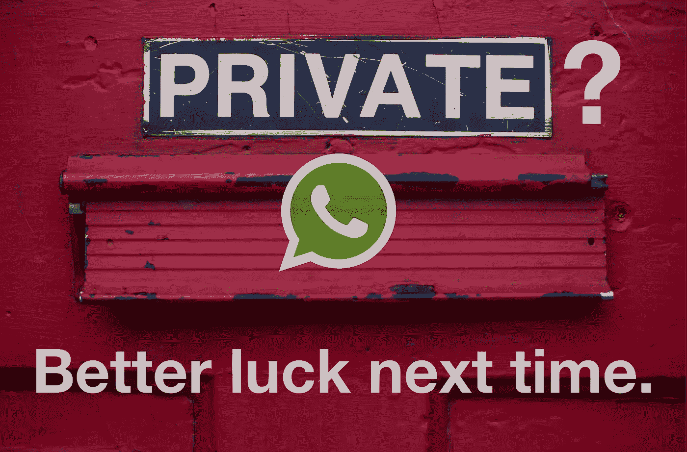

# WhatsApp 不再私密。应该停止使用吗？

> 原文：<https://medium.com/codex/whatsapp-is-no-more-private-should-you-stop-using-it-427b32fc475b?source=collection_archive---------4----------------------->

## [法典](http://medium.com/codex)

[戴恩·托普金](https://unsplash.com/@dtopkin1?utm_source=unsplash&utm_medium=referral&utm_content=creditCopyText)在 [Unsplash](https://unsplash.com/s/photos/privacy?utm_source=unsplash&utm_medium=referral&utm_content=creditCopyText) 上的照片

2020 年 7 月，WhatsApp 的新政策称:

> "*我们可能会使用与他们共享的信息来帮助运营、提供、改进、理解、定制、支持和营销我们的服务和产品*。"

最初，人们并没有那么担心，尤其是在印度，因为现在每个人都知道这些互联平台在桌子底下做不正当的事情，这没什么。我们已经学会接受它。有趣的是，发展中国家的人们并不真正关心他们的私人数据。“我们没有什么可隐瞒的，”他们说。

# 但是你为什么不在乎呢？条款和条件太长。我看不懂那个！

如果你是其中之一，在安装或更新应用程序时，你甚至不在乎看一眼“条款和条件”弹出窗口，或者如果你的答案是“不，它太长了，无法阅读。”嗯，是时候改变你致命的习惯了！

**很快，你的生活将被大型科技巨头所驱动。令人惊讶的是，它已经发生了。我们还没有感受到这种冲击。**

2021 年 2 月 8 日是 WhatsApp 更新后的隐私政策和服务条款生效的日子。不过，一些用户也在 2020 年 1 月 8 日获得了 Whatsapp 的更新。

> 让我非常苦恼的一点是，用户必须接受应用更新才能继续在设备上使用 WhatsApp，否则他们的帐户将被删除！直到永远。

# 这是什么？数字独裁？

早些时候，我曾经认为“数字优势”并不会真正影响最终用户，因为他们总是有选择——不购买该产品或做出不同的选择，尽管价格更高。你总是有一个替代者。

但是这个科技巨头的新政策跨越了所有的界限；我们在深水中，我的朋友。需要说明的是，WhatsApp 的政策一直说它与脸书共享信息。但是最新的更新有一个显著的不同。

马库斯·温克勒在 [Unsplash](https://unsplash.com/s/photos/update?utm_source=unsplash&utm_medium=referral&utm_content=creditCopyText) 上拍摄的照片

# 有什么新的更新？

嗯，它已经要求用户接受这些变化(新的条款和条件)和隐私政策，否则他们的帐户将被删除。这一新的更新清楚地暗示了脸书旗下的 WhatsApp 将在收集和处理我们信息的方式上发生的剧烈变化。

作为应用程序家族之间更大统一运动的一部分，与其母公司的合作是更大统一运动的一部分。老实说，这同时令人愤怒和失望。

> 鉴于该应用程序现在支持“金融交易”和“电子商务”，这一消息引发了人们对该公司将访问多少数据的担忧。

在我看来，现在是我们这些最终消费者大声反对这种令人担忧的情况的时候了，我们的手似乎被束缚住了。

# 那么，WhatsApp 的替代品有哪些？

由[萨拉·库菲](https://unsplash.com/@stereophototyp?utm_source=unsplash&utm_medium=referral&utm_content=creditCopyText)在 [Unsplash](https://unsplash.com/s/photos/appstore?utm_source=unsplash&utm_medium=referral&utm_content=creditCopyText) 上拍摄的照片

根据您的需求，以下是世界各地正在使用的 WhatsApp 的一些最佳替代品:

***信号、线路、Viber、KakaoTalk 信使、LiveProfile、脸书信使、Kik 信使、Groupme、Riot。IM、ChatON、微信*** *(在印度不行)* ***、Telegram、Threema、Wire。***

## 首先，如果安全和加密是你最关心的问题，

在这种情况下，**信号**在排行榜上名列前茅。 **Telegram** 也不错，而且免费，就像 WhatsApp 一样。一项名为秘密聊天的功能可以对电报进行端到端加密。WhatsApp 上的群组规模是 20 万人，而不是 256 人。

Threema 也是一个安全的选择，因为瑞士的数据保护法适用于它。它在谷歌和 iOS 应用商店售价 2.73 美元。

## 如果你只是想随便聊聊，我建议你:

**Hike Messenger** 或 **Facebook Messenger** ， **Snapchat，卡考**， **Tango** ， **Line** ， **GroupMe** 。这些应用的用户界面非常好用，也很有美感。我敢肯定，如果你喜欢分享你的生活时刻，你一定在使用其中的一个:)

## 对于业务相关的应用，请访问

**Skype，Slack，微软团队**， **Google Hangouts** ，**亚马逊 Chime** 。对于 WhatsApp 来说，它们是一个很好的替代品，但受到个人用户数量的限制，而不是商业用户。这些应用程序中使用了一种称为信号协议的数据传输协议，但缺少端到端加密。

我希望它能帮助你深入理解这个问题。请在下面的评论中告诉我你对此的看法。