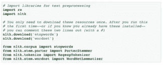
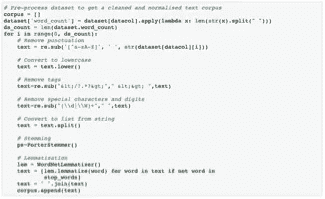
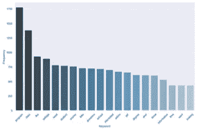
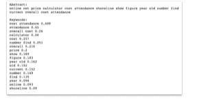

# 何时以及如何使用 NLP

> 原文：<https://medium.com/codex/when-and-how-to-use-nlp-25972be44059?source=collection_archive---------20----------------------->

当我从事各种数据科学项目时，我经常会遇到文本数据，并需要在收集过程后对其进行分析。在浏览任何网站后，你需要继续前进，从你已经提取的数据中获得洞察力。能够从数千行自由格式的用户评论电子表格中获得洞察力可能很棘手。或者有大量的抽象信息并思考如何获得一些见解，那么你必须采用 NLP 方法。

# NLP 用例

一种好的方法是使用自然语言处理(NLP)开始在高层次上理解数据集的整体趋势，然后使用这种理解来识别更集中的查询线-要么应用于数据本身，要么用于指导相关研究。

大量免费的 Python NLP 库提供了一些相对容易部署的工具，可以帮助我们发现大型数据集的关键特性。我们将在本文中探索的工具将允许我们从大型非结构化数据集创建单个和多个术语的关键字列表(称为 n-gram)。这些列表将帮助我们对数据集的内容有一个基本的高层次理解。

虽然这一过程被称为“文本挖掘”，必然是简化的，但它提供了进入数据集的几个入口点，否则这些入口点可能看起来难以理解:

*   关键词本身也很有用，尤其是在回答“人们最常谈论/询问的是什么？”
*   关键字可以帮助您关注更小的单个记录集，以便了解更多信息，并开始回答有关用户需求和目标的特定问题
*   关键字结合对更小的单个记录集的分析，可以帮助您确定您对用户的理解中的差距，从而有助于集中后续的研究工作

# NLP 代码的来源

*   [*使用 NLP*](/analytics-vidhya/automated-keyword-extraction-from-articles-using-nlp-bfd864f41b34) 从文章中自动提取关键词，作者 Sowmya Vivek，展示了如何从学术机器学习论文的摘要中提取关键词。这是我对这个工具包最感兴趣的一篇文章。
*   [*用 TF-IDF 和 Python 的 Scikit-Learn*](https://kavita-ganesan.com/extracting-keywords-from-text-tfidf/#.XpRvAVNKi8U) 提取关键词，作者 Kavita Ganesan，似乎是 Vivek 女士在 TF-IDF 矢量化过程中借鉴最多的教程。

# PYTHON 资源

*   由 Steven Bird、Ewan Klein 和 Edward Loper 所著的 [*使用 Python 进行自然语言处理*](https://www.nltk.org/book/) 是一本免费的在线书籍，深入介绍了如何使用自然语言工具包(NLTK) Python 模块来理解非结构化文本。这是基于最佳实践构建基础知识的可靠资源。我发现前三章是一个很好的入门，随着我技能的提高，我可能会回到其余部分作为参考。
*   [*学习 Python 3 中的编码:编程初级到高级*](https://www.udemy.com/course/learn-python-programming-a-step-by-step-course-to-beginners/learn/lecture/13131564?start=0#overview) ，作者 Ivan Gomes via Udemy，是一本优秀的 Python 入门书。该课程假设没有 Python 的先验知识(它从如何安装它的详细模块开始)，但速度足够快，以保持吸引力并保持进步感。我强烈推荐。另外:一定要做练习——它们很有趣，有助于记住内容。

# 导入库

以下是您希望为模块安装的内容:

*   熊猫为数据分析和操纵工具
*   nltk，一套用于英语的符号和统计自然语言处理的库和程序
*   用于绘制数据的 matplotlib
*   seaborn 用于数据可视化
*   枕头，一个影像库
*   用于创建单词云可视化的单词云
*   机器学习库 sklearn

一旦您开始使用 Python，[从 GitHub](https://github.com/andybywire/nlp-text-analysis) 下载 NLP 文本分析库，并将示例文本文件复制到您的桌面。从存储库目录运行“jupyter notebook ”,然后按照下面列出的步骤来生成规范化关键字和 n 元语法的列表和可视化。一旦你掌握了窍门，就把你自己的大量非结构化注释和自定义关键字的电子表格换出来，尽情享受独自进行 NLP 文本分析的荣耀吧。

# 如何提取关键词

# 1.加载数据集并识别要分析的文本字段

选择“text-analytics.ipynb”笔记本中的第一个代码单元格，然后单击“运行”按钮。确保将“rfi-data.tsv”和“custom-stopwords.txt”文件拖到桌面上；脚本会在那里寻找它们。

按照提示加载数据。选择您的。tsv 文件中，您将选择包含要分析的数据的列，然后查看未处理文本中最常用和最不常用的单词。这将有助于您在规范化文本之前识别您可能想要添加的任何自定义停用词。

# 2.创建停用词列表

停用词是常用词，如“the”、“a”、“an”、“in”等。在自然语言中出现频率很高，但并不传达关于信息含义或主题的重要信息。

NLTK 模块提供了英语中最常见的停用词列表，我们将在这里导入。在这一步中，我们还将根据我们正在分析的文本添加一个自定义停用词列表。

我们上面生成的“最常出现的单词”列表为定制自定义停用词列表提供了一些很好的候选词。当您开始生成下面的结果时，您可能希望返回到这一步，并根据您的内容集添加额外的停用词，以生成更有用的结果。

# 3.擦除，规范化文本数据

预处理包括从文本中删除标点符号、标签和特殊字符，然后将剩下的内容规范化为可识别的单词。规范化过程包括“词干化”，即从词根中删除后缀和前缀，以及“词汇化”，即将剩余的词根形式(可能不总是正确的单词)映射回自然语言中出现的实际单词。

这些过程共同确定了一组相关词形的典型代表，这使我们能够独立于词形变化来评估词频。

# 4.提取最常出现的关键词和 N 元语法

现在我们终于可以生成一组顶级关键词和 n 元语法了，在我们的例子中是两个和三个单词的短语(二元和三元)。当然，这些列表和图表只是对文本语料库中可能包含的所有见解的暗示，但它们为我们可能需要更仔细地观察或进行额外研究的地方提供了指导。它们还提供了一个高层次的概述，可以很容易地传达给合作者和利益相关者。

这些脚本还会将每个视图的术语和频率数据的. csv 文件发送到您的桌面，以便直接访问编译的结果。如果您发现一些术语对于数据集来说是通用的，例如“would”、“like”、“need”和“know”并没有真正表达唯一的含义，您可以将这些术语添加到停用词列表中，然后再次运行分析。

# 5.提取顶级 TF-IDF 术语列表

TF-IDF 是“词频-逆文档频率”的缩写，是一种数字统计，旨在反映一个词对集合中的文档有多重要。术语的 TF-IDF 值与单词在文档中出现的次数成比例地增加，然后被包含该单词的语料库中的文档数量抵消。这有助于调整某些单词通常出现频率更高的事实。最终结果是，我们最终得到一个单词列表，这些单词根据它们对整个语料库的重要性进行排序:

也就是说，我不会说我已经完全理解了 TF-IDF 矢量化过程中发生的事情。

后续步骤

该过程的输出旨在为您提供一组数据点，您可以使用这些数据点来更好地理解大型非结构化数据集中包含的用户反馈。它还可以帮助你更容易地关注未来的分析和研究活动。一旦你掌握了上面的基本流程，开始调整变量和参数。当您对这里可以做的事情感到满意时，您就可以探索使用这些库和工具的许多其他方法了。如果您有任何问题，请联系我@kristinelpetrosyan@gmail.com，让我知道。希望这对您有所帮助。