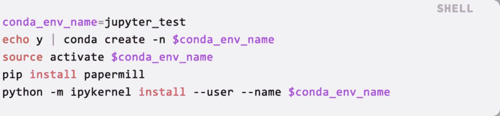
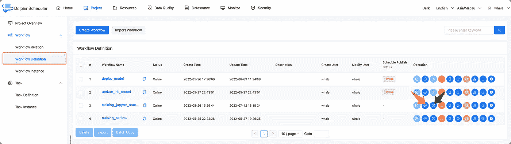

# 当 Apache DolphinScheduler 遇到 MLOps 时，将机器学习模型部署到生产中会更快、更安全

> 原文：<https://medium.com/codex/when-apache-dolphinscheduler-meets-mlops-deploying-machine-learning-models-to-production-is-faster-fe26ac70ae5c?source=collection_archive---------17----------------------->

**作者|周杰光 WhaleOps 高级算法工程师**

> MLOps，机器学习模型的操作是计算机科学家们彻底研究过的概念。可以将其视为机器学习的 DevOps，这一概念使数据科学家和 it 团队能够通过监控、验证和管理机器学习模型来协作并加快模型开发和部署。MLOps 加快了从试验和开发、将模型部署到生产以及为用户执行质量控制的过程。

这篇演讲分为四个部分:

*   Apache DolphinScheduler 与 MLOps 冲突
*   Apache DolphinScheduler 支持的机器学习任务
*   Jupyter 组件和 MLflow 组件的使用
*   Apache DolphinScheduler 和 MLOps 集成计划

# **01 当阿帕奇海豚调度程序与 MLOps 碰撞**

## **什么是 MLOps？**

MLOps 是机器学习时代的 DevOps。它的主要功能是将模型构建团队与业务、运营和维护团队联系起来，并建立标准化的模型开发、部署和运营流程，以便公司可以使用机器学习功能来发展业务。

在实际生产中，ML 代码可能只占整个系统的一小部分，而所需的其他相关元素是庞大而复杂的。

## **MLOps 景观**

虽然存在各种类型的 MLops 系统，但是它们的核心是相似的，并且可以大致分为以下四类:

*   数据管理
*   建模
*   部署
*   监视

## **MLOps 用例**

## **DolphinScheduler 在 MLOps 中的定位**

*   支持调度和运行 ML 任务
*   使用各种框架支持用户培训任务
*   支持调度和运行主流 MLOps
*   为用户提供现成的主流 MLOPs 项目
*   支持在构建 ML 平台时编排各种模块
*   根据 MLOps 与任务的匹配程度，在不同的模块中应用不同的项目

# **02 Apache dolphin scheduler 支持的当前 ML 任务**

*   Jupyter 任务插件
*   MLflow 任务插件
*   OpenMLDB 任务插件

## **Jupyter 任务插件**

**Jupyter 笔记本简介**

> Jupyter Notebook 是一个基于网络的交互式计算应用程序。它可以应用于计算的整个过程:开发、文档、运行代码和显示结果。

Papermill 是一个可以参数化执行 Jupyter 笔记本的工具。

**组件介绍**

*   Conda 环境名称:Conda 环境名称
*   输入注释路径:输入 jupyter 注释模板路径
*   输出音符路径:输出 jupyter 音符路径
*   参数:Jupyter 注释参数化的 JSON 格式参数。
*   内核:Jupyter 笔记本内核

## **MLflow 任务插件**

**MLflow 简介**

MLflow 是一个优秀的 MLOps 开源项目，用于管理机器学习的生命周期，包括实验、再现性、部署和中央模型注册。

**介绍组件— MLflow 项目**

**自定义项目**

**自定义项目:运行其支持的 MLflow 项目**

*   URI 物流跟踪服务器
*   实验名称:运行任务的实验
*   参数:mlflow 运行中的参数列表
*   操作仓库:MLflow 项目的仓库地址
*   项目版本:对应于 git 版本管理的项目版本，默认为 master。

**基本算法**

**基本算法:包含逻辑回归 svm，lightgbm，xgboost**

*   URI 物流跟踪服务器
*   实验名称:运行任务的实验
*   注册模型:是否注册模型
*   注册型号名称:注册型号名称
*   数据路径:文件/文件夹的绝对路径
*   参数:初始化模型时的参数
*   算法:选择的算法，支持 LR，SVM，LightGBM，XGBoost。
*   参数搜索空间:运行相应算法的参数搜索空间

该功能的预设算法通过以下方式实现

[https://github.com/apache/dolphinscheduler-mlflow](https://github.com/apache/dolphinscheduler-mlflow)

**AutoML**

**AutoML: AutoML 工具，支持 autosklearn，flaml**

*   URI 物流跟踪服务器
*   实验名称:运行任务的实验
*   注册型号名称:注册型号名称
*   数据路径:文件/文件夹的绝对路径
*   参数:初始化 AutoML 训练器时的参数
*   AutoML 工具:目前支持 autosklearn、flaml

该功能的预设算法由[https://github.com/apache/dolphinscheduler-mlflow](https://github.com/apache/dolphinscheduler-mlflow)实现

**ml 流量模型**

MLFLOW:直接读取模型地址，启动推理服务

*   URI 物流跟踪服务器
*   部署模型的 URI:ml flow 服务中模型对应的 URI
*   部署 API:部署服务时的 API

**DOCKER:** 将模型打包成 DOCKER 映像并运行它

*   URI 物流跟踪服务器
*   部署模型的 l URI:ml flow 服务中模型对应的 URI
*   部署 API:部署服务时的 API

**Docker 编写:**使用 Docker 编写部署模型

*   URI 物流跟踪服务器
*   部署模型的 URI:对应于 MLflow 服务中模型的 URI
*   部署 API:部署服务时的 API
*   最大 cpu 限制:容器占用的最大 CPU
*   最大内存限制:容器占用的最大内存限制

## **OpenMLDB 任务插件**

# **03**Jupyter 组件和 MLflow 组件的使用

## **Jupyter 组件的用法**

**环境配置**

您可以在 common.properties 中配置 conda 环境变量

为执行 Jupyter Notebook 创建 conda 环境:

如何调用 Jupyter 任务运行笔记本？

1.准备一个 Jupyter 笔记本

2.使用 DolphinScheduler 创建一个 Jupyter 任务

3.运行工作流

以下是使用 SVM 和虹膜数据集训练分类模型的笔记本。

笔记本接收以下四个参数

1.实验名称:记录在 MLflow 服务中心的实验名称

2.C: SVM 参数

3.内核:SVM 参数

4.model_name:注册到 MLflow 模型中心的模型名称

将 Jupyter 组件拖到画布上，创建一个任务，如下所示。

该任务将运行 Notebook:/home/lucky/WhaleOps/jupyter/MLOps/training _ iris _ SVM . ipynb，并将结果保存在以下路径中:

/home/lucky/whale ops/jupyter/MLOps/training _ iris _ SVM/03 . ipynb

将运行时参数 C 设置为“1.0”，将内核设置为“线性”，运行的 conda 环境就是内核:“jupyter_test”。

我们可以用不同的参数复制两个相同的任务。因此，我们得到三个具有不同参数的 Jupyter 任务，如下所示:

创建完成后，我们可以在工作流定义中看到我们的新工作流(该工作流包含 3 个 Jupyter 任务)，单击红色箭头后，我们可以执行修改工作流(您也可以单击绿色箭头来设置计划任务，以满足实现运行计划工作流的需要)。

工作流运行后，您可以单击任务实例来检查每个任务是如何执行的，并单击红色箭头所指的按钮来查看每个任务的日志。

**用例**

*   数据探索和分析
*   培训模型
*   定期在线数据监控

## **MLflow 组件用法**

**环境配置**

*   康达环境配置

创建环境后，每个后续任务都可以在环境名称中选择我们刚刚创建的环境。

*   MLflow 服务

为了安装 MLflow，我们使用 pip install mlflow 来安装和启动 mlflow 服务。

更稳健的开始方式:

*   使用 Docker 撰写(例如:https://github.com/Toumash/mlflow-docker)
*   使用头盔(例如:[https://artifacthub.io/packages/helm/cetic/mlflow)](https://artifacthub.io/packages/helm/cetic/mlflow))

## 使用 MLflow 任务训练模型

配置好环境后，如何使用 MLflow 训练任务？

1.准备数据集

2.使用 DolphinScheduler 创建 MLflow 训练任务

3.运行工作流

下面是 CSV 格式的虹膜数据集。

创建工作流的示例如下，包括两个 MLflow 任务:

任务一:使用 svm 训练虹膜分类模型，设置以下参数，其中超参数搜索空间用于参数调整。如果未填写，将不会搜索超参数。

任务 2:使用 AutoML 方法训练模型。使用 flaml 作为 AutoML 工具，并将搜索时间设置为 60 秒，只允许使用 lgbm，xgboost 作为估计器。

创建工作流后，我们可以单击红色箭头所指的按钮来立即运行工作流。

工作流中的任务实例

已执行任务实例的详细信息

## 使用 MLflow 部署任务

1.选择要部署的模型版本

2.使用 DolphinScheduler 创建的 MLflow 来部署任务

3.简单的测试界面

如上所述，我们已经在 MLflow 模型中心注册了一些模型，我们可以打开 127.0.0.1:5000 查看模型的版本，如下所示:

选择要部署的模型版本

为 MLflow 模型创建任务。指定型号为 iris_model(量产版)，监听端口设置为 7000。

确定型号 URI 和监控端口

特定运行机制

测试可定制的运行结果

## **联合使用** Jupyter + MLflow

训练模型后自动部署，例如:

使用我们上面创建的工作流(Jupyter 培训模型，MLflow 部署模型)作为子工作流，并将它们连接起来形成一个新的工作流。

**思考:Jupyter+MLflow 还能做什么？如果我们加入 OpenMLDB 呢？**

# **04**Apache dolphin scheduler 和 MLOps 集成计划

## **MLOps 景观**

上图是机器学习相关工具和平台的展示图。Apache DolphinScheduler 将有选择地支持其中一些使用范围广、价值高的工具和平台。

## 未来 MLOps 组件支持

未来，Apache DolphinScheduler 将把支持的 MLOps 组件分成三个模块，包括数据治理、模型和部署。涉及的组件主要是 DVC(数据版本控制)，集成 Kubeflow 建模，并提供 Seldon Core、BentoML、Kubeflow 等部署工具，以适应不同场景的需求。

如何集成更多的工具，使 Apache DolphinScheduler 能够更好地为用户服务，是我们长期思考的话题。我们欢迎更多对 MLOps 或开源感兴趣的合作伙伴参与到联合事业中来。

# 加入社区

参与 DolphinScheduler 社区并为其做出贡献的方式有很多，包括:

**文档、翻译、Q & A、测试、代码、文章、主题演讲等。**

我们假设第一个 PR(文档、代码)是简单的，应该用来熟悉提交过程和社区协作风格。

所以社区整理了以下适合新手的问题列表:[https://github.com/apache/dolphinscheduler/issues/5689](https://github.com/apache/dolphinscheduler/issues/5689)

非新手问题列表:【https://github.com/apache/dolphinscheduler/issues? q = is % 3A open+is % 3A issue+label % 3A % 22 volunteer+wanted % 22

如何参与投稿:[https://dolphin scheduler . Apache . org/en-us/community/development/contribute . html](https://dolphinscheduler.apache.org/en-us/community/development/contribute.html)

**GitHub 代码库:**[https://github.com/apache/dolphinscheduler](https://github.com/apache/dolphinscheduler)

**官网**:https://dolphin scheduler . Apache . org/

:dev@dolphinscheduler@apache.org 邮件列表

**推特**:@海豚时间表

YouTube:https://www.youtube.com/channel/UCmrPmeE7dVqo8DYhSLHa0vA

松弛:https://s.apache.org/dolphinscheduler-slack

**投稿指南:**https://dolphin scheduler . Apache . org/en-us/community/index . html

你的项目之星很重要，不要犹豫，为 Apache DolphinScheduler 点亮一颗星:[https://github.com/apache/dolphinscheduler](https://github.com/apache/dolphinscheduler)❤️