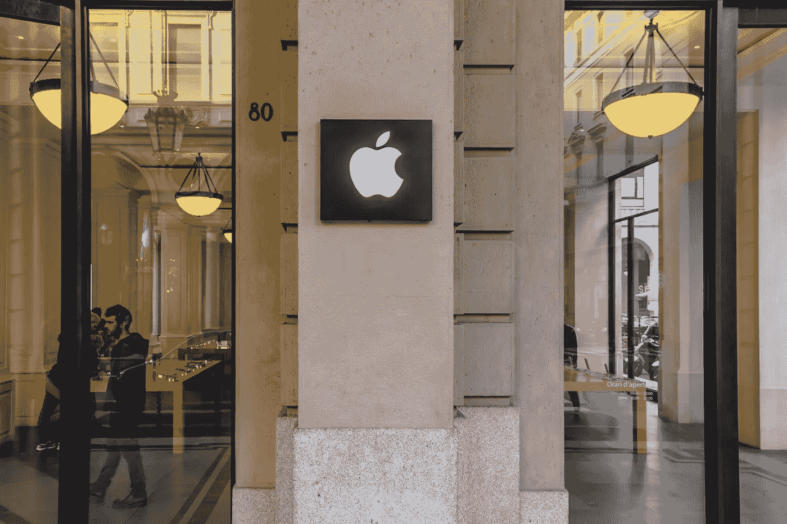

# 当苹果发现说谎时

> 原文：<https://medium.com/codex/when-apple-caught-lying-191bb49a0d35?source=collection_archive---------5----------------------->

Alexander Schimmeck 在 [Unsplash](https://unsplash.com/photos/17VSxPiqM2o) 上的照片

> 当史蒂夫·乔布斯和史蒂夫·沃兹尼亚克建立苹果电脑公司时，他们的使命是提供最好的产品，让客户享受高端技术的优势。史蒂夫·乔布斯因胰腺癌去世十年后，公司发生了很大的变化。但是，很遗憾，这不是一个好的方向。苹果被指责更关心商业方面，而不是满足其…