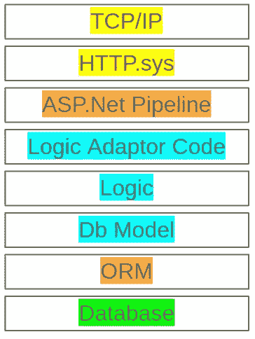
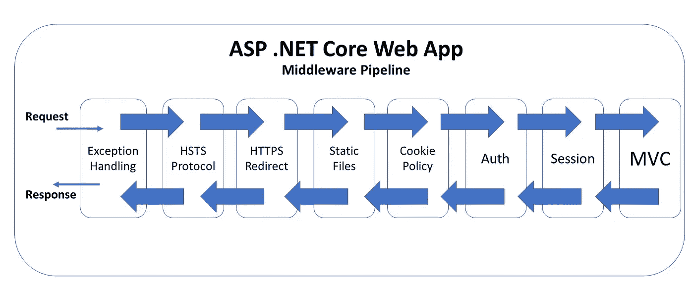

# 当 DRY 成为反模式时:抽象层

> 原文：<https://medium.com/codex/when-dry-becomes-an-anti-pattern-abstraction-layers-540b9f0cb831?source=collection_archive---------1----------------------->

在构建 Web 服务时，我逐渐意识到了这一组反模式。我找到了解决方案，而且大部分都留给了自己，因为我能够更快地构建软件，而且错误和延迟更少。那是我的秘制调味汁。

我觉得是时候分享了，因为我真的很想挑战常规思维，给大家提供更多的概念设计工具。请注意，这更像是一篇学术文章，因为没有正确的工具，您不应该实现我的方法。相反，我希望你能帮助我要求正确的编码原则，这样有一天你会得到你的工具。

(这些天来，我已经超越到一个更好的方法，我希望在来年分享这个方法。)

# 一抹亮色

在我的上一篇文章[https://medium . com/codex/when-dry-been-a-anti-pattern-code-in-code-87 B1 caab 791 f](/codex/when-dry-becomes-an-anti-pattern-code-in-code-87b1caab791f)中，我强调了可读性的重要性。

在那篇文章的一个回复中，有人指出了我的有限定义的一个潜在缺陷:

```
the "more readable" code does not scale because one will need to read too much.
```

我仍然需要花时间来写一篇完整的专门文章，但现在，我只会添加一些颜色。


萨拉·帕克斯顿艺术品— [在此购物](https://sarapaxtonartworks.com/shop-2/)

色彩理论在视觉艺术中很好理解，然而软件到目前为止只有伪科学。我们在探索枯燥科学的缺点，但我仓促发明的哲学，可读性是最重要的(RIMI)，也有所欠缺。

在单个函数中编写“更多行”代码是理想的。另一种方法是将这些代码行分散到多个代码片段中。每个片段都需要自己的函数声明仪式，可能还需要类声明。当你试图阅读抽象的代码时，你不能像阅读这个句子一样按顺序阅读，你不得不像随机存取一样在代码中跳跃。计算机在随机存取方面效率较低，人类在这方面很糟糕。人类的工作记忆大约有 7 个符号，在抽象的代码图中跳来跳去很快就达到了这个极限，除了 10x 程序员，他们喜欢写这样的抽象。

当然，简单地增加代码行并不能达到可读性的目标。你需要设计和理解大量的决定性例子和边缘案例。我倾向于尝试建立一个“高级流程”功能。这样的函数每个“步骤”大约有 1 行，并且大量使用子函数来隐藏细节。

例如:

```
void ImportMechanics(sourceQuery, tableRoot, transformQuery, loadQuery)
{
    var sourceData = ReadFromSource("SELECT *...");
    WriteToStaging(sourceData, Mechanics_Staging);
    TransformData("UPDATE Mechanics_Staging...");
    TransformData("UPDATE Mechanics_Staging..."); //Second transformation
    LoadData("UPSERT Mechanics...");
}
```

这意味着函数可以用作“索引”。读码的时候，这里是大本营。这种好处在本章中被进一步放大。

# 抽象意大利面

接下来的 3 章将涵盖基于 Asp.Net 的 Web 服务中常见的 3 个抽象领域。它们是:管道；自定义适配器代码；还有 ORM。



一些人如何编写 ASP.Net Web 服务

上图显示了如何处理 web 请求。在端口 443 上发出请求，在 Windows 上是 HTTP。SYS 模块将请求封送到主机匹配的正确进程。Asp.Net 是在这个过程中处理请求的库。软件开发人员最终需要将 Asp.Net 粘合到 ORM 上，然后 ORM 与数据库进行通信。逻辑理想地与胶水分离，以使单元测试和重用逻辑更容易。

在这一章中，我将重点介绍管道。

# Asp。Net MVC 管道

Asp。Net 是一个固执己见的框架，随着时间的推移，这些观点已经发生了变化和改进，通常是越来越好。在最新版本[Asp.Net Core 5](https://docs.microsoft.com/en-us/aspnet/core/fundamentals/middleware/?view=aspnetcore-5.0)中，常用中间件这个词。



来自 https://wakeupandcode.com/middleware-in-asp-net-core/[的一张非常有用的图表](https://wakeupandcode.com/middleware-in-asp-net-core/)

Asp.Net 管道处理基本的 Web 服务器活动，如 HSTS、HTTPS 重定向和静态文件。我说的不是那些。相反，应该关注 Cookie 策略、Auth、Session，当然还有 MVC。

# 以前

ASP.NET MVC 模式已经很好地建立起来，而且功能强大，但是它们并不适合阅读。代码示例看起来“很少”，甚至可能是“手工制作的”，但这并没有使它更容易阅读，这是一种虚假的安慰。相反，代码是分散的，高级流程功能没有完全定义。

```
[ApiController]
[Authorise(Role="Sales")]
[Route("api/[controller]")]
public class CarsController: ControllerBase
{
    private readonly CarsContext db;

    public TodoItemsController(TodoContext context)
    {
        _context = context;
    }

    [HttpPost()]
    public IActionResult Create(CarDetails newCar)
    {
        db.Cars.Add(newCar);
        db.SaveChanges();

        return Ok();
    } 
}
```

熟悉 Asp.Net 框架的人在这里会有宾至如归的感觉。但是它不像实际代码那样可读，你不能读你看不见的东西。把代码塞到壁橱里让它看起来“整洁”,但这并不真正整洁，不是吗？

*   **属性**用于修饰成员，在运行时动态注册 Web 服务。无法调试属性。
*   **授权**使用属性来注释 Web 服务方法的需求，但是在方法被调用之前，它们在黑盒中被强制执行。错误配置的授权很难调试。
*   **反序列化**隐含在方法的参数类型中，发生在中间件的黑盒中。如果配置不当，它将会失败。
*   **URI** 来源于反思。
*   **错误**处理可以集中配置
*   **缓存**可以集中配置，每个方法都有属性。这可能会变得非常复杂。不要做缓存。
*   **依赖注入**将在构建期间提供服务。这是 DbContexts 的推荐模式，因为框架会在结果写入响应流之后处理上下文。

要调试一个问题，你需要知道 Asp.Net 是如何工作的，你需要查看几个地方，看看它是如何配置的。

# 在...之后

考虑命令式代码方法:

```
public class CarsController: HttpController
{
    public void Create(HttpContext ctx)
    {
        try
        {
            ctx.Request.DemandAuthorisedUser("Staff"); //Throws an exception if not
            var newCar = CarDetails.Deserialize(ctx.Request); //Real code
            using (var db = LocalDatabase.Create())
            {
                db.Cars.Add(newCar);
                db.SaveChanges();
            }
            ctx.Response.Ok();
        }
        catch (Exception ex)
        {
            ctx.Response.Error(ex); //Break-point here if you like
        }
    } 
}

public void RegisterWebApis(IApplicationBuilder app)
{
    var carsController = new CarsController();
    app.Use("api/Cars/Create", context => carsController.Create);

}
```

这里有一点伪代码，因为这主要是学术性的。

所有的代码都可以在一个地方被一个刚毕业的学生阅读。

*   不需要依赖注入，因为有一个工厂方法。如果你需要的话，这是可以改变的——但是这实际上永远不会发生。
*   **授权**现在是单行代码。这是一行你可以调试的代码。这是一行你可以修改的代码。您想禁用该功能的授权吗？注释掉该行。您是否希望此功能仅使用一次性令牌？简单。
*   **URI** 就是专门为此功能定义的。在 Create 函数中，按 CTRL+F12，找到它绑定到特定相对 URI 的位置。
*   **错误**处理明显。您可以在调试时设置断点来调查异常的深度。(如果有这样一个函数返回数据，您甚至可以捕获响应序列化错误)。

# 结论

因此，尽管按照预期的方式使用 Asp.Net 仍然是最佳实践，但我已经演示了如何使 Web 服务代码更具可读性。隐藏代码逻辑确实使控制器“最小化”，但这就像把一堆乱七八糟的东西塞进橱柜。复杂性是不可避免的，它应该集中在一个地方展示。

我确信微软的工程师坚持 DRY 原则，许多人对提供的 API 非常满意。我希望看到工具和对 RIMI 原则开发者的支持。

虽然这个例子是针对 Web 服务的，但这只是 DRY 原则局限性的另一个例子。如果看得太远，可读性就会受损。

在我的下一篇文章中，我将继续关注 Web 服务管道上下文，并向您展示 RIMI 原理如何改进 ORM 抽象层。

(如果您希望我展示应用的 RIMI 方法，请使用注释给我发送代码示例)