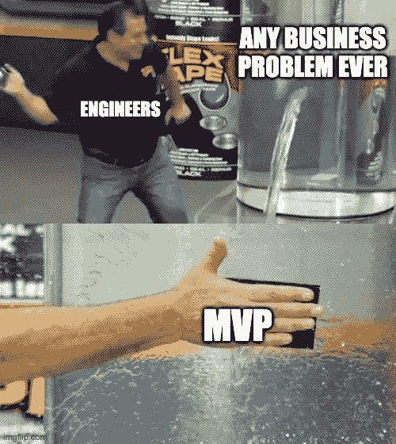

# 什么时候 MVP 是个坏主意？

> 原文：<https://medium.com/codex/when-is-an-mvp-a-bad-idea-6c9223d1b51a?source=collection_archive---------1----------------------->

## 只是因为每个人都这样做，并不意味着你应该这样做。

来源:作者

如果你在技术行业工作，“MVP”可能是你听到的比你自己的名字还多的词之一。最低可行的产品。多么光荣的概念。你很快就可以拼凑出一些东西，当它几乎不能工作的时候，再把它交给用户。一切都是以创新的名义。如果你在 MVP 之前获得了 A 系列赛的奖励积分…