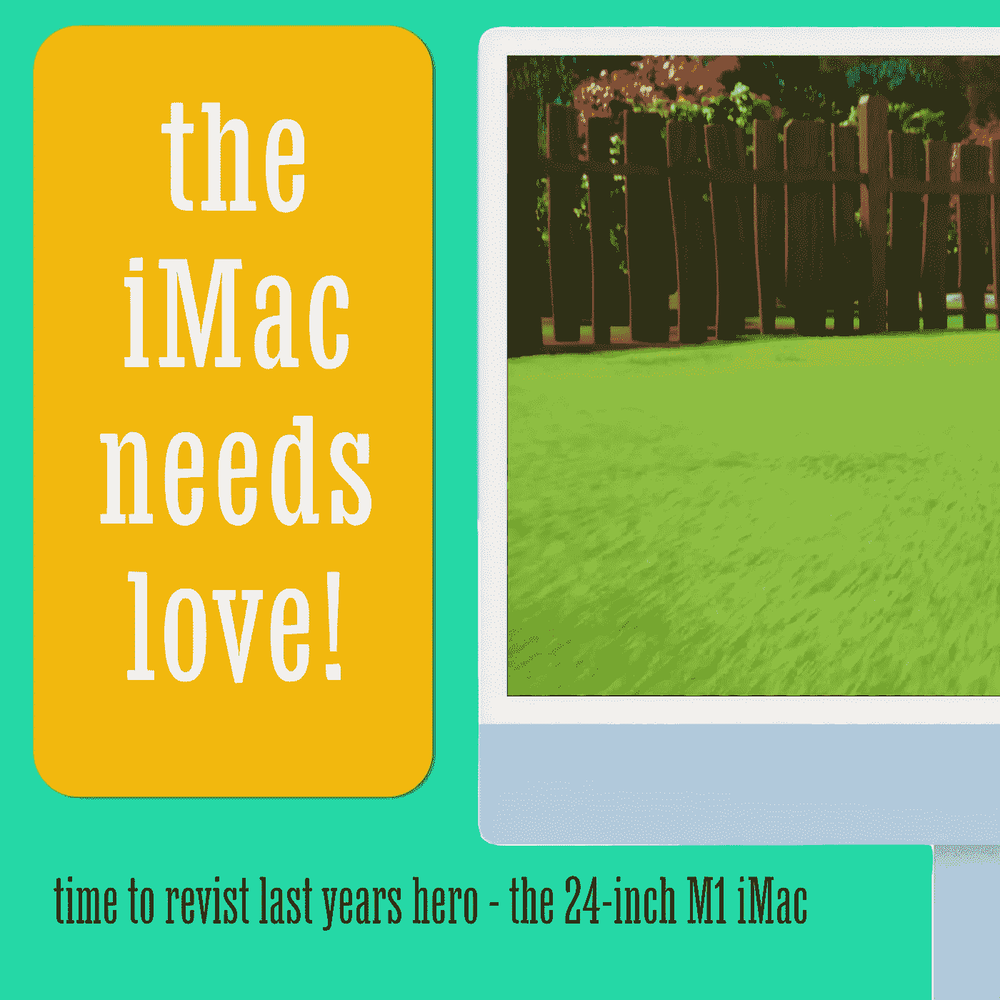
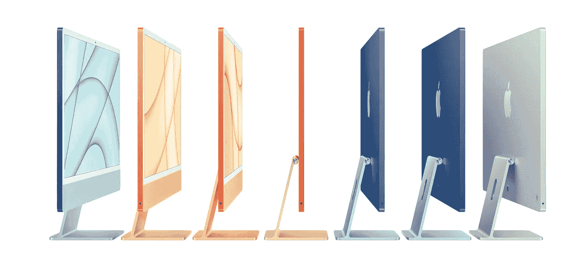
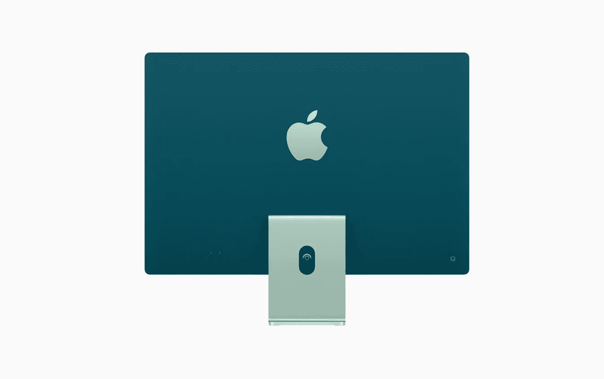
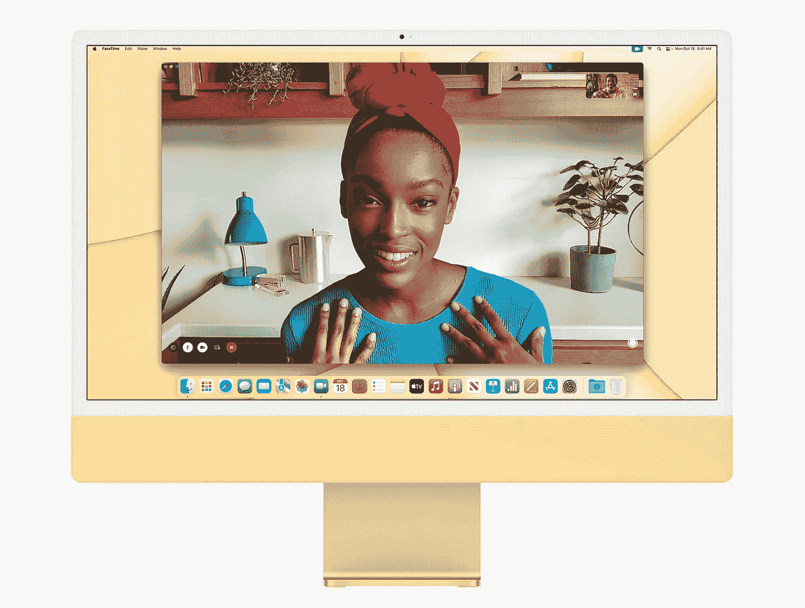

# 什么时候，够了，够了？

> 原文：<https://medium.com/codex/when-is-enough-enough-d66ad10a049b?source=collection_archive---------8----------------------->

## M1 芯片改变了一切。我们一度很快乐，但要求更多。但它止于何处？

重温 iMac

我急切而耐心地等待着我的新 16 英寸 MacBook Pro M1 Max 的到来，所以在某种程度上，我对我将要写的东西感到内疚。在去年的春季活动中展示的 M1 芯片改变了个人电脑的规则。快速、节能、几乎无声且功能强大。至少在一段时间内，科技界疯狂了！

它被用于各种设备，包括 Mac mini、MacBook、MacBook Air、iPad Air 和 iPad Pro。苹果目前只有一款一体机，那就是 24 英寸的 M1 iMac。*为什么它如此被忽视？*

易于安装和使用

## 被遗忘的英雄

今年，在发布了 Studio Mac 和 Studio display 之后，苹果撤回了该系列中的另一款 iMac。多年来，27 英寸的 iMac 已经影响了我们的生活。它一度成为最完美的 iMac Pro，对于那些不够专业的专业人士来说，它是一座伟大的桥梁，足以保证英特尔驱动的 Mac Pro 的令人垂涎的费用。目前，产品线中唯一的 iMac***是***M1 驱动的版本，苹果似乎并不急于扩大范围。许多人想知道苹果是否会取代备受喜爱的大尺寸 iMac。自然的继任者现在似乎是工作室钻机，但这是有代价的。3500 确切地说，如果你选择了显示器和 Mac 的基本规格。但对许多人来说，这太多了。不仅在成本方面，而且在原始计算能力方面。然而，出于某种原因，去年的英雄现在似乎成了一个小角色。纯粹是一张漂亮的脸，没有别的。为什么呢？

 [## 被遗忘的苹果宝石

### 家庭共享以及为什么您应该使用它

medium.com](/codex/the-forgotten-apple-gem-817f2c38e8eb) 

多彩的 iMac 系列

## 对大多数人来说绰绰有余

M1 iMac 有三种配置。基础机少了一个 GPU 核心，只有 7 个，只有两个 Thunderbolt 端口，没有以太网选项。中端和高端产品的唯一区别在于存储。除此之外，在这两个顶级的两个选项中，你可以获得 8 核 CPU/8 核 GPU M1 芯片，两个 thunderbolt 端口，两个 USB-C 端口，一个千兆以太网连接和带 touch ID 的魔法键盘。整个系列也体现了巨大的价值，价格从 1249 英镑到 1649 英镑不等(基本规格)。

 [## AirPod Pro 2 来了

### 我们能从他们那里期待什么？

medium.com](/codex/airpod-pro-2-are-coming-c93d56f371e2) 

iMac 上的醒目颜色

## 设计

释放时，下巴上有聊天和不和谐。下巴一直让 iMac，嗯，成为一个 *iMac* 。这是一个一眼就能认出来的标志性设计。即使是对苹果电脑知之甚少的人也能把那台电脑当成 iMac。然而，下巴并不纯粹是一种美学设计。它是功能性的，因为它容纳了*整个*计算机。颜色是此次发布的一大亮点，这也是 iMac 首次采用拉丝铝以外的颜色。在高端选择上，有七种可爱、温暖、柔和的颜色可供选择。相反的是颜色最鲜艳的地方，这使得它非常适合用在前台场景，如餐厅和接待区。iMac 很薄，非常薄，只有 11.5 毫米厚，因此，以太网连接器位于电源模块中。这是有道理的，因为大多数以太网电缆是在踢脚板高度进入室内的。在电源模块中安装以太网可以让多一根电缆看不见，所以我会竖起大拇指。

展示是华丽的。这是我们对视网膜显示器的典型期待。这是一个 4.5K 的面板，支持多达 10 亿种颜色，P3 宽彩色和 500 尼特的亮度。这是一款易于全天使用的显示器，即使是从倾斜的角度也能很好地观看。我之前提到过价值。如果你将 iMac 这种功能强大的完整电脑与新的工作室显示器进行比较，你就会明白我的意思了。在基本规格中，iMac 比工作室显示器少 250*！好的，所以工作室显示器更大，为 27 英寸，为 5K，最大亮度为 600 尼特。但在 iMac 上，你可以得到更好的网络摄像头体验，和几乎等同于工作室显示器的扬声器。网络摄像头不提供中央舞台，*但是*颜色、细节和清晰度都比那些麻烦的工作室显示面板要好。*

**

*非常适合家庭使用-24 英寸 iMac*

## *适合你吗？*

*如果你想要开箱即用、即插即用的简单性，那么到目前为止，Mac 产品线中确实没有其他选择。在 1249 点，你买了一台电脑进入 Mac 世界，对大多数人来说，这已经足够了。这就是对这台伟大机器的失望。*

*这比大多数人认为的要好得多。如果你的日常工作包括收发电子邮件、处理电子表格和浏览网页，那么这款 M1 iMac 将会满足你的需求。事实上，在这些任务中，你很难知道你是在使用 M1 还是 M1 超芯片。它敏捷、反应灵敏、快速。如果您勾选所有选项框，添加 2 TB 存储和 16 GB 统一内存，那么这款入门级 iMac 可以轻松成为一款强大的视频编辑设备。同样，甚至有人认为这可能是有史以来最好的消费者 iMac。*

*24 英寸，有人说太小了。如果你担心，去一家店内玩玩。超级显示屏和轻薄的白色边框使其使用起来如此身临其境，以至于从 27 英寸的 iMac 到 24 英寸的型号几乎无法区分。说实话，这很好。*

**

*出色的 1080P 网络摄像头*

## *结束的*

*苹果将带着 iMac 走向何方，谁也说不准。还会有 27 英寸的型号吗？他们会在 24 英寸的机身上安装 M1 Pro 吗？今年晚些时候会有 M2 选项吗？当苹果上个月取消 27 英寸 iMac 时，没有提到我们是否应该期待一个直接的替代品。你的猜测和我的一样好。但是，将这款时尚多彩的 iMac 贬为旁观者是错误的。对大多数人来说，这种机器将会更加快速和高效。仅仅因为有更快、更贵的选择，*并不代表*就适合你。*

*除非你只是想要钱所能提供的最新最好的东西，那就去重新看看目前唯一可用的 iMac。*快速、安静、低调，这种被遗忘的美正等待着满足。什么时候，够了，终于，够了？**

*你现在正在寻找一台台式电脑吗？你有什么考虑？您会考虑看看这台 iMac 吗？*

*负十六播客*

## *在你走之前*

*我只是高端博客网站 Medium 的众多作者之一。它是如此物有所值，你可以在这里加入[https://medium.com/membership](https://medium.com/membership)*

*加入我的幕后[邮件列表](https://www.talkingtechandaudio.com)*

*最初发表于 2022 年 4 月 13 日 https://www.talkingtechandaudio.com/blog。*