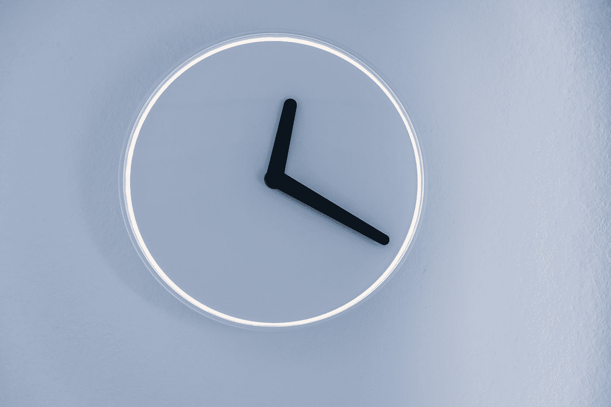

# 什么时候应该停止学习编程语言？

> 原文：<https://medium.com/codex/when-is-it-time-to-stop-learning-a-programming-language-412462b96646?source=collection_archive---------6----------------------->

## ⏰作为开发者停止浪费时间的个人意见

莫里茨·金德勒在 [Unsplash](https://unsplash.com?utm_source=medium&utm_medium=referral) 上拍摄的照片

作为一名开发人员，我们**在学习**方面有很大压力。我们必须经常更新，我们必须了解许多不同的事情:**方法**、**语言**、**技术**、**良好实践**等。因此，如果我们想提高我们的生活质量，我们必须正确地投资我们的时间