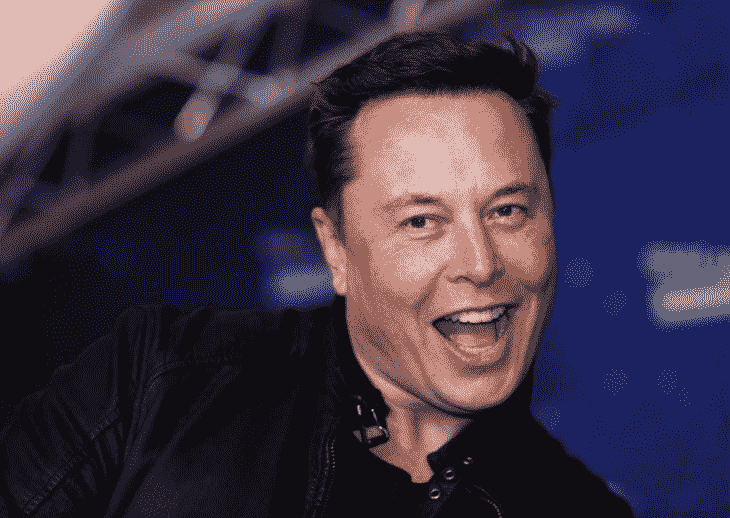
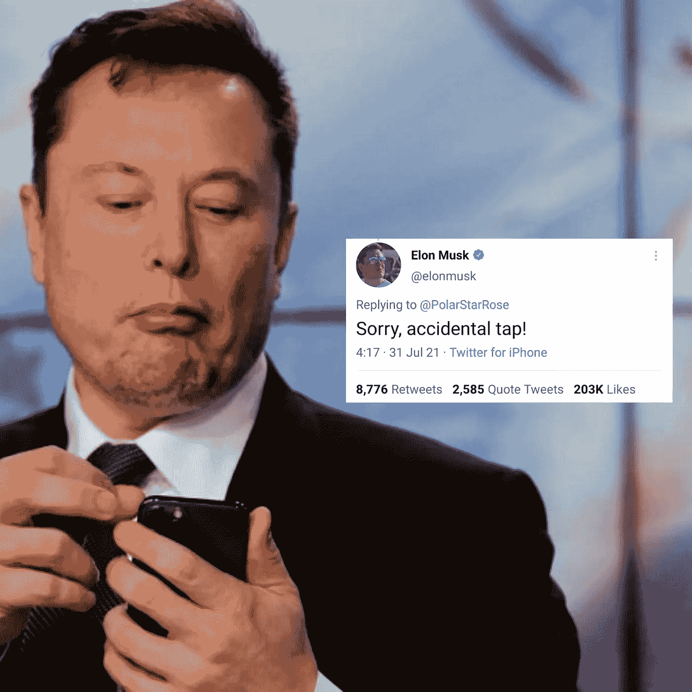

# 当开源是可怕的|以及为什么这会影响你…

> 原文：<https://medium.com/codex/when-open-source-is-terrible-and-why-this-will-affect-you-14c18cda0644?source=collection_archive---------5----------------------->

## 你知道有些情况下你甚至不应该考虑开源产品。但是，是时候让这一切发生了

如果你了解我，你就会知道我是开源的超级粉丝。我有几个完全开源的产品，我很高兴我为软件世界做出了贡献。

当您开始贡献错误的代码部分时，问题就来了。而这……正是 Twitter 正在发生的事情。简而言之，这就是我对整个形势的看法。

> 这是 Twitter 衰落的开始……这就是当实验走得太远时会发生的事情。此外，这可能是埃隆马斯克开始获得负面声誉的时候。

# 发生了什么事？

**2022 年 4 月 25 日**埃隆·马斯克(Elon Musk)(不用我介绍了)收购了 Twitter，这也加入了埃隆·马斯克旗下所有公司的名单中。我的意思是……拜托……埃隆·马斯克正在实现拥有最多大公司的梦想。从特斯拉到 PayPal 再到 SpaceX，他已经涵盖了很多品种。现在，你有了推特。

总的来说，我是埃隆·马斯克的忠实粉丝，我认为他是一个令人敬畏的家伙。但是我通常不喜欢一个公司过多的主导一个市场的时候(你猜对了，微软！).

## 什么是开源？

对于那些对软件不感兴趣的人来说，开源软件是代码对所有人开放的软件。您也可以使用、编辑和贡献代码。

如果你理解了上面的内容，恭喜你！你了解开源

## 简直跨越了开源的极限！

来点上下文，埃隆马斯克是开源的……等等 Twitter 用的算法。这不仅意味着您可以看到代码并为其做出贡献，还意味着您可以利用它。我将在下面的下一部分详细解释。

## 埃隆·马斯克做了什么？

嗯……他开源了 Twitter 的算法。这似乎是一件好事，但它证明了一个事实，即开源…也有它的缺点。

# 你现在的劣势

## 你现在有了教科书

我觉得和考试很有可比性。你去学校的主要目的应该是学习，但是因为你有考试，你现在不得不去学校看分数，如果你明白我的意思的话。

非常类似地，在 Twitter 上，真正的意图只是享受和在人们周围发推文。但是现在你已经打开了算法，你现在必须“算法友好”，不要落后。

获得关注者的竞争不再是活跃在 Twitter 上的竞争。更多的是打败算法。

## 容易发现漏洞

你现在知道了算法的一切。这不仅意味着很容易找到漏洞，而且很容易有意利用它们。是的…我知道漏洞可以被纠正，但即使是最流畅的算法代码也可能有一些错误，更不用说 Twitter 算法的编码并没有考虑开源。即使捐款也无济于事，因为那时损害已经造成了。

## 非常“片面的评论”

现在你知道 Twitter 如何管理你的推文，以及哪种推文会受欢迎，你只需要发布那些会被更多推广的东西。每个人都会这么做，结果是只有一种类型的推文，而不是所有种类的推文。

# 也许是一个优势

如果这有什么好处的话，我能想到一个…而且就一个。你看，现在算法完全开放了，甚至你可以正式更改它，抱怨算法本身的人会非常少，就像一些人对 YouTube 算法所做的那样。我不是说它会消失，我只是说会有更少的人，因为算法本身现在是由人控制的。

所以最终我们可以知道 Twitter 的算法将会相当的纯净和流畅。

# 结论

无论如何，我不希望它被开源，因为显而易见的原因，但在一天结束时，它是人们如何接收和使用它的，所以我希望一切顺利。

我想以某种方式为 Twitter 算法做出贡献，所以也许在未来，我可以这样做。我会在我的 YouTube 频道上专门为此制作视频。我还会发一些本文无法涵盖的小东西。这篇文章就讲到这里，希望你喜欢，下一篇再见。

**你真棒:)**

> 法丁吉克