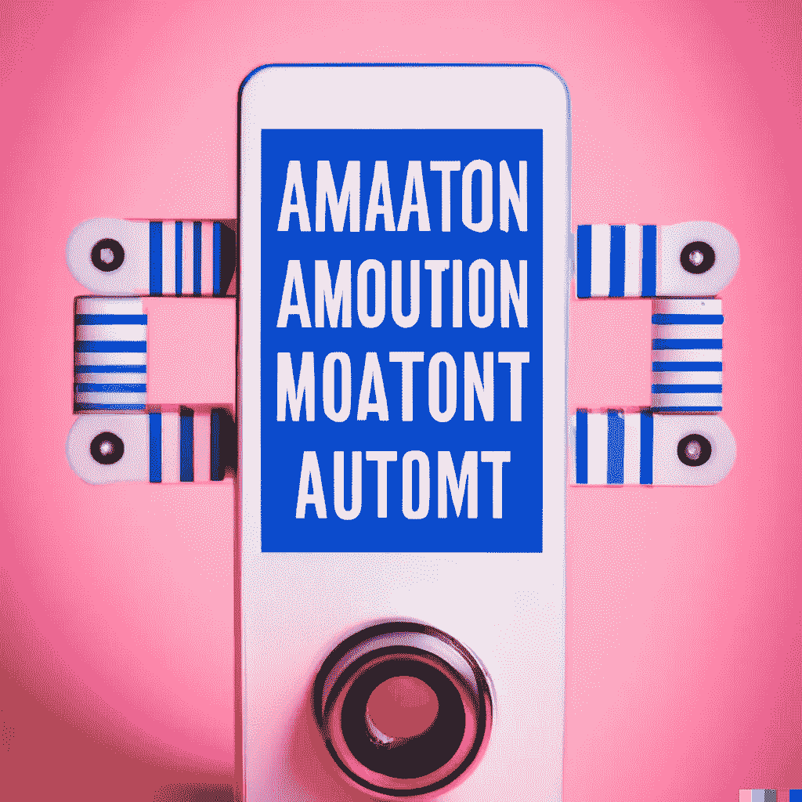

# 当 Python 自动化不足时

> 原文：<https://medium.com/codex/when-python-automation-falls-short-1ddc7680bbe8?source=collection_archive---------14----------------------->

## 使用 Sikuli 自动化您的 GUI

这张照片是由 Open AI 的 DALL-E 使用短语“Instagram 自动化”生成的

我承认使用 Python 来自动化我的生活是我最喜欢的消遣之一。但是有时我会遇到用 Python 或 Bash/Shell 文件编写脚本不合适的情况。这让我发现了我新喜欢的工具:Sikuli。

Sikuli 允许你编写脚本，利用计算机视觉来控制…