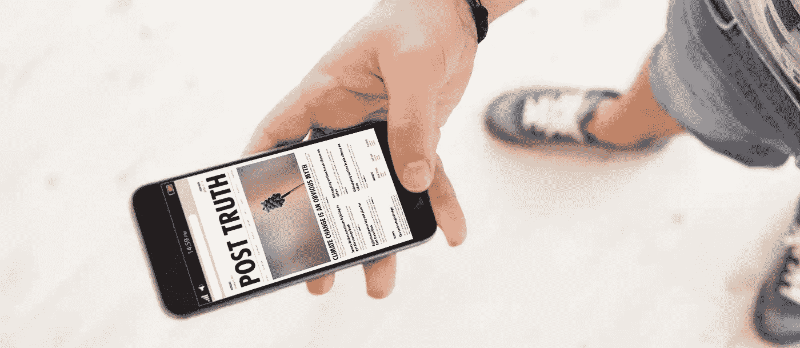
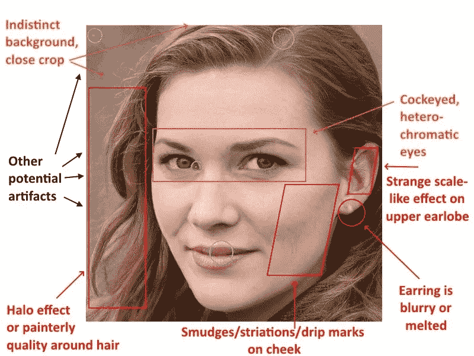
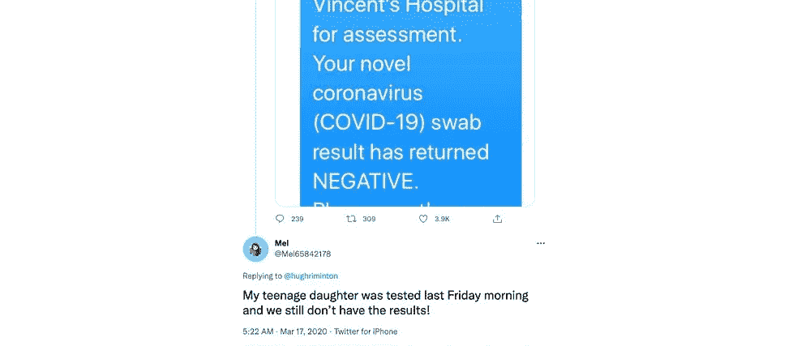
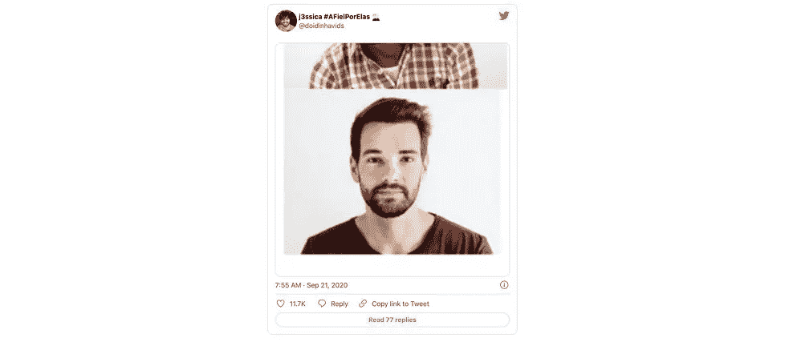

# 当机器人在社交媒体上制作有偏见的虚假内容时

> 原文：<https://medium.com/codex/when-robots-make-biased-fake-content-on-social-media-8530eff4e6c4?source=collection_archive---------40----------------------->

## 人工智能和 fakenews

脸书、Twitter、LinkedIn:在每一个社交网络中，自动化系统都可能产生和传播虚假信息。|图片(细节):colourbox.com

世界各地的组织都在大规模实施人工智能系统。然而，这些自动系统并不总是用于好的方面，它们也不总是做出最好的决定。在这篇文章中，我将强调三种类型的有偏见的机器人，以三个案例为例:消除社交机器人，有偏见的人工智能工具和合成档案。

*作者布莱恩·l·到期*

# 需要注意的三种类型

在本文中，人工智能实际上被定义为自动软件机器人，它们基于先进的算法，由人类编程，并由人类为了特定的目的在大型但特定的数据集上进行训练。人工智能可能会产生虚假和有偏见的内容，通常不可能确定其来源。人类可能认识到这一点，并有目的地使用它，而不知道或声明它是假的，我们称之为*假信息*，因为它故意误导或操纵。

例如，2016 年英国退出欧盟公投期间，社交媒体上流传的[种族主义错误信息](https://www.deutschlandfunk.de/soziale-medien-und-das-brexit-referendum-propaganda-luegen-100.html)就显示了这种影响:在所谓的黑暗广告中，一群人针对脸书，虚假声明欧盟将给予 7600 万土耳其人免签证入境。除此之外，这个群体中的人因为害怕更多的移民和失去主权而团结在一起——他们被算法过滤掉了。这些活动旨在吸引潜在的英国退出欧盟支持者投票。它们威胁到民主决策的原则。

然而，虚假的人工智能生成的内容也可能“只是”被传播，而没有任何恶意，仍然会导致偏见或*错误信息*。在这篇文章中，我们看三种结合了三个关键特征的现象:a)人工智能内容生成 b)在某种形式上是假的，c)也(重新)产生偏见。*内容*在这里定义为提供给广大受众的信息。*假的*意味着信息是误导性的，要么是错误的，而*偏见*被广义地定义为支持或反对某事的不成比例的权重，这通常是无意的和无意识的。

在下文中，我将简要描述三种类型的软件机器人，包括 1)虚假信息/错误信息之间的区别，2)内容、虚假和偏见的结合，以及 3)在不同社交媒体平台上的发生。显然，还有其他类型和呈现类型的方式。例如，有一个方面没有被涵盖，那就是日益严重的假货。

# 1.反病毒社交机器人:当虚假的机器人档案传播虚假信息

第一种有偏见的机器人大量出现在脸书和推特这样的大平台上。在这里，我们看到了人工智能机器人的简介，起初似乎是人类在关键话题上传播有偏见的虚假信息，特别是在政治方面。通过更仔细地检查这些简介，人们会发现它们通常有数字名称，在网络上相当新，没有或只有很少的追随者，并且它们的帖子有非常狭隘或有偏见的主题。有许多机器人军队污染政治进程的例子，这也被称为社交媒体的武器化。最近的例子与新冠肺炎有关，在那里，人们看到机器人制作虚假内容，导致人们不信任政府(见例子 1)。

【https://apnews.com/bc2f19097a4c4fffaa00de6770b8a60d? UTM _ campaign = social flow&UTM _ medium = AP&UTM _ source = Twitter

**例 1:** 一个由机器人“Mel65842178”创建的虚假社交媒体账号。一种自动生成的机器人，将评论植入社交媒体源，其更深层次的意图是消除或改变公众的观点。在这种情况下，梅尔传播假新闻，仅仅是因为机器人不可能有女儿，所描述的事件也不可能发生。它还转发了一条带有强烈偏见和仇恨的评论。

# 2.有偏见的人工智能工具:当人工智能创造的内容导致错误信息时

第二种有偏见的机器人是作为特定平台内的工具存在的 AI 算法。它们旨在帮助提高工作效率，例如，通过建议单词或句子完成或图像建议，作为平台上的用户体验。基本上，人工智能工具不仅基于预测，还基于说明性分析，能够使用户在工具中嵌入下一步行动时立即采取行动。在此过程中，他们可能会产生无意识的偏见，因为例如，他们是由特定的开发人员群体(例如，白人男性)开发的，并根据有偏见的数据进行训练。先前的例子计算警察算法(*预测警务*)，这可能导致警察不公平地将目标对准少数族裔人口比例高的社区，而不管这些地区的真实犯罪率如何。最近的一个例子是 Twitter 的人工智能裁剪工具——如果你发布长而瘦的照片，裁剪工具会集中在它认为是推文中最好的部分。它裁剪图像的方式是优先选择白皮肤的人，而不是黑皮肤的人(见例 2)。

图片(截图):推特

**例子 2:**Twitter 裁剪工具更喜欢以白人面孔为中心，而不是黑人面孔。原图输入的是左图 11 个黑皮肤的人和 1 个白皮肤的人。裁剪工具选择聚焦于一个白人。应该提到的是，Twitter 很快处理了这个问题。

# 3.合成侧写。当伪造的个人资料导致虚假信息

第三种类型的机器人是合成的“人类”，即，如果它们是物理机器人，将被称为类人机器人。作为软件机器人，它们比“消灭社交机器人”更有说服力，后者成群出现，没有背景故事。合成的个人资料在 Instagram 上作为影响者而出名，其中 *#lilmiquela* 就是一个典型的例子。有一个完整的虚拟人行业，由人工智能生成人脸和内容。看 ThisPersonDoesNotExist.com 的假面。他们可以被用来制作有偏见的内容和传播虚假信息。一个重要的例子是 LinkedIn 上的简介“凯蒂·琼斯”能够与美国政界的高层人物建立联系。

图片(截图):推特

例 3:LinkedIn 的个人资料“凯蒂·琼斯”不存在。这是假的，人工智能合成的脸。美联社对个人资料图片进行了分析，并表示这是专业社交网站上典型的间谍活动。

# 揭穿假新闻

社交媒体上有许多类型的虚假个人资料和人工智能生成的内容。在这篇文章中，我已经涵盖了三种类型:1)反病毒社交机器人，2)有偏见的人工智能工具，以及 3)合成简档。显然，当被标记为来自机器人时，机器人可以为传播真实信息提供很大帮助，并可能在更广泛的层面上用于打击偏见，例如西挪威研究所所做的，该研究所试图在人工智能的帮助下揭穿假新闻和仇恨言论。最终，不可能有一个完全无偏见的人类，所以基本上也不可能建立一个无偏见的人工智能系统。但我们肯定可以做得比现在好得多。

## **相关链接**

*   [英国退出欧盟公投期间的社交媒体](https://www.deutschlandfunk.de/soziale-medien-und-das-brexit-referendum-propaganda-luegen-100.html)
*   [社交机器人 Mel65842178](https://stories.uq.edu.au/contact-magazine/2020/stop-covid-19-bots/index.html)
*   [PredPol 的算法带来了歧视风险](https://www.theguardian.com/uk-news/2019/sep/16/predictive-policing-poses-discrimination-risk-thinktank-warns)
*   [Twitter 裁剪工具中的偏见](https://www.boredpanda.com/twitter-image-centering-algorithm-racist/?utm_source=google&utm_medium=organic&utm_campaign=organic)
*   [伪造凯蒂·琼斯的 LinkedIn 个人资料](https://apnews.com/article/ap-top-news-artificial-intelligence-social-platforms-think-tanks-politics-bc2f19097a4c4fffaa00de6770b8a60d)

## 作者

Brian L. Due 是丹麦哥本哈根大学北欧研究和语言学系的副教授。他正在对人类与新技术的互动进行社会研究，并对感知人工智能和人类多感官特别感兴趣。

版权所有:正文:[歌德学院，布莱恩 l .到期](https://www.goethe.de/de/index.html?wt_ca=22cc)。这个文本是德国 3.0 版的知识共享协议。

2022 年 2 月

*原载于*[*https://www . Goethe . de*](https://www.goethe.de/prj/one/en/aco/art/22740616.html)*。*