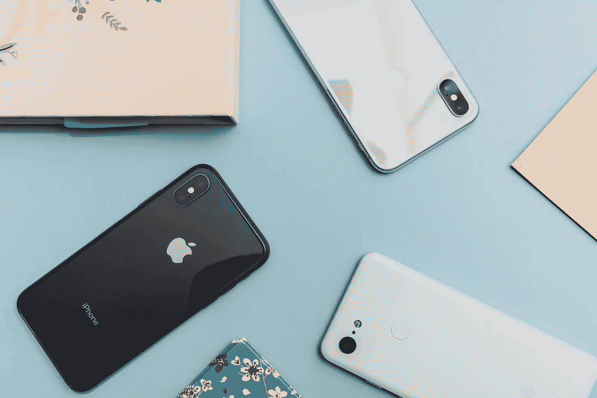

# 什么时候买 iPhone 最好？

> 原文：<https://medium.com/codex/when-the-best-time-to-buy-an-iphone-9ef7f0fe7c82?source=collection_archive---------14----------------------->

## 现在购买还是等待

阿恩尔·哈萨诺维奇在 [Unsplash](https://unsplash.com/photos/4oWSXdeAS2g) 上拍摄的照片

自从史蒂夫·乔布斯在 2007 年推出这些智能手机系列以来，iPhone 成为了一个全球现象。许多人都想得到它，但价格太高，有些人要等好几年才能买一部 iPhone。这背后只有一个原因，一个经济上明智的原则。像其他科技产品一样，iPhone 的价格会随着时间的推移而降低。所以接下来的问题是…