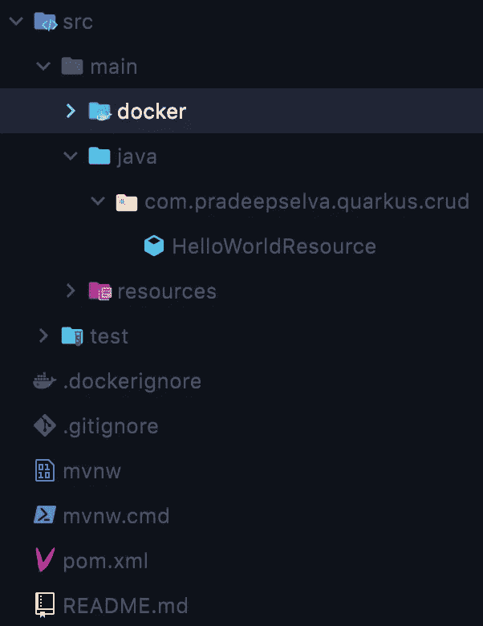
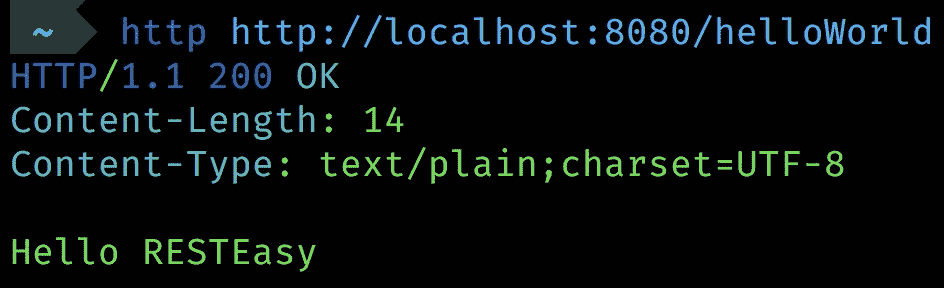
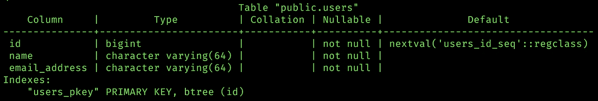
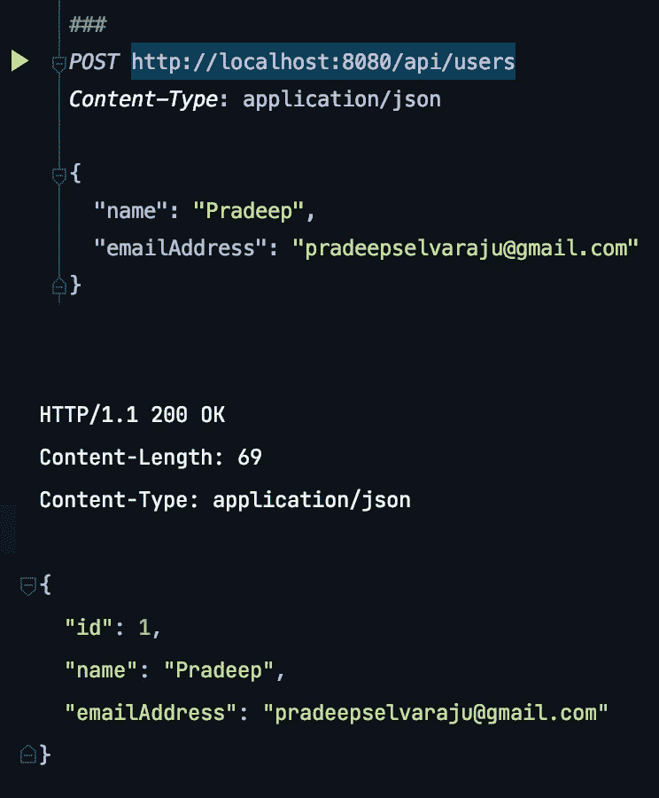
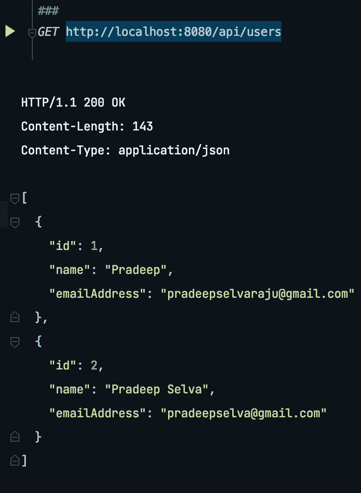

# 什么时候在 Spring Boot 上空使用夸库？以及如何入门？[2]

> 原文：<https://medium.com/codex/when-to-use-quarkus-over-spring-boot-and-how-to-get-started-2-d18484710e8?source=collection_archive---------4----------------------->


由 [Markus Spiske](https://unsplash.com/@markusspiske?utm_source=medium&utm_medium=referral) 在 [Unsplash](https://unsplash.com?utm_source=medium&utm_medium=referral) 上拍摄的照片


如果您还没有阅读第一部分，请继续阅读，以更深入地了解何时使用，但是如果您只关心入门部分，那么这就是了。在本文中，我们将了解如何快速使用 Quarkus 应用程序，以及它有多简单。

出于本文的目的，我们将使用 **Maven** 作为依赖性管理工具。如果你还没有安装`mvn`，你应该继续安装它。如果你在苹果电脑上，你就可以运行—

```
brew install maven
```

`mvn`提供了一种快速启动 Quarkus 项目的方法。你可以直接跑——

```
mvn io.quarkus:quarkus-maven-plugin:2.0.3.Final:create \                                                                                      DprojectGroupId=com.YOUR_NAME \
DprojectArtifactId=ARTIFACT_ID \
DclassName="com.YOUR_NAME.ARTIFACT_ID.crud.HelloWorldResource" \
-Dpath="/helloWorld"
```

用您的名字或者您的组织的名字替换`YOUR_NAME`,用您的项目想要的工件 ID 替换`ARTIFACT_ID` 。我会让我的组是`com.pradeepselva`，工件 ID 是`quarkus-demo`。



这将在您的 repo 中创建一个名为`ARTIFACT_ID`的项目

您的项目目录应该如下所示。它附带了预配置的 **Dockerfiles** 供您使用，**预写的测试**和一个简单的**预写的 HelloWorldResource** ，它公开了您的端口中的/helloWord 端点:8080，该端点将返回`Hello RESTEasy`。(resteasy 提供了使我们能够轻松创建 REST APIs 的功能)

要运行新启动的应用程序，只需停留在根目录下运行—

```
./mvnw compile quarkus:dev
```

一旦应用程序启动，测试`localhost:8080`上的`/helloWorld`端点。



就是这样！引导你的第一个项目并运行它是如此简单。

# 更进一步

让我们更进一步，制作一个简单的 API，它可以创建一个用户并查询所有保存的用户。出于本文的目的，我们将使用 **PostgreSQL** ，但是也可以随意使用您选择的 DB。

## 设置数据库

*   因为这不是一个 PostgreSQL 教程，所以我们不要太深入它的设置。只需启动 PostgreSQL 并在**端口:5432** 上运行它，创建一个名为`**quarkusdemo**`的数据库，我们就可以开始了
*   在`quarkusdemo`中，用下面的模式创建一个名为`USER`的表

```
CREATE TABLE USER (
  ID BIGSERIAL PRIMARY KEY, 
  NAME VARCHAR(64) NOT NULL, 
  EMAIL_ADDRESS VARCHAR(64) NOT NULL
);
```



## 添加依赖关系

现在，我们需要添加一些包，以便使用您的数据库。对于一个 **ORM** 来简化我们的 SQL 操作，我们将使用`quarkus-hibernate-orm-panache`，**连接我们的 PostgreSQL** 数据库，我们将使用`quarkus-jdbc-postgresql`来接受和**产生 JSON 响应**我们将`quarkus-resteasy-jackson`。将下面的依赖 XML 添加到根目录下的`pom.xml`文件中——

```
<dependency>
  <groupId>io.quarkus</groupId>
  <artifactId>quarkus-hibernate-orm-panache</artifactId>
</dependency>
<dependency>
  <groupId>io.quarkus</groupId>
  <artifactId>quarkus-jdbc-postgresql</artifactId>
</dependency>
<dependency>
  <groupId>io.quarkus</groupId>
  <artifactId>quarkus-resteasy-jackson</artifactId>
</dependency>
```

在`src/main/resources`内部。将此添加到您的`application.properties`以配置连接您的数据库。

```
*quarkus.datasource.db-kind* = postgresql
*quarkus.datasource.username* = postgres
*quarkus.datasource.password* = postgres
*quarkus.datasource.jdbc.url* = jdbc:postgresql://localhost:5432/quarkusdemo
```

## 创建实体

首先，让我们为`USER`表创建一个实体

*   在与您的 HelloWorldResource.java 相同的目录中，创建一个名为`entity`的包，并在其中创建一个名为`Users.java`的 java 类，内容为

```
*// Replace with your package name and class name
package* com.pradeepselva.quarkus.crud.entity;

*import* io.quarkus.hibernate.orm.panache.PanacheEntityBase;

*import* javax.persistence.*;

@Entity
@Table(name = "USERS")
*public class* Users *extends* PanacheEntityBase {
    @Id
    @Column(name = "ID")
    @GeneratedValue(strategy = GenerationType.***IDENTITY***)
    *private long* userId;

    @Column(name="NAME")
    *private* String name;

    @Column(name = "EMAIL_ADDRESS")
    *private* String emailAddress;

    *public long* getUserId() {
        *return* userId;
    }

    *public void* setUserId(*long* userId) {
        *this*.userId = userId;
    }

    *public* String getName() {
        *return* name;
    }

    *public void* setName(String name) {
        *this*.name = name;
    }

    *public* String getEmailAddress() {
        *return* emailAddress;
    }

    *public void* setEmailAddress(String emailAddress) {
        *this*.emailAddress = emailAddress;
    }
}
```

*   我们将使用这个实体来处理对`USERS`表的操作。这个类将拥有我们的 **ORM 函数**，因为它扩展了 **PanacheEntityBase** 类。这里我们将表中的每一列定义为实体的一个类变量。我们声明 long 类型的 ID，并将其生成策略设置为`IDENTITY`，这是我们的主键。本类中使用的装饰者(`Entity`、`Table`、`Column`、`Id`等)。)都很直接，完全按照他们说的去做。

## 创建 POST 端点以将用户保存到数据库

现在把`HelloWorldResource`的类名改成`UsersResource`。让我们设置`UsersResource`的路径来处理端点`/api/users`。我们将从添加一个 **POST** 方法到这个路径开始，添加保存用户的功能。

*   为了创建一个 post 方法，*你猜对了，我们使用来自`javax.ws.rx`的* `POST`生成器。这个端点将**接受用户的一个 JSON** 对象(我们不会为这个演示处理任何复杂的验证)，也就是说，它从请求中消费一个 JSON 对象。我们将请求对象的媒体类型指定为 JSON，这是在`Consumes`生成器中指定的。这个**也产生一个 JSON** 响应作为`Response`对象，这在`Produces`生成器中再次指定。由于这是一个保存数据的**事务函数**，我们指定使用`Transactional`生成器。挺直白的！

```
*package* com.pradeepselva.quarkus.crud;

*import* com.pradeepselva.quarkus.crud.entity.Users;

*import* javax.transaction.Transactional;
*import* javax.ws.rs.Consumes;
*import* javax.ws.rs.POST;
*import* javax.ws.rs.Path;
*import* javax.ws.rs.Produces;
*import* javax.ws.rs.core.MediaType;
*import* javax.ws.rs.core.Response;

@Path("/api/users")
*public class* UsersResource {
    @POST
    @Transactional
    @Consumes(MediaType.***APPLICATION_JSON***)
    @Produces(MediaType.***APPLICATION_JSON***)
    *public* Response createUser(Users user) {
        Users.*persist*(user);

        *if*(user.isPersistent()) {
            *return* Response.*ok*(user).build();
        }

        *return* Response.*status*(Response.Status.***BAD_REQUEST***).build();
    }
}
```



这正是我们上面讨论的。它**"持久化"**一个用户，如果它**"持久化"**，那么它返回用户对象作为 **JSON 响应**，否则它发送 **BAD_REQUEST** 的状态码作为响应。

您可以从根目录运行您的应用程序，使用—

```
./mvnw compile quarkus:dev
```

左边的图片是第一次看到我们的 API 在运行！

## 创建一个 GET 端点来获取数据库中的所有用户

现在，你应该知道该怎么做了。现在我们将使用`GET`生成器在`/api/users`创建一个 GET 端点。这不会消耗任何东西，因为它是一个 get 请求，并且会产生一个 JSON 响应。现在你已经知道了如何让**产生一个 JSON** 响应。`Users`实体的`listAll()`函数返回`USERS`表中所有数据的**可迭代**。它基本上只是`SELECT * FROM USERS;`，但是有一个简单的函数将它转换成`Users`类型的 Iterable。

```
@GET
@Produces(MediaType.***APPLICATION_JSON***)
*public* Response getAllUsers() {
    *Iterable*<Users> allUsers = Users.*listAll*();
    *return* Response.*ok*(allUsers).build();
}
```



这个函数应该是你的`UsersResource`类的一部分。它做的和它说的完全一样！

同样，这是我们全新的 GET 请求！

# 包扎

就像那样，我们已经配置了我们自己的 PostgreSQL 数据库以在我们的应用程序中使用，为方便起见设置了 **ORM** ，并编写了 API 来保存**用户数据和**取回**它们！**

最棒的是，它几乎不需要任何时间，而且非常简单。这就是它的美妙之处。

这只是夸夸其谈的一部分。从这里开始，您可以了解更多关于 Quarkus 提供的所有实用程序、Hibernate Panache ORM、使用实体管理器编写定制查询等等。旅程是漫长的，但是有一些很棒的文档可以支持你。

祝你在构思过程中愉快！