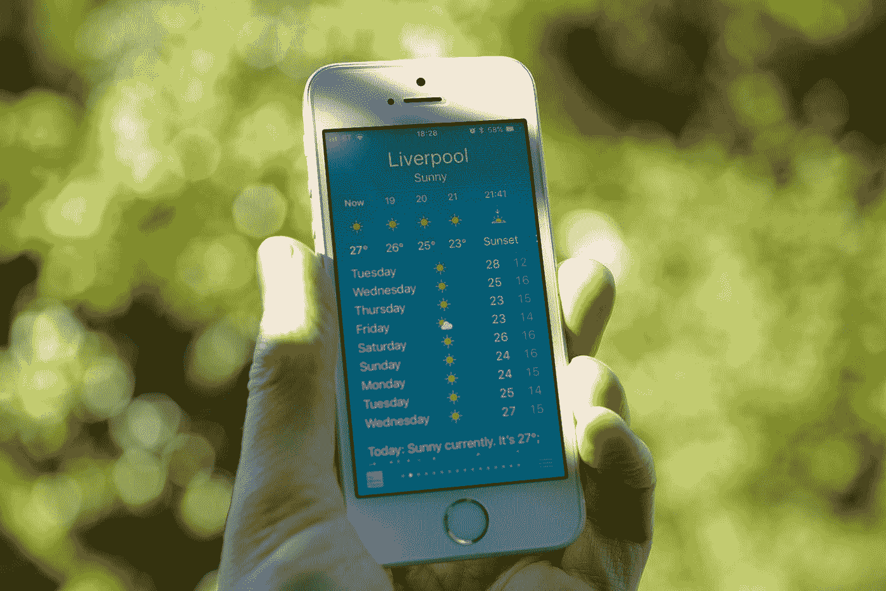

# 我在哪里可以找到我的分析或数据科学项目的数据？

> 原文：<https://medium.com/codex/where-can-i-find-data-for-my-analytics-or-data-science-project-b7f5e7fdc8aa?source=collection_archive---------5----------------------->

## [法典](http://medium.com/codex)

## **获取数据集和获得创意有不同的方式**

由[弗兰基·查马基](https://unsplash.com/@franki?utm_source=medium&utm_medium=referral)在 [Unsplash](https://unsplash.com?utm_source=medium&utm_medium=referral) 上拍摄的照片

如果你希望成为一名数据分析师或数据工程师/科学家，你很可能或不可避免地需要创建自己的项目，并在 Github 上展示你的工作(这是免费的)。规划这些类型的项目时，一个困难的方面是找到数据集。想一个你最感兴趣的话题，然后开始搜索！如果你是一名求职者，理想情况下，你应该想出一些与你想进入的行业类型相关的东西。

数据有不同的存储格式，因此数据集可能是电子表格、CSV 文档或纯文本文件。请注意，获取和准备数据的不同方式在难度上可能有所不同，并且需要一些技术和基本的数据管理知识。以下要点将描述您获取数据的方式:

*   从网上下载吧。这是获取数据最简单的方法。有一些像 Kaggle 或 Data.gov 这样的网站，你可以找到免费的数据集。尽管要注意有些文件会不完整或格式不正确，这意味着你可能需要“清理”或修复文件集。如果“损害无法修复”，就不要浪费时间去修复质量差的数据。作为一种选择，你可能需要在其他网站上付费才能让他们向你提供信息，但是如果你的目标是开发一个个人项目，我建议避免这些网站。

[活动创建者](https://unsplash.com/@campaign_creators?utm_source=medium&utm_medium=referral)在 [Unsplash](https://unsplash.com?utm_source=medium&utm_medium=referral) 上的照片

*   自己创造。获取数据的一种老方法是通过调查。计划您项目的问题，并将调查的回答包含在电子表格中。执行此操作时，请确保您的数据格式正确。此外，你不希望浪费时间发起一项调查，这将导致与你的项目无关的无用信息。一种不常见的获取数据(例如温度)的方法是通过传感器！这种方法的缺点是，你可能需要电路、电子和通用编程语言方面的知识。我猜一个类似的选择是手动记下来自其他设备的结果，然后编辑你的结果或数据。根据个人经验，我曾经做过一个数据处理项目，通过连接到笔记本电脑的 Arduino 板记录实时流温度数据。如果您的目标是使用虚拟(伪造)数据，并获得一些数据分析工具(如 Excel、SQL 或 Python)的经验，您可能需要考虑使用 Python 的 Faker。这个库将产生随机数据集(姓名，日期，地址等)。)，但是请注意，数据的质量可能不是最好的。

由[威廉·艾文](https://unsplash.com/@firmbee?utm_source=medium&utm_medium=referral)在 [Unsplash](https://unsplash.com?utm_source=medium&utm_medium=referral) 上拍摄

*   **码一个网刮。如果您决定使用这种方法，请注意，对于某些网站来说，抓取其内容或数据是非法的(即使您尝试这样做，也可能非常困难！).scraper 基本上是一组代码，可以读取网页的 HTML 标签，并提取这些标签中的任何内容。使用你自己的代码从别人的网页上获取数据是可以的，只要它不是个人信息或者你不打算出售它。例如，你可能会从一个提供“YouTube 热门频道”等信息的网站上抓取数据。这种方法的第二个缺点是，为了提取数据并将其存储在电子表格中，您需要一些 web 开发知识和 Python 之类的编程语言。**

伊利亚·巴甫洛夫在 [Unsplash](https://unsplash.com?utm_source=medium&utm_medium=referral) 上拍摄的照片

*   来自 API 的请求。一个 API(应用编程接口)基本上会从一个源中提取数据，直接提供给你。它做的工作与 web scraper 一样，唯一的区别是有人为你做了这些工作…事实上，有些人通过提供这种类型的服务和维护 API 的完全功能来赚钱，因此，不是所有这些都是免费的。API 通常以“URL 链接”的形式出现。我个人曾为一个个人简单的前端 web 应用程序使用公共 API，但你可以将它连接到 Microsoft Excel。通过这种方法获取数据可能需要也可能不需要编码技能。如前所述，对你的项目所基于的东西进行研究，也许你想要或需要的数据不是免费的。

由[加文·阿兰伍德](https://unsplash.com/@gavla?utm_source=medium&utm_medium=referral)在 [Unsplash](https://unsplash.com?utm_source=medium&utm_medium=referral) 上拍摄的照片

## 结论:

从事数据分析(或科学)项目的第一步是弄清楚如何获得你的数据。获取信息有不同的方法，这可能意味着第三方或使用您自己的来源来汇编原始数据。在应用上述四种方法中的任何一种之前，确保你知道你想要开发什么类型的项目。根据您正在做的事情，有些方法可能比其他方法更有效。规划应该是你的第一步。