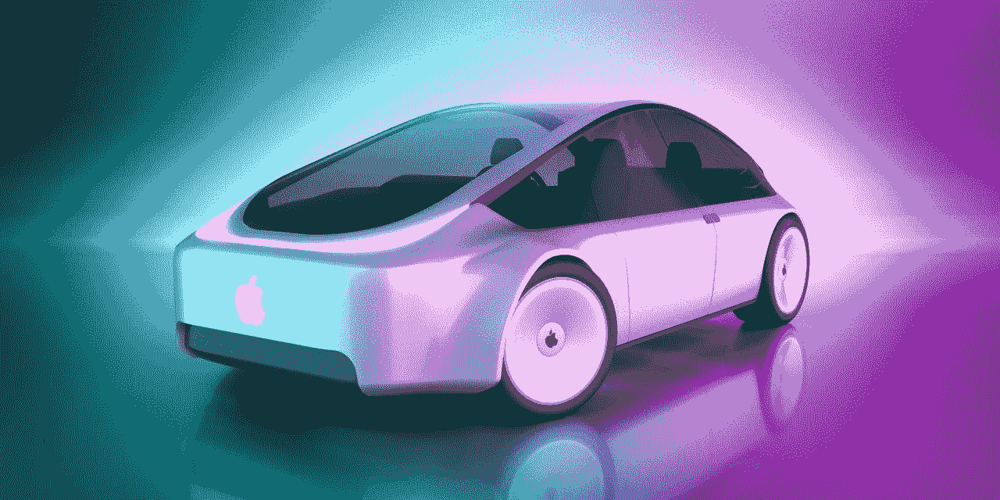
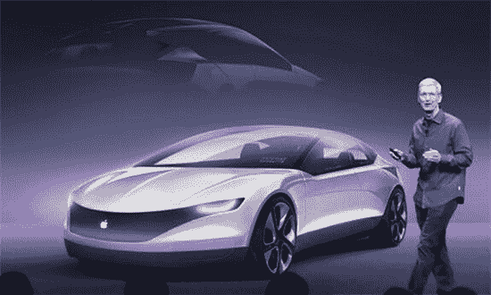
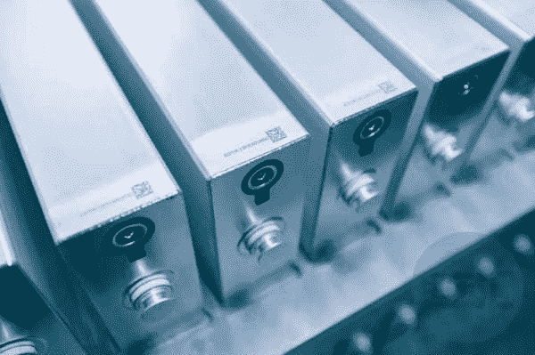
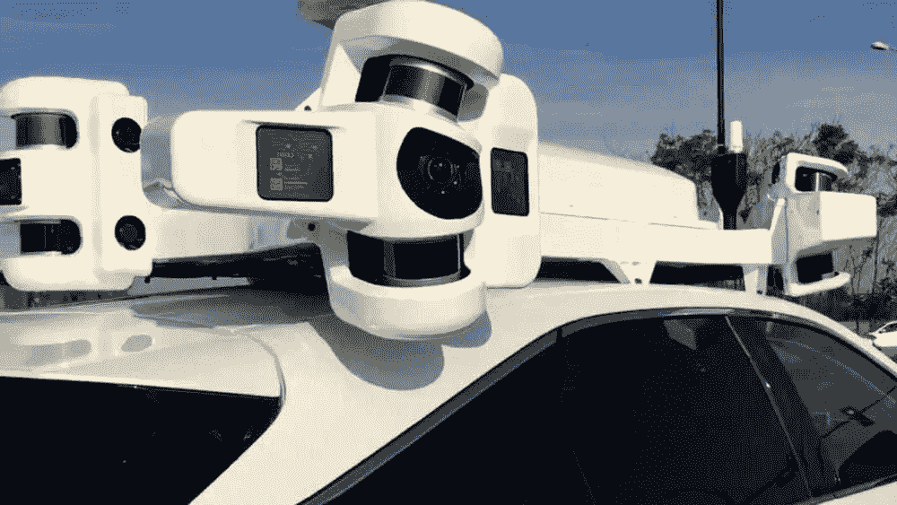

# 苹果汽车去哪儿了？

> 原文：<https://medium.com/codex/where-did-apple-cars-go-e719b886da44?source=collection_archive---------4----------------------->

图片来自[华尔街日报](https://www.wsj.com/articles/apple-and-the-end-of-the-car-as-we-know-it-11621656010)

R 最近关于互联网科技公司造车的新闻层出不穷。然而，这些公司并不是第一批进入这一领域的公司。

早在 2014 年，苹果就秘密启动了“ [**泰坦**](https://en.wikipedia.org/wiki/Apple_electric_car_project) ”项目，决心涉足*汽车领域*，但由于种种原因，实体汽车研发部门倒闭。原本想开发整车计划的项目，早已沦为自动驾驶技术的开发。

图片来源: [hebergementwebs](https://www.hebergementwebs.com/hightech/apple-car-we-know-more-about-apple-s-electric-car)

2021 年 6 月 1 日，苹果被曝重启“ **Titan** 项目研发整车。苹果还没有公布完整的消息，但是已经有很多信息显示苹果已经开始行动了。

## **寻找与比亚迪和 CATL 的动力电池合作**

6 月 8 日，路透社报道称，苹果正在接洽动力电池供应商，而这些供应商恰好是中国动力电池行业的佼佼者， **CATL** ，以及**比亚迪**。[媒体援引四位知情人士的话称，苹果更倾向于使用 L **磷酸铁锂**电池，因为生产成本低于**镍**和**钴**](https://min.news/en/auto/905368b03d307c27abf8dcbfc9e3b689.html) 。不过，CATL 和比亚迪没有回应此事。

图片来源: [dracing](https://www.dracing.pe/events-view/byd-construye-la-fabrica-de-baterias-para-autos-mas-grande-del-mundo/)

> 由此看来，苹果重启的车辆计划也是当今最热门的新能源领域。同时，中国新能源汽车产业的发展，使得中国的新能源汽车供应商成为全球公司的首选目标。

## **代工合作谈判继续失败**

在车辆项目重启之前，苹果曾在汽车项目上寻求代工厂的帮助，但都是沟通协商失败。或许也是前几轮代工沟通的失败，让苹果决定重启整车制造项目。

> 今年 1 月，有消息称苹果将与现代集团合作，计划于今年 3 月签署自动驾驶汽车电动化合作协议，并于 2024 年在美国生产。

但不久后 [**现代集团**宣布与苹果](https://www.reuters.com/article/us-hyundai-motor-apple-idINKBN29D02E)的合作会降低现代品牌的自我价值，不想成为代工厂，因此双方的潜在合作搁浅。

在与现代的合作谈判破产后，日产加入了与苹果的谈判，但在完成初步接触后，日产也退出了沟通谈判，因为苹果的要求是请求日产制造苹果品牌的汽车。日产对此也不感兴趣。

## **自动驾驶技术还在路上**

作为全球市值最高的公司，苹果最大的亮点是在*电子技术*领域的成就。将**自动驾驶**技术作为未来苹果汽车的核心卖点，是苹果汽车项目的一个重要方向。

图片来源: [macrumors](https://www.macrumors.com/roundup/apple-car/)

从汽车项目开始，苹果就在自动驾驶技术上进行投资，在行驶里程上取得了长足的进步。根据苹果官方数据，[苹果自动驾驶汽车的自动驾驶里程已经从 2019 年的 7544 英里(12100 公里)增加到 2020 年的 18800 英里(30300 公里)。其中，脱离距离从 2019 年的 118 英里(189 公里)延长至 2020 年的 145 英里(232 公里)。](https://min.news/en/auto/905368b03d307c27abf8dcbfc9e3b689.html)

然而，**自动驾驶**技术长期没有实现，以至于苹果的自动驾驶研发团队也经历了很多变数。据媒体报道，在过去的几个月里，[已经有三名负责自动驾驶项目的苹果高管离开了公司](https://www.bloomberg.com/news/articles/2021-06-02/apple-loses-several-top-managers-from-self-driving-car-division)，这意味着苹果投入巨资的自动驾驶项目在没有收获的情况下不得不面临人才流失的危险。

现在车辆项目再次启动，不知道会不会让苹果尽快步入正轨，完成库克十年内推出成熟自动驾驶汽车的计划。然而，人才的流失和代工谈判的失败，使得苹果不得不重复特斯拉等公司的老路。