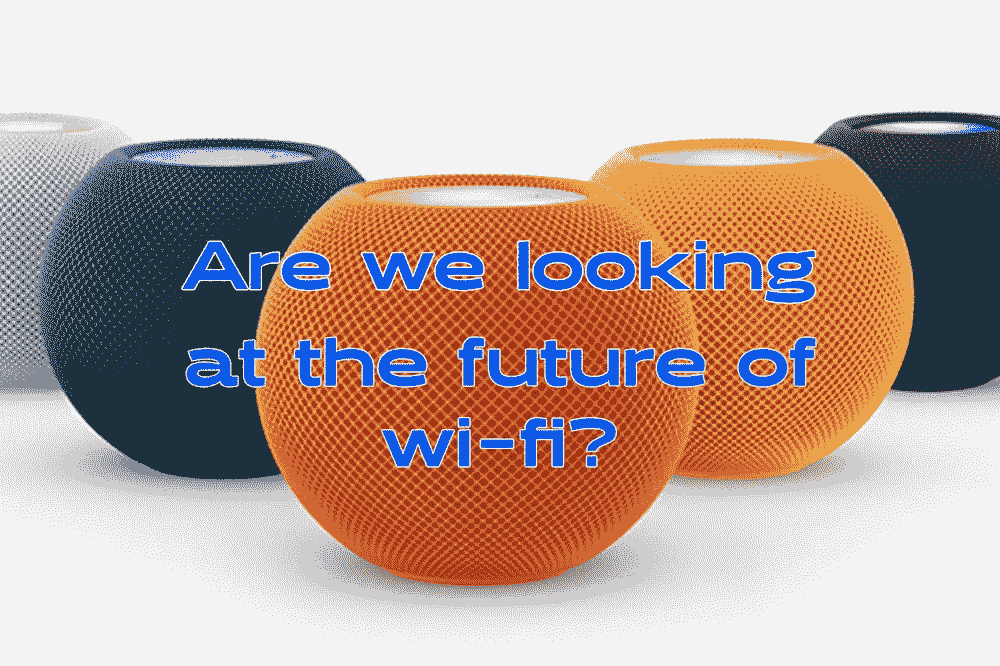
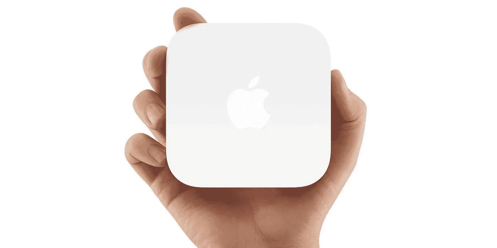
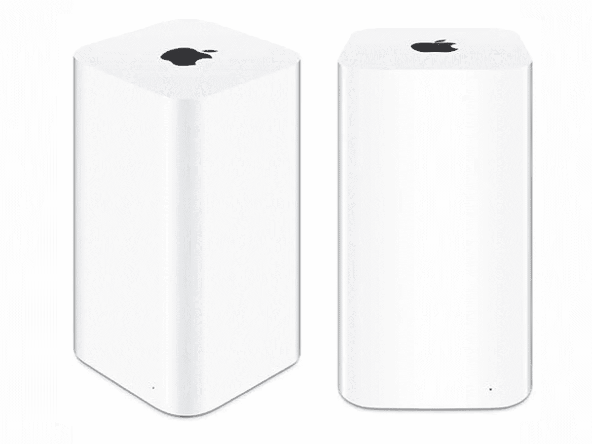
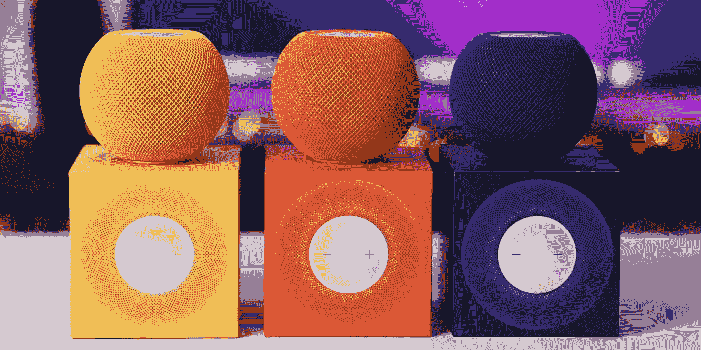
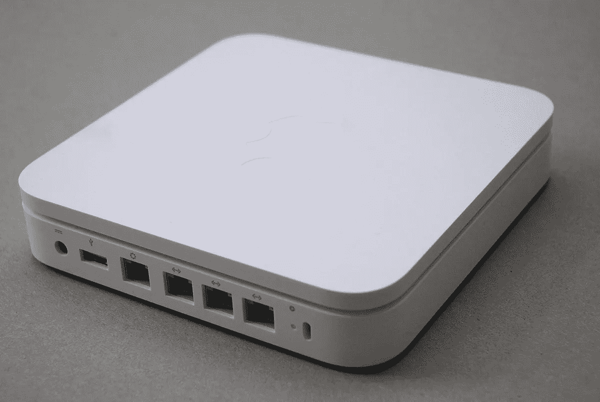
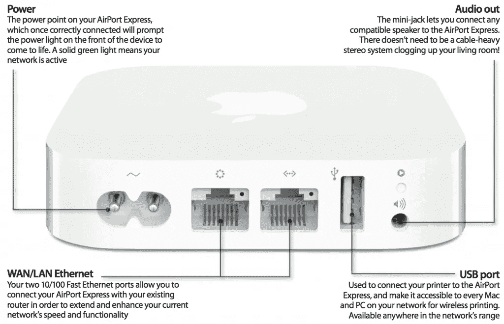

# wi-fi 去哪了？

> 原文：<https://medium.com/codex/where-did-the-wi-fi-go-15ecea31a89e?source=collection_archive---------5----------------------->

## 苹果有许多依赖 wi-fi 的产品，但他们不再有路由器。为什么？

苹果重回路由器市场？

只要你能说出它的名字，任何数量的苹果设备都是通过与外界的联系而生存和发展的。都是关于 wi-fi 的。然而，奇怪的是，苹果不卖 wi-fi 路由器，至少不再卖了。如果你要回到 5、6 年前，我们有几个选择。有 AirPort Express 和 AirPort Extreme，但自从它们被关闭后，苹果就没有再涉足这个市场。

 [## 强大的 Mac mini 的下一步是什么？

### 为这款惊艳的台式机做了大量规划

medium.com](/codex/what-next-for-the-mighty-mac-mini-8815484e070d) 

## 回去的路

机场快线看起来怎么样

苹果已经袖手旁观，看着他们的竞争对手推出像谷歌的 Nest，亚马逊 Nero 甚至三星的 SmartThings 这样的产品，但他们似乎仍然对重新进入市场持谨慎态度。但似乎答案已经摆在他们面前了。这可能是苹果不需要*夸大布丁*的时候——或者换句话说，过度设计答案。不，与其寻找创造一个全新的路由器，为什么不用他们已经生产的东西来制造一个路由器呢？他们可以用已经获得投资回报的产品制造路由器。我在说什么？我的愿景是使用 HomePods、HomePod Mini 或 Apple TV 的网状路由器生态系统。现在，这些设备实际上分散在我们的家中，可以很容易地进行转换，以提供一个独特的家庭网络解决方案。苹果的 USP，一直是关于独一无二的。鹤立鸡群。不要害怕创新。它几乎是在做苹果最擅长的事情——硬件和软件的结合，当然也包括服务和应用。

负十六播客

## 我们以前见过

旧机场极限

我所建议的，对苹果来说也不是革命性的。我们已经看到同样的事情最近才发生，与工作室显示。有了这个小组，他们不会轻易做出选择。相反，他们*将其苹果化*。他们可以简单地在已经外包的 LG 面板周围放上一个铝制机身。但事实并非如此——他们以全新的视角看待面板。虽然有些人可能会认为这是过高的价格，但他们所做的是，用一种全新的，大胆的方法，将面板带向一个新的方向。它有自己的固件，运行 A13 仿生芯片，这是 iPhone 11 和 iPad 9 使用的同一芯片，他们并没有就此止步。他们添加了降噪麦克风、中央舞台网络摄像头、空间音频、TrueTone 甚至 SmartHDR 技术。爱它或恨它，这是苹果最擅长的。苹果曾短暂尝试外包他们的路由器，甚至试图帮助第三方供应商提供基于 HomeKit Secure 的路由器，但最终对苹果来说不够独特。它没有活&呼吸它们的 DNA。

 [## 九台新的 M2 苹果电脑

### 和四种不同版本的 M2 芯片。是时候让我们看看了！

medium.com](/codex/nine-new-m2-macs-1415cfa37ac5) 

## 他们从哪里开始

多彩的 HomePod 迷你电脑——即将成为路由器？

目前，wi-fi 的号角是 wi-fi 6E，因为它是最好的。实际上，设置会非常简单，几乎不存在。然后，我们有望根据用户需求看到不同的模型。比如一个机场迷你，里面有 A13 芯片。在设置上，比如说在一个小公寓里，它将是完美的，当然，作为苹果生态系统的一部分，它将通过 iCloud 将你所有的设备连接到它，所以不用登录。但是，当你的需求增长，或在较大的家庭，迷你繁荣到一个亲！理论上，任何点缀在你家中的固定式苹果产品(在我的印象中至少是*)都会成为网状网络的一部分。隔壁的迷你电脑正在和我书房里的苹果电脑通话，而苹果电脑又在和我卧室里的 HomePod 迷你电脑通话。当然，如果你*真的*需要扩展网络，比如说到了花园尽头，再买一台 mini。但本质上，每次你加入苹果产品阵容，它都可能悄悄地、无形地、强有力地加入你的网状网络。*太棒了，还是我有太多的复活节阳光？**

## 这只是开始

苹果的时间胶囊

他们可以在船上有一些存储，回到时间胶囊(*我实际上还有一个*)，这样你网络上的设备就可以自动同步和备份。也许你甚至可以登录它，调节孩子的屏幕时间，或者内置一些 HomeKit 功能。不难想象，在未来的某个时候，苹果公司甚至会涉足成熟的家庭娱乐市场。然后，你的电视室或客厅里的剧院系统也会加入进来。如果你在同一个房间里用 VR 头戴设备玩游戏，连接和限制似乎是无限的。

## 结束的

木卫一可以发挥重要作用

正如我之前所说，苹果似乎终于以巧妙的思维重新回到了马鞍上。是的，工作室的展示并不是完美的，无论如何也不是，但是，它展示了它们完美地代表了什么。硬件、软件和服务都捆绑在一个出色的设备中。出于这样或那样的原因，我们都购买了苹果品牌。我知道我写的一些东西听起来有点异想天开，但是，闭上你的眼睛，想象你的家完全是苹果公司的，永远不要离开这个加利福尼亚技术打手的辉煌设计和网络。是的，很牵强，但是，不可能吗？

*你怎么看？简单地通过给家里增加一台设备来增加网络的想法有吸引力吗？你想在你家周围建立一个网状的苹果网络吗？不再有藏在餐具柜上的无聊的黑色路由器，取而代之的是色彩鲜艳、醒目的苹果电脑和 HomePod 迷你电脑，它们时尚地为我们做着这项工作。*

## 在你走之前

我只是高端博客网站 Medium 的众多作者之一。它是如此物有所值，你可以在这里加入[https://medium.com/membership](https://medium.com/membership)

[加入我的幕后邮件列表](https://www.talkingtechandaudio.com)

原载于 2022 年 4 月 20 日 https://www.talkingtechandaudio.com/blog。