# 我应该在哪里扩展我的咖啡店生意？

> 原文：<https://medium.com/codex/where-should-i-expand-my-coffee-shobusiness-44872e2187f8?source=collection_archive---------18----------------------->

内森·杜姆劳在 [Unsplash](https://unsplash.com?utm_source=medium&utm_medium=referral) 上的照片

咖啡店是人们可以去的一个地方。很多原因可以让你最终去咖啡店，无论是在工作负荷后快速恢复精神，仅仅是享受咖啡的味道，还是想工作并需要一些个人空间。

根据[调查](https://nowjakarta.co.id/dining/culinary-talk/the-emerging-business-of-coffee-shops-in-indonesia)，2019 年印尼的咖啡店数量已经达到 2950 家，是 2016 年的 3 倍。这种现象是由许多因素推动的，例如社交媒体的存在比促销更容易，打车平台的存在可以方便客户通过送货来购买，购买力的增加，以及印度尼西亚年轻人之间闲逛的新文化。

如果你想扩大你的业务，无论是开始新的业务还是扩大你现有的咖啡店特许经营，将有这么多方面要彻底考虑，所以你可以确保业务尽可能有利可图。位置是需要考虑的一个重要方面。在一个有许多现有竞争对手的地区建咖啡店会很困难，所以你可能会选择其他策略。一个例子是选择人口众多但竞争对手较少的地区。

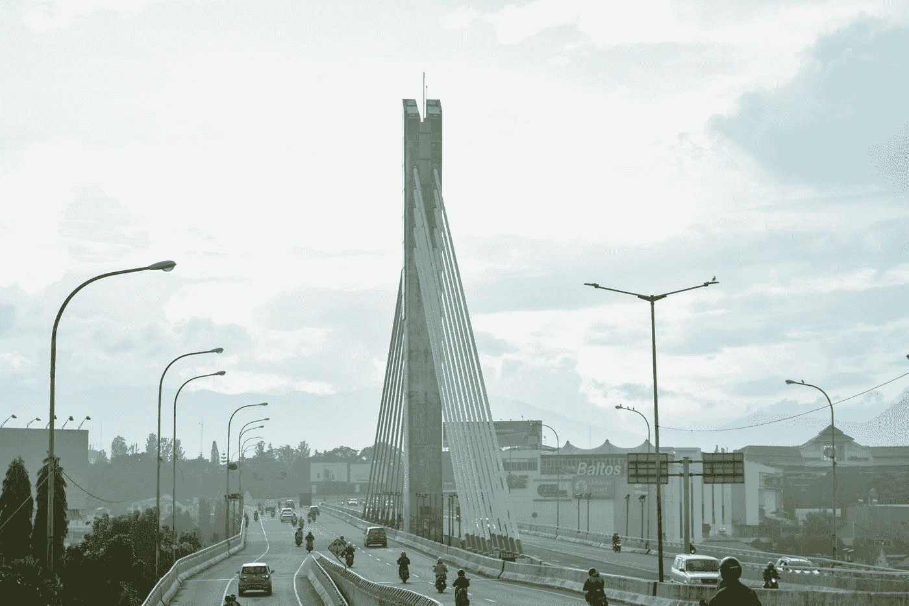

照片由 [Hani Fildzah](https://unsplash.com/@hanifildfn?utm_source=medium&utm_medium=referral) 在 [Unsplash](https://unsplash.com?utm_source=medium&utm_medium=referral) 上拍摄

拥有 250 万人口的万隆现在是印度尼西亚人口第四多的城市，咖啡店的增长趋势也不例外。使用机器学习，我们将探索我们应该在万隆的哪里扩展我们的咖啡店业务。

# 数据

第一个数据取自[公开数据哥打万隆](http://data.bandung.go.id/dataset/jumlah-penduduk-berdasarkan-kelompok-umur/resource/ddef7c33-dc17-4a64-9d00-4eac7c8dcb7f)。从该资源中获取的数据是基于年龄组和街区(或印度尼西亚术语“Kecamatan ”)的万隆人口数量。根据这些数据，年龄组将被重组为新的组(儿童、青少年、年轻人、成年人和老年人)。每个 Kecamatan 的年轻成年人数量&将在以后作为特征包括在内。

其他数据来自 FourSquare API，其中将收集每个 Kecamatan 的场馆，每个 Kecamatan 的咖啡店数量也将包括在内。

# 关于数据集的探索

## 人口数据集

首先，让我们看看人口数据集

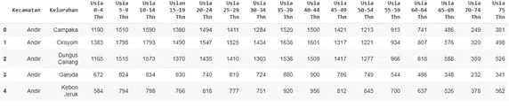

人口数据集快照

数据集包含 151 行和 18 列。在该数据集中，还包括 Kecamatan 和 Kelurahan(其下的区/较小区域)的名称。人口数量分为几个年龄组，年龄范围为 5 岁。对于该项目，数据集将被重新归类到新的年龄组。在万隆，有 30 个 Kecamatans 作为分析对象。

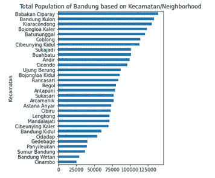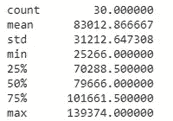

左:每个 Kecamatan 的总人口，右-每个 Kecamatan 的总人口的统计描述

万隆人口最多的 Kecamatan 是 Babakan Ciparay，约有 139，000 人，人口最少的是 Cinambo(约 25，000 人)。平均总人口约为 83，000 人。

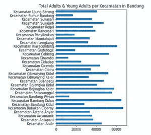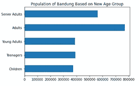

图 4 —左:每个 Kecamatan 的青年和成年人总数，右:基于新年龄组的总人口数

数据集被重新分类为新的年龄组，具体如下:

*   儿童:0-9 岁
*   青少年:10-19 岁
*   年轻人:20-29 岁
*   成年人:30-49 岁
*   老年人:> 49 岁

参考上面的图表，万隆以成人年龄组为主，其次是老年人。万隆有很大的咖啡店扩张潜力，因为成人和年轻人的人口数量相当高。成人和青年人数最多的 Kecamatan 是 Babakan Ciparay、Kiaracondong 和 Bandung Kulon。

## 来自 Foursquare API 的场馆数据集

在这一部分中，将使用 Foursquare API 检索每个 Kecamatan 的场馆。首先，我们将通过 geocoder libary 检索每个 Kecamatan 的坐标。万隆的坐标也将被检索。

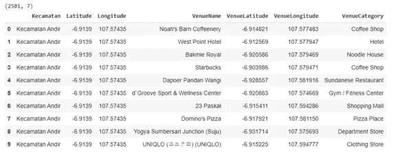

场馆数据集快照

根据上图，万隆周边收集了 2501 个场馆。半径设置为 3000，每个请求收集的场地总数限制为 100

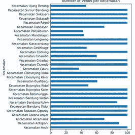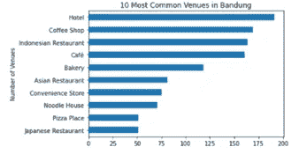

左图:每个 Kecamatan 的场馆数量，右图:万隆最常见的场馆

根据上面的图表，似乎有一些更拥挤的 Kecamatans，在那里，就业务/场地数量而言，他们有 100 个最大值。其他的不太拥挤。总共有 167 个独特的场馆类别。

还可以得出结论，印尼餐厅是万隆大多数 Kecamatans 最常见的场所类别，其次是酒店。与此同时，就每类场所的数量而言，酒店是最常见的场所，其次是咖啡厅和印度尼西亚餐厅。

# **使用的机器学习算法**

我们将发现万隆的 Kecamatans 适合于那些希望在咖啡店扩大业务的人，通过使用 K-Means 聚类，以现有咖啡店的数量和每个 Kecamatan 的成年人和年轻成年人的总人口为特征。选择这些特征的原因是，我们希望通过选择有更多购买力更强、渴望在咖啡店花钱或花时间的人(因此是年轻人和成年人)的区域，来最小化同一区域中竞争的可能性，并最大化购买。

使用 K-Means 将特征聚类成 3 组。应用这种算法的原因是特征非常简单，因此该过程将更快且更容易解释。

# **分析和结果**

## **预处理**

首先，对于已经检索到的每个地点，我们将基于地点类型创建一个 hot 编码。然后，对于每个 Kecamatan，我们将计算每个场馆类型的平均值，以便我们可以获得每个 Kecamatan 的总场馆类型的表示作为特征。为了进一步分析，我们还为每个 Kecamatan 创建了 10 种最常见的场馆类型。

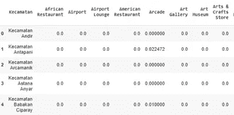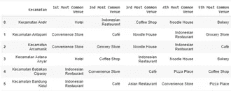

衍生特征的快照

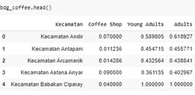

最终特征的快照

用于聚类的要素是每个 Kecamatan 的咖啡店平均数量和年轻人及成年人总人口。之所以包括这些年龄组，是因为成年人有购买力，一些年轻人可能也有，但他们渴望在咖啡店里花费时间和金钱。聚类前将对人口要素进行缩放。

## 结果

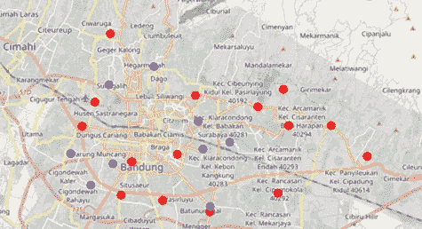

基于 K-均值的 Kecamatans 聚类

群集 0 用红色表示，1 是紫色，2 是浅绿色。

根据上面的结果，聚类 0 具有最多的 Kecamatans，聚类 2 具有最少的 Kecamatans。第 2 类中的大多数 Kecamatans 人在万隆东部，而第 1 类倾向于在万隆中西部。与此同时，集群 0 在城市中蔓延。

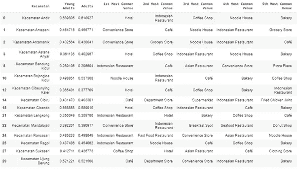

群集 0 的特征

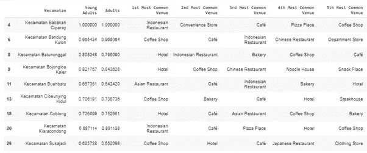

群组 1 的特征

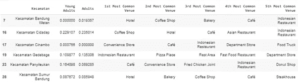

群组 2 的特征

查看每个集群的截图，似乎集群高度依赖于目标人口比率。聚类 2 的年轻成年人和成年人数量最少，而聚类 1 的数量最多。

为了总结各个 Kecamatan 的咖啡店是如何占据主导地位的，我们可以看看下表。

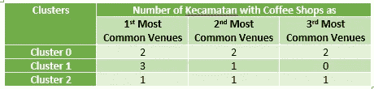

将咖啡店作为三个最常见场所的 Kecamatans 人数

根据上表，我们可以在第 0 类的 Kecamatans 中最容易找到咖啡店，因为它是第 0 类 Kecamatan 中最常见的前 3 个地点。集群 2 在集群中实际上没有很多咖啡店。

可以得出结论，首先基于总人口，然后是咖啡店的数量来清楚地构建聚类。

对于在哪里建造新咖啡店的建议，人们应该选择第 1 组中的 Kecamatans，因为该组中成年人和年轻人的比例最高，但咖啡店的数量适中。

如果要详细的话，我会进一步推荐 Kecamatans，也是基于靠近市中心/最常去的地方的位置或从集群 1。在万隆，大多数闲逛/游览的地方都在市中心偏北的地方。

以下是第一组中建造新咖啡店的前三名 Kecamatans:

1.  Kiaracondong(目标人口约为 0.9，咖啡店是第五大常见场所)
2.  Batununggal(目标人口约为 0.8，咖啡店是第四大常见场所)
3.  Coblong(目标人口约为 0.73，咖啡店是第四大常见场所，经常光顾的地区)

**结论&下一步**

Kiaracondong、Batununggal 和 Coblong 是聚类 1 中推荐的三个 Kecamatans，因为它们具有最高的目标人口比率、咖啡店数量和靠近市中心/游客最多的地方的位置。

我对进一步发展的建议是:

1.  利用包含人均收入比率的其他数据集，添加关于购买力的知识
2.  包括关于交通堵塞率的位置/地点的数据，因为这可能影响递送准时性
3.  提交给谷歌或打车应用程序的评级数量，以了解该地区的购买率，甚至评级本身也可以提供关于哪里更容易竞争的知识。

对于代码，您可以查看下面的我的 github repo:

 [## GitHub-intandeay/Applied-Data-Science-Capstone-Project:面向应用数据科学…

### 面向应用数据科学顶点项目-GitHub-intandeay/应用数据科学顶点项目:面向…

github.com](https://github.com/intandeay/Applied-Data-Science-Capstone-Project)