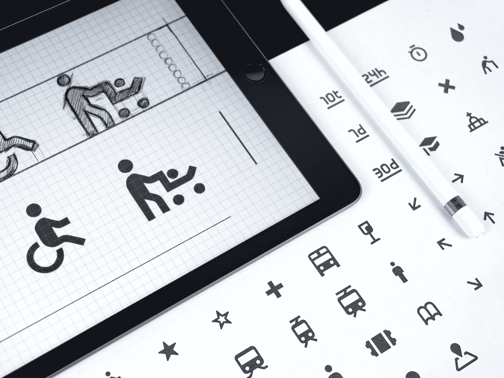

# 何时何地不使用 SVG！

> 原文：<https://medium.com/codex/where-when-and-when-not-to-use-svg-150d5a5d7592?source=collection_archive---------1----------------------->

在 [Unsplash](https://unsplash.com?utm_source=medium&utm_medium=referral) 上由 [Balázs Kétyi](https://unsplash.com/@balazsketyi?utm_source=medium&utm_medium=referral) 拍照

在之前的一篇[文章中，我写了关于图标使用网络字体的内容。这是一个强大的技术，对于单色图标来说很棒，而且不会把 HTML 弄得一团糟。但是这也引起了一些人问我“那么你永远不会使用 SVG 了？”](/codex/creating-custom-icon-webfonts-478a934c7ddf)

我当然会使用 SVG。更多的是时间、地点和原因的问题。不过，你是否应该使用它也是一个很好的问题，非常具体的情况。我认为在网络开发中…