# 哪个自动化工具最好:Selenium Web Driver | Cypress | Web Driver io | test cafe |剧作家

> 原文：<https://medium.com/codex/which-automation-tool-is-the-best-selenium-cypress-webdriverio-testcafe-playwright-c56c6f22df1f?source=collection_archive---------0----------------------->

> 我应该为我的新项目选择哪个自动化工具|框架？

在我看来，每当需要为新项目选择新的自动化工具时，这是最常被问及的&搜索问题之一。如果你加入了一家公司，那里的测试自动化工具和编程语言都已经决定好了，而且也没有改变的打算，那么你是最幸运的一个——你可以跳过阅读，除非你对其他自动化工具很好奇:)

这篇文章的目的是向您展示不同的自动化工具，这些工具可以用来为功能性 E2E 测试建立自动化框架。我不会介绍每个工具的标准特征，因为这可能会花太多时间。然而，当我们寻找一个新的工具时，我将试着涵盖给这个工具带来显著优势的特殊特征，并且也涵盖可能是最重要的事情的限制。因此，说一个工具是最好的，或者比另一个更好，既不容易，也不符合逻辑——这完全取决于您的需求和产品特性。

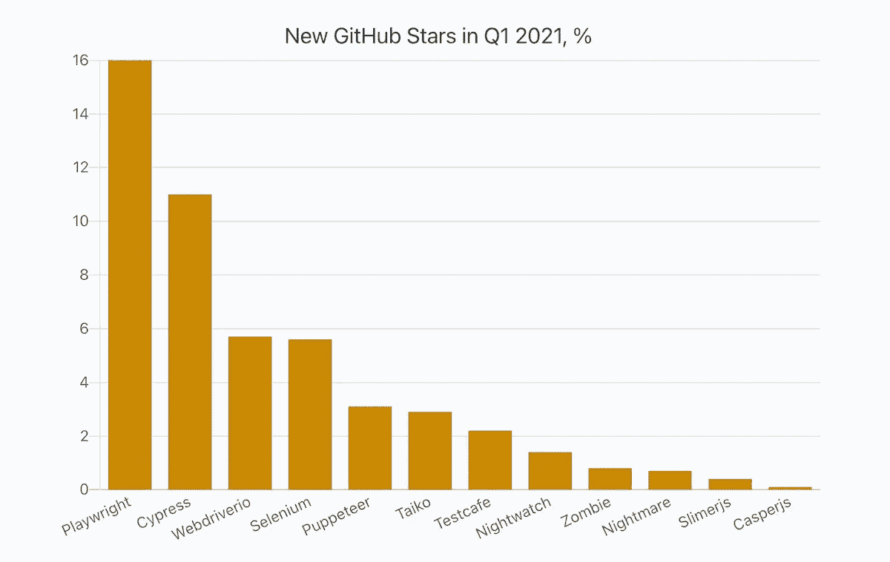

# 概观

Cypress 和 TestCafe 是本地 JavaScript 测试框架，已经开发了几年。**剧作家**是微软为自动化浏览器而启动的开源 Node.js 库，也支持多种编程语言。随着它们的功能变得更加强大，它们都越来越受开发人员的欢迎。这些框架的优点是它们是用 JavaScript 编写的，这是许多开发人员喜欢的，并且它们在浏览器中运行，而不是像 Selenium 那样远程执行测试。

另一方面，Selenium WebDriver 可以与 JS 一起使用，但是它广泛用于 Java 编程语言。最近，它在 Python 和 Ruby 中也很流行。尽管有所有这些基于 JS 的自动化工具，Selenium WebDriver 仍然是今天使用最多的测试自动化框架。它也是运行全面测试自动化策略的 QA 测试人员的首选测试自动化框架。这在未来可能会改变——我们会看到……为了保持竞争力，Selenium WebDriver 在准备 Selenium 4 的主要发布时也做了令人印象深刻的改进。

最后，WebdriverIO 于 2015 年首次推出。它提供了 Selenium WebDriver API 的定制实现。

让我们来看看他们的简短定义… ✍

**硒是什么？** Selenium 是一个开源工具，用于自动化在 web 浏览器上执行的测试(使用任何 web 浏览器测试 Web 应用程序)。Selenium 自动化浏览器。首先，它是为了自动化 web 应用程序的测试目的，但当然不仅限于此。基于 web 的重复性管理任务也可以实现自动化。

**柏树是什么？** Cypress 是为现代网络开发的前端自动化测试应用程序。Cypress 构建在一个新的架构上，运行在与被测试的应用程序相同的运行循环中。

**什么是 WebdriverIO？***node . js 的 web driver/Selenium 2.0 JavaScript 绑定*。WebdriverIO 是用 JavaScript 编写的，并且使用了 Selenium。它还自带内置的测试运行器，并支持其他测试框架，如 Jasmine、Cucumber 和 Mocha。

**什么是 TestCafe？**它是一个纯 node.js 的端到端解决方案，用于测试 web apps。它负责所有的阶段:启动浏览器、运行测试、收集测试结果和生成报告。

**什么是剧作家？微软的剧作家是无头浏览器测试框架的最新成员。剧作家是一个 web 测试自动化库，针对最流行的浏览器的底层引擎进行测试。剧作家利用 DevTools 协议来编写强大、稳定的自动化测试。**

> 这里值得一提的是，剧作家是木偶师的高级版本。木偶师，一个由谷歌开发的开源网络自动化工具。然而，木偶师不支持 Safari 或 Firefox。微软从木偶团队雇佣了开发人员来开发剧作家，作为该工具的高级版本，提供了更多的功能和更广泛的浏览器支持。

# **特殊功能**

B elow 特性自然不局限于本文所涵盖的内容。目标是深入了解每种工具。

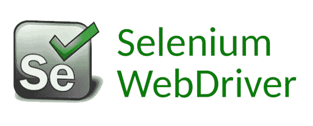

***Selenium Web 驱动:***Selenium 4 中提供的新特性，包括**相对定位器**，它根据附近指定的元素定位元素，比如 above()、below()、toLeftOf()、near()...等等。

借助于 **newWindow()** 方法，无需在同一个测试中创建新的驱动程序对象来管理多个应用程序，就可以在同一个会话中创建并打开一个全新的或选项卡式的窗口。

**Chrome DevTools 协议**，它允许用户利用调试协议提供的浏览器增强可见性，一个在 UI 元素级别抓取**屏幕截图的选项**，**增强的 Selenium Grid** 部署，**可观察性**和**增强的异常**是新功能的一部分。

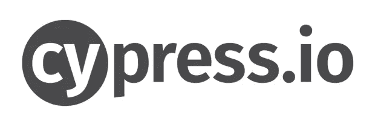

***Cypress:***Cypress 一个非常好用的特性就是**活重装能力**。
这意味着当您编写您的测试脚本并点击‘save’时，测试运行人员会获取文件并重新运行测试。即使这意味着中断已经运行的测试。这给了你几乎即时的测试反馈。

你的脚本的每一步都有一个截图，如果有任何错误的通过或失败的测试，这对调试也很有帮助！

Cypress 等待元素变得可见，动画完成，DOM 加载，XHR 和 AJAX 调用完成，等等。因此，不需要定义隐式和显式等待。

***WebdriverIO:*** 主要优势是使用 Appium 同时支持 web 和移动。您可以使用 WebdriverIO 来自动化:

*   🌐用 React、Vue、Angular 或其他前端框架编写的现代 web 应用程序
*   📱在仿真器/模拟器或真实设备上运行的混合或本地移动应用程序
*   💻原生桌面应用程序(例如用 Electron.js 编写的)

WebdriverIO 可以在 [WebDriver 协议](https://w3c.github.io/webdriver/)上运行，用于真正的跨浏览器测试，也可以在 [Chrome DevTools 协议](https://chromedevtools.github.io/devtools-protocol/)上运行，用于基于 Chromium 的自动化

***TestCafe:***由于 test cafe 只推出浏览器，所以可以在桌面或移动端实现浏览器自动化。与 WebDriver 不同，您不需要特殊版本的浏览器和驱动程序来准备运行测试。

有一个**自动等待机制**，它自动等待发生变化并重试检查。TestCafé知道什么时候等待，以及在测试继续之前等待什么。当测试运行时，一个大的指针显示哪个元素正在被交互。

还有一个**自动化认证脚本**，保存并激活用户角色，方便在不同用户账号之间切换。

另一个很酷的功能是**移动网络应用测试**，它通过 IOS 或 Android 设备测试网络浏览器，没有任何额外使用 Appium 的变通方法。您可以使用二维码将您的 iOS 或 Android 设备连接到 TestCafe 作为远程浏览器:[远程浏览器](https://devexpress.github.io/testcafe/documentation/using-testcafe/command-line-interface.html#remote-browsers)。还有在移动设备上测试的第三方浏览器插件:[test cafe-browser-provider-I device](https://www.npmjs.com/package/testcafe-browser-provider-idevice)和[test cafe-browser-provider-Android](https://www.npmjs.com/package/testcafe-browser-provider-android)。

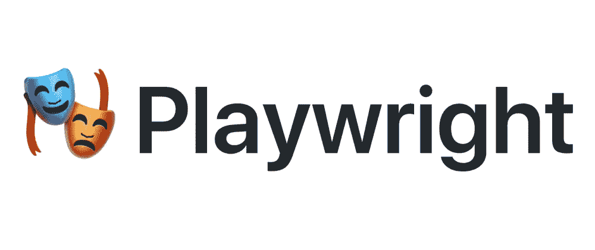

***剧作家:*** 它自动等待所有相关检查通过，然后才执行所请求的动作。如果要求的检查没有在给定的`timeout`内通过，则动作会因`TimeoutError.`而失败

剧作家可以在测试场景中拦截网络活动，以修改或模仿网络请求。

> 默认情况下，剧作家测试使用多个工作进程并行运行测试。每个工作进程创建一个新的环境来运行测试。默认情况下，剧作家测试尽可能多地重用工人，以使测试更快。如果任何测试失败，剧作家将丢弃整个工人进程以及使用的浏览器，并开始一个新的。这样，失败的测试不会影响健康的测试。您可以通过[命令行](https://playwright.dev/docs/test-cli)或在[配置文件](https://playwright.dev/docs/test-configuration)中控制并行工作进程的最大数量。

如果测试失败，剧作家测试将重试测试。运行测试时应超过最大重试次数，或者应在[配置文件](https://playwright.dev/docs/test-configuration)中设置。

截图功能:提供全页面截图和元素截图。

# 浏览器支持

***Selenium web driver***支持所有主流浏览器(Mozilla Firefox、Internet Explorer、Google Chrome、Safari 或 Opera)。

***Cypress*** 目前，Cypress 已经支持 [Chrome 系列浏览器](https://docs.cypress.io/guides/guides/launching-browsers#Chrome-Browsers)(包括基于电子和铬的微软 Edge)，以及 Firefox。

***TestCafé*** *支持 m* 多个浏览器，包括手机版本。谷歌 Chrome，ie 浏览器(11+)，微软 Edge，Mozilla Firefox，Safari。

***WebdriverIO*** 还支持所有已知的浏览器，如 Google**[chrome Driver](http://chromedriver.chromium.org/downloads)，Firefox — [Geckodriver](https://github.com/mozilla/geckodriver/releases) ，微软 Edge — [Edge Driver](https://developer.microsoft.com/en-us/microsoft-edge/tools/webdriver/) ，Internet Explorer—[InternetExplorerDriver](https://github.com/SeleniumHQ/selenium/wiki/InternetExplorerDriver)，Safari — [SafariDriver](https://developer.apple.com/documentation/webkit/testing_with_webdriver_in_safari) 。**

*****剧作家*** 对所有现代浏览器都有完整的 API 覆盖，包括谷歌 Chrome 和微软 Edge(带 [Chromium](https://www.chromium.org/) )、苹果 Safari(带 [WebKit](https://webkit.org/) )和 Mozilla Firefox。**

# **语言支持**

**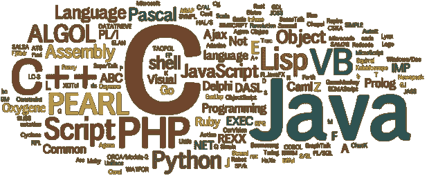**

****硒:** Java，JavaScript，Python，C#，PHP，Ruby，Perl &。网**

****Cypress:** Cypress 测试只用 JavaScript 编写。**

****web driver io:**web driver io 测试也只使用 JavaScript / TypeScript 编写。**

**test cafe:test cafe 测试也只使用 JavaScript 编写。**

****剧作家:** JavaScript & TypeScript，Python，Java，C#**

# **受欢迎程度|社区支持**

**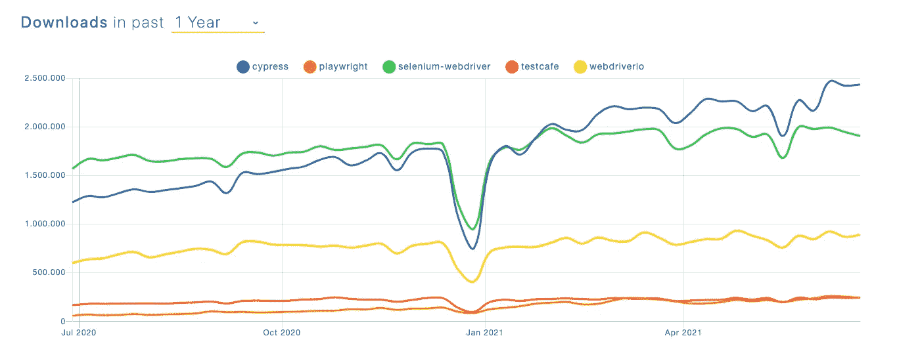**

****来源:**[**https://www . NPM trends . com/cypress-vs-writer-vs-test cafe-vs-web driver io-vs-selenium-web driver**](https://www.npmtrends.com/cypress-vs-playwright-vs-testcafe-vs-webdriverio-vs-selenium-webdriver)**

**他的特征很重要。因为如果社区很大，无论何时你遇到困难，总会有人在外面帮助你。**

**Selenium Web 驱动程序: Selenium 有一个庞大的活跃用户社区，你可以很容易地在互联网上找到问题的答案。**

****柏木:**柏木在 2017 年一出现就相当新鲜，人气也在稳步增长。除了社交平台，还有 Gitter Chat，你可以直接提出你的问题。【https://gitter.im/cypress-io/cypress 号**

**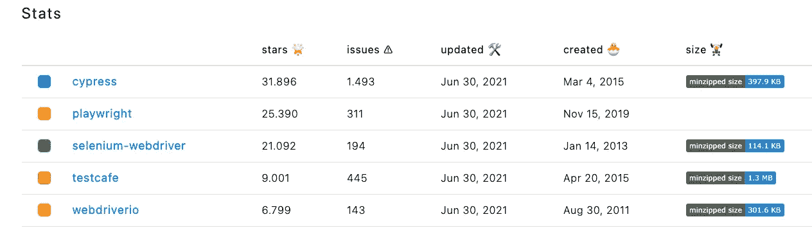**

**[**https://www . NPM trends . com/cypress-vs-Wright-vs-test cafe-vs-web driver io-vs-selenium-web driver**](https://www.npmtrends.com/cypress-vs-playwright-vs-testcafe-vs-webdriverio-vs-selenium-webdriver)**

**另一方面，他们提供开放的办公时间来支持用户。但是，如果想将 selenium 与 JS 语言结合使用，这是最好的选择之一。也有论坛可用。**

****TestCafe:**有两本书介绍 test cafe 自动化工具。这些书包含独家提示和见解。还有一个社区博客，其中包含 TestCafe 社区成员撰写的文章。**

**剧作家:因为它很新，建立一个社区可能需要时间。有专门的松弛通道预留给问题。否则，可以从 Twitter 关注新新闻。**

# **证明文件**

****

**所有 JavaScript 自动化工具都提供了或多或少类似的文档，这给了用户直接开始编写测试的机会。即使你不知道什么是 Cypress、TestCafé、WebdriverIO 或剧作家，只要浏览一下文档，你就可以处理在构建新的项目框架时可能遇到的任何情况。几乎所有这些都提供了很好的示例项目。从文档的角度来看，我没有发现它们之间有很大的不同，但是我发现 Cypress 和剧作家的文档更加用户友好，更加全面。**

**当谈到 Selenium 时，仅仅通过遵循文档很难构建一个自动化框架，因为它比其他自动化框架复杂。然而，正如我前面提到的，有一个巨大的社区，在那里你可以找到你需要的几乎任何东西，并且有许多开源的现成样板文件。**

# **句法**

**我将尝试用这些工具演示非常基本的登录测试来展示语法。正如我们在下面看到的，语法与主要动作非常相似。只有当场景变得复杂时才不同。我们也可以很容易地认识到，除了 Selenium 和 WebdriverIO，其他工具都提供了自动等待，这样我们就不需要显式地编写等待动作，这使得它们更加稳定。**

**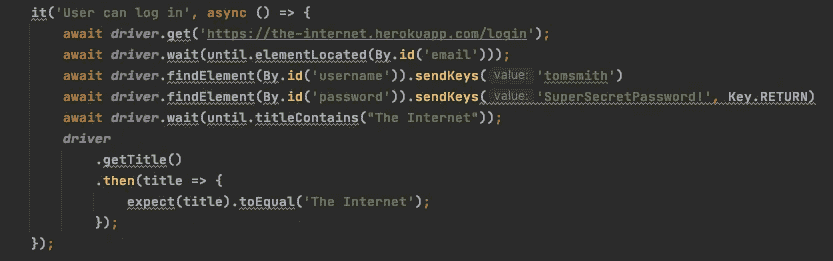**

*****硒与 JS****

**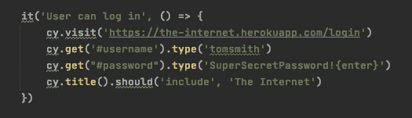**

*****柏树****

**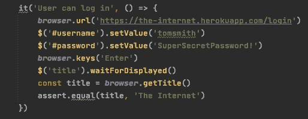**

*****网络驱动****

**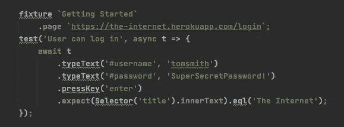**

*****测试咖啡馆****

**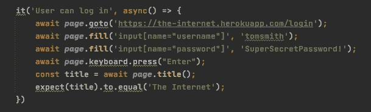**

*****剧作家****

# **限制**

**当所选择的自动化工具有限制时，这里有一些变通方法。众所周知，每一项新功能都有其局限性。你越深入，就越发现基于你的需求和期望的局限性。我将试着提及最常见的几个。**

**Selenium Web 驱动程序:它不是很快，需要更多的知识来正确设置。它也仅用于基于网络的应用程序，并且对图像测试的支持有限。**

****Cypress:** 不能在 Safari(第二常用的桌面浏览器)中运行。Cypress 对 iframes 的支持也是有限的，需要编写一个自定义代码来处理。**

**此外，Cypress 不支持打开和操作多个选项卡和窗口。因为 Cypress 在浏览器中运行，它永远不会有多标签支持。就像多标签一样，Cypress 不支持一次控制一个以上的浏览器。**

**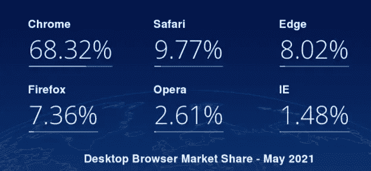**

****来源:**[**https://GS . statcounter . com/browser-market-share/desktop/world wide**](https://gs.statcounter.com/browser-market-share/desktop/worldwide)**

**WebdriverIO: 必须与 WDIO 一起运行以进行调试，并且由于它是基于 Selenium 的，Selenium 服务器必须独立启动。WebdriverIO 将 Puppeteer 作为第二个自动化驱动工具，允许其他自动化工具已经拥有的额外功能。**

**TestCafe:因为 test cafe 不控制浏览器，所以你实际上不能自动化所有用户的操作。例如，TestCafé无法在匿名模式下打开新标签或新的浏览器窗口。在第三方服务器或 iframes 内部运行测试也会有一些问题。调试可能的问题也很困难，因为您不知道实际上如何解析网页来注入自动化脚本。**

**剧作家:剧作家不支持传统的微软 Edge 或 IE11 ( [弃用通知](https://techcommunity.microsoft.com/t5/microsoft-365-blog/microsoft-365-apps-say-farewell-to-internet-explorer-11-and/ba-p/1591666))。支持新的微软 Edge(在 Chromium 上)。此外，剧作家只使用桌面浏览器来模拟移动设备。**

# **结论**

**答应用程序变得更加复杂，因为它们建立在子系统的层和整个网络上，包括 UI 和 API 层、外部数据库、网络，甚至第三方集成。因此，总是需要进行彻底的测试，以确保应用程序按预期工作。这包括从单元测试到应用程序的端到端测试。**

**正如我们所讨论的，没有每个人都使用的完美工具，而是有许多选项，其中我们必须基于许多因素进行选择，例如我们的需求、测试团队的知识和经验，以及产品/客户需求。因此，应首先确定需求，然后分析收益和成本评估，以做出最终决策。所有这些工具都有自己的优势和局限性，这意味着在它们之间进行选择是主观的，取决于它们将被用于的场景。多样性增加了竞争，这使得我们每天都能遇到质量更好的工具。😎**

**希望这篇文章能帮助你找到一个合适的工具，或者至少给你一个启示，它能满足你的所有需求。**

# **☕️快乐测试！☕️**

**你可以在 [Medium](https://ekremkurt1907.medium.com/followers) 上关注我更多文章，请在 [LinkedIn](https://www.linkedin.com/in/ekrem-k-3a094b19a/?locale=en_US) 上联系我**

# **来源:**

*   **[https://www.selenium.dev/documentation/en/webdriver/](https://www.selenium.dev/documentation/en/webdriver/)**
*   **[https://applitools.com/blog/new-features-selenium4/](https://applitools.com/blog/new-features-selenium4/)**
*   **[https://www.cypress.io/](https://www.cypress.io/)**
*   **[https://webdriver.io/](https://webdriver.io/)**
*   **[https://testcafe.io/](https://testcafe.io/)**
*   **[https://playwright.dev/](https://playwright.dev/)**
*   **[https://codecept.io/testcafe/#cons](https://codecept.io/testcafe/#cons)**
*   **[https://www . NPM trends . com/cypress-vs-writer-vs-test cafe-vs-web driver io-vs-selenium-web driver](https://www.npmtrends.com/cypress-vs-playwright-vs-testcafe-vs-webdriverio-vs-selenium-webdriver)**