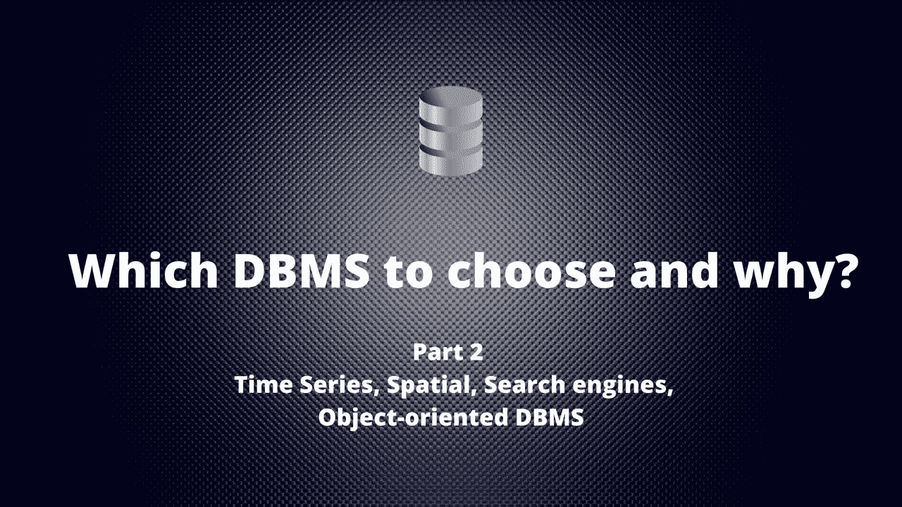

# 选择哪个 DBMS，为什么？(第二部分)

> 原文：<https://medium.com/codex/which-dbms-to-choose-and-why-part-2-1883795486b1?source=collection_archive---------5----------------------->

在发布了“[如何选择 DBMS 来解决您的任务(第一部分)](/@yevgeniy.sam/how-to-сhoose-a-dbms-to-solve-your-tasks-943039388756)之后，我收到了关于没有提及 DBMS 类型(如时间序列和空间)的公平评论。在本文中，我将简要描述它们，并添加另外两种类型——搜索引擎和面向对象。

## 让我提醒您，上一篇文章描述了:

*   有关系的
*   键值
*   文件
*   图表
*   面向列

## 这篇文章涉及到:

*   时间序列
*   空间的
*   搜索引擎
*   面向对象

就像上一篇文章一样，你可以在文末找到汇总表。该表包含了我们之前讨论过的所有类型的 DBMS，以及我们今天将要讨论的 DBMS。如果您只对紧凑的编译感兴趣(类型、何时选择、这种类型的流行 DBMS)，请滚动到文本的最末尾。

# 时序数据库管理系统

该 DBMS 针对存储时间戳或时间序列数据进行了优化。时间序列数据可以包含在一段时间内跟踪、收集或组合的测量值或事件。这可能是从运动跟踪传感器收集的数据、来自 Java 应用程序的 JVM 指标、市场交易数据、网络数据、API 响应、流程正常运行时间等。

数据与时间戳一起存储，这是一个关键特性。此外，数据被索引和写入，因此可以比在传统的关系数据库中更快地查询这种时间序列数据。

> **这种类型最知名的 DBMS 有:** [InfluxDB](https://www.influxdata.com/products/influxdb-overview/) ， [Kdb+](https://kx.com/) ， [Prometheus](https://prometheus.io/) ， [TimescaleDB](https://www.timescale.com/) ， [QuestDB](https://questdb.io/) ， [AWS Timestream](https://aws.amazon.com/timestream/) ， [OpenTSDB](http://opentsdb.net/) ， [GridDB](https://griddb.net/) 。

## 何时选择时间序列数据库管理系统

应用这种数据库管理系统的主要领域是监控、遥测处理和金融系统。

## 当你不应该选择时间序列数据库管理系统

对于不涉及时间序列和时间戳的任务，不要使用这样的 DBMS。

# 面向对象的数据库管理系统

顾名思义，这个 DBMS 是为存储和处理对象而优化的。与 OOP(面向对象编程)一样，这些对象在 DBMS 中有属性和方法。它们还实现了封装和多态。使用对象 DBMS 的主要目的是让使用对象编程模型的开发人员生活更轻松。开发人员不必将对象转换成表、行以及它们之间的关系。

> **这类 DBMS 的亮眼代表有:**[【MongoDB Realm】](https://www.mongodb.com/realm)[InterSystems caché](https://www.intersystems.com/)[ObjectStore](https://ignitetech.com/softwarelibrary/objectstore)[Actian NoSQL DB](https://www.actian.com/data-management/nosql-object-database/)[Objectivity/DB](https://objectivity.com/resources/objectivitydb-10-product-introduction-and-strengths/)。

## 何时选择对象数据库管理系统

老实说，我还没见过多少使用对象 DBMS 的成功实现。但是，对于具有复杂结构的高性能对象操作，通常推荐使用对象数据库。同时，开发涉及面向对象的编程语言。使用对象数据库的一些常见应用是实时系统、3D 建模的建筑和工程、电信、科学产品、分子科学和天文学。

## 当你不应该选择对象数据库管理系统

如果您计划使用经典的 SQL 语言，如果您不使用 OOP，或者如果有任何从这个数据库迁移到另一个数据库的计划，请不要选择对象 DBMS。如果你对 OOP 没有很深的理解，大多数情况下你应该选择面向文档的 DBMS。

# 搜索引擎 DBMS

这种类型的 DBMS 用于提供全文搜索。此外，可以对不同的数据进行搜索，例如来自其他数据库、电子邮件、RSS-feed、文本、JSON、XML、CSV 甚至 PDF 和 MS Office 文档的数据。搜索引擎 DBMS 有自己的优化方法来索引数据。这包括使用所谓的倒排和分面索引来提供接近实时的搜索。这种类型的不同 DBMS 可能使用不同的查询语言。

> **这种类型的知名 DBMS 有:** [Apache Solr](https://solr.apache.org/) ， [Elasticsearch](https://www.elastic.co/) ， [Splunk](https://www.splunk.com/) 。

## 何时选择搜索引擎数据库管理系统

适用于跨各种数据源的快速全文搜索，结构化、半结构化和非结构化数据日志收集和日志搜索系统就是很好的例子。

## 当你不应该选择搜索引擎数据库管理系统

如果您搜索有限数量的结构化数据字段。

# 空间数据库管理系统

这种类型的 DBMS 经过优化，可以处理几何空间中定义的对象。这些可以是简单对象(点、曲线、多边形)或复杂对象(3D 对象、拓扑覆盖、线性网络)。该 DBMS 具有一组特殊的函数来处理创建、转换、测量(距离、面积、体积)、计算(相交/接触)以及基于特定标准的选择。在这样的数据库管理系统中，有专门的索引来优化对象的处理，还有专门的标准化 SQL/MM 语言。

> **这类 DBMS 的著名代表:** [Oracle Spatial](https://www.oracle.com/ru/database/spatial/) 、**T5[Microsoft SQL](https://docs.microsoft.com/ru-ru/sql/relational-databases/spatial/spatial-data-sql-server?view=sql-server-ver15)、[PostGIS](https://postgis.net/) 、 [Spatiallite](https://www.gaia-gis.it/fossil/libspatialite/index) 。**

## 何时选择空间数据库管理系统

如果您正在构建 GIS 解决方案，那么您不仅要存储，还要在 DBMS 级别处理几何对象。

## 当你不应该选择空间数据库管理系统

如果您计划简单地将几何对象存储为坐标。

# 结论

我们的列表中又增加了四种 DBMS 类型:时间序列、面向对象、搜索引擎和空间。这仍然不是一个完整的列表，我们将在下一篇文章中继续努力。在以后的文章中，我们将考虑几家同时提供多种类型 DBMS 的大型供应商。

以下是之前帖子的链接:

 [## 如何选择一个数据库管理系统来解决你的任务

### 这是关于 DBMS 的系列文章中的第一篇，在这篇文章中，我将用简单的语言解释如何选择正确的 DBMS。

medium.com](/@yevgeniy.sam/how-to-сhoose-a-dbms-to-solve-your-tasks-943039388756) 

我喜欢帮助组织用数据来支持他们的业务，所以我很乐意在下面的评论中听到你对上述内容的想法，并随时通过 [LinkedIn](https://www.linkedin.com/in/yevgeniysamoilenko/) 与我联系。