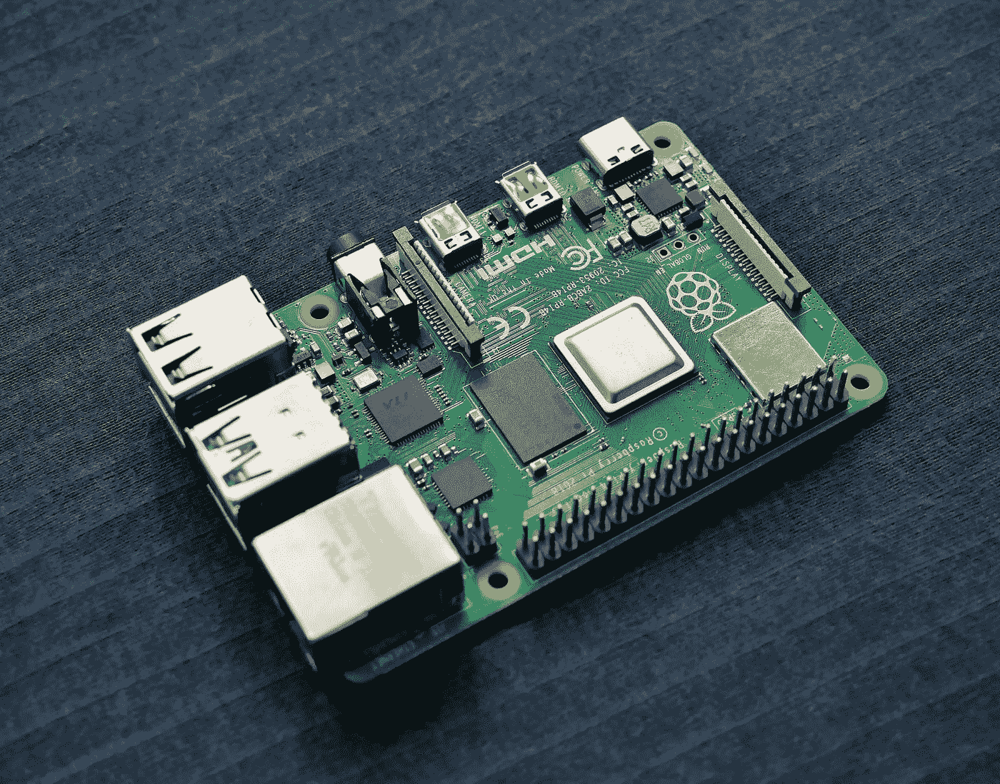

# 您应该在 Raspberry Pi 上安装哪个 Kubernetes 发行版

> 原文：<https://medium.com/codex/which-kubernetes-distribution-you-should-install-on-raspberry-pi-27fa9fe1e658?source=collection_archive---------2----------------------->



由[Vishnu Mohan](https://unsplash.com/@vishnumaiea?utm_source=medium&utm_medium=referral)在 [Unsplash](https://unsplash.com?utm_source=medium&utm_medium=referral) 上拍摄的照片

运行 Azure/AWS/GCP 管理的 k8s 集群可能会很昂贵，如果你只是为了开发/测试目的而使用它的话。但是，如果你碰巧有一个树莓 Pi，你可以在它上面运行一个 k8s 集群。

如果你在谷歌上搜索“在 raspberry pi 上运行 k8s”，有许多可用的 Kubernetes 发行版，在这篇文章中，我将简要地尝试一些流行的发行版，即 MicroK8s/k3s/kind/k3d/k0s，并提供我的两美分，哪一个最适合你的 Raspberry Pi。

在这篇文章中，我使用的是单个 Raspberry Pi 型号 4B 4G Ram 型号，带有 32GB 存储卡，运行 Raspberry Pi 操作系统，又名 Raspbian。让我们开始吧。

# TL；DR；

> 从易用性的角度来说，如果你更喜欢 docker 就挑 k3d，否则就用 k0s。

# MicroK8s

[MicroK8s](https://microk8s.io/) 是一款低运营成本、最小生产量的 Kubernetes，适用于开发人员、云、集群、工作站、Edge 和物联网。它只支持单个节点，但最近他们增加了集群。

安装 MicroK8s 很容易，只需`sudo snap install microk8s — classic`假设你已经安装了`snap`。

然而，在我的 Raspberry Pi 上，上面的命令给出了这个错误:

```
error: snap "microk8s" is not available on stable for this architecture (armhf) but exists on other architectures (amd64, arm64, ppc64el)
```

这表明 armhf(又名 arm32)架构不支持 MicroK8s。你也许可以把它安装在其他 64 位的操作系统上，但是这对我来说是一个很大的困难，所以我不再花太多时间在这上面了。

# k3s

[K3s](https://k3s.io/) 是经过认证的 Kubernetes 发行版，专为物联网&边缘计算而打造。它非常轻便，并针对 ARM 进行了优化，包括 arm64 和 armv7。

注意 k3s 取代了传统 K8s 集群使用的一些组件。特别是，`etcd`被替换为用于状态管理等的 sqlite3。不过这不会影响我们的日常使用。

安装 K3s 也相当容易，只是`curl -sfL https://get.k3s.io | sh -`甚至不需要`snap`。

然而也是第一次失败。

```
Job for k3s.service failed because the control process exited with error code.
See "systemctl status k3s.service" and "journalctl -xe" for details.$ journalctl -xemsg="failed to find memory cgroup, you may need to add \"cgroup_memory=1 cgroup_enable=memory\" to your linux cmdline (/boot/cmdline.txt on a Raspberry Pi)"
```

这看起来很难解决。在 cmdline.txt 的末尾加上`cgroup_memory=1 cgroup_enable=memory`即可，注意 cmdline.txt 只是一个单行的文件，不要另起一行追加这个值。重启后，安装成功。

在您可以执行任何 kubectl 命令之前，您必须给 Kubernetes 配置文件:`sudo chmod 644 /etc/rancher/k3s/k3s.yaml`权限，并享受您的集群！

```
pi@raspberrypi:~ $ kubectl get node
NAME          STATUS   ROLES                  AGE   VERSION
raspberrypi   Ready    control-plane,master   78m   v1.20.7+k3s1
```

安装后，它只是一个普通的集群，没有任何简单的入口，甚至没有仪表板，你需要自己定制它。

# 种类

[Kind](https://kind.sigs.k8s.io/) 是一个使用 Docker 容器“节点”运行本地 Kubernetes 集群的工具。Kind 主要是为测试 Kubernetes 本身而设计的，但也可以用于本地开发或 CI。

Kind 与 k3s 相比更加轻量级，因为它运行在一个容器中，这允许你在几分钟内创建一个集群并摧毁它，没有任何剩余。

然而，在检查了路线图和类似的已知问题后，它在我的 Raspberry Pi 设备上不能很好地工作，原因如下:

*   KIND 甚至还没有进入测试阶段，这意味着它还不稳定，还缺少一些关键功能。
*   KIND 目前不支持开箱即用的非 AMD64 架构，这是一个硬屏蔽。
*   与其他解决方案相比，KIND 安装对用户不太友好。

所以，告别的那种。

# k3d

k3d 是在 docker 中运行 [k3s](https://github.com/rancher/k3s) 的轻量级包装器。k3d 使得在 docker 中创建单节点和多节点的 k3s 集群变得非常容易，例如在 Kubernetes 上进行本地开发。

到目前为止，k3s 是唯一成功安装在 Raspberry Pi 上的 Kubernetes 发行版。所以，我们来试试 docker 版本的 k3s，k3d。

安装 k3d 需要。如果您没有 docker，请参见附录部分了解 docker 的安装。

```
# install the k3d CLI
curl -s https://raw.githubusercontent.com/rancher/k3d/main/install.sh | bash# create your cluster
k3d cluster create mycluster
```

安装出奇的容易和简单。注意不包括类似`kubectl`的 k8s 工具安装。要安装`kubectl`，请参见`kubectl`安装的附录部分。

```
kubectl get nodesNAME                     STATUS   ROLES                  AGE   
k3d-mycluster-server-0   Ready    control-plane,master   21m 
```

删除集群也很容易，只需使用`k3d cluster delete mycluster`。

# k0s

最后让我们试试 [k03](https://k0sproject.io/) 。这是一个包罗万象的 Kubernetes 发行版，预配置了所有必需的功能，只需将可执行文件复制到每台主机上并运行即可构建 Kubernetes 集群。

k0s 不需要在设备上安装 docker。相反，k0s 只是在`/usr/bin/k0s`中的一个可执行文件，它作为一个系统服务安装在本地主机上。

```
# download executable
curl -sSLf https://get.k0s.sh | sudo sh# install as system service
sudo k0s install controller --single# start the service
# this takes 1-2 minutes to make cluster ready
sudo systemctl start k0scontroller# enable the k0s service to be started always after the node restart, optional
sudo systemctl enable k0scontroller
```

注意 k0s 安装包括`kubectl`，但是你必须为所有命令加上`sudo k0s`前缀。不过这没什么大不了的，您可以使用 alias 来制作`kubectl=sudo k0s kubectl`。

```
sudo k0s kubectl get node
NAME          STATUS   ROLES    AGE     VERSION
raspberrypi   Ready    <none>   3m25s   v1.21.1-k0s1
```

另一个注意，k3d 的 API 服务似乎运行在端口 6443，而不是默认的 8080。

# 结论

这篇文章的目的是让你知道在众多 k8s 发行版中，哪些不能在你的 Raspberry Pi 设备上运行，哪些是最简单的本地 k8s 集群。这样一来，这个检讨就很浮出水面了。它不包括每个发行版提供的任何高级特性。

**我的外卖:MicroK8s/KIND 和你的树莓 Pi 不搭配我更喜欢 k3d ≥ k0s > k3s。**

# 附录

## 安装 Docker

```
# make sure you install the latest version
# this may take more than 10 minutes 
sudo apt-get update && sudo apt-get upgradecurl -fsSL https://get.docker.com -o get-docker.sh
sudo sh get-docker.sh
```

## 安装`kubectl`

```
# Note only arm version works, amd64/arm64 won't work.
curl -LO "[https://dl.k8s.io/release/$(curl](https://dl.k8s.io/release/$(curl) -L -s [https://dl.k8s.io/release/stable.txt)/bin/linux/arm/kubectl](https://dl.k8s.io/release/stable.txt)/bin/linux/arm/kubectl)"sudo install -o root -g root -m 0755 kubectl /usr/local/bin/kubectl# Verify installation
kubectl version --client
```