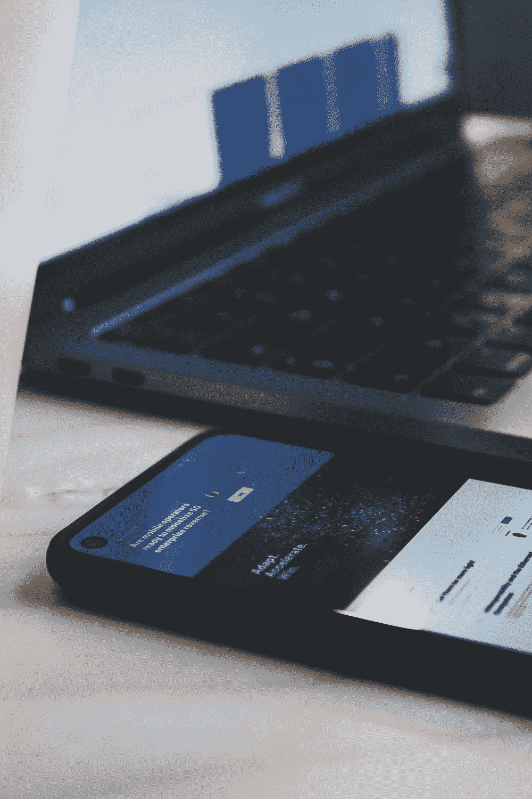
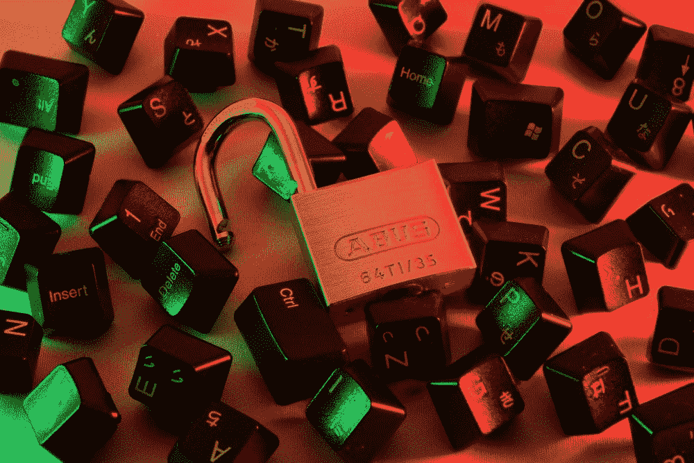
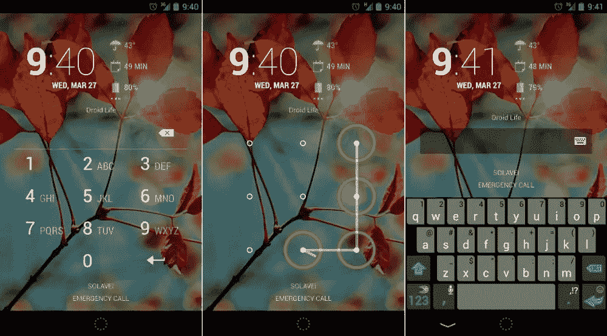
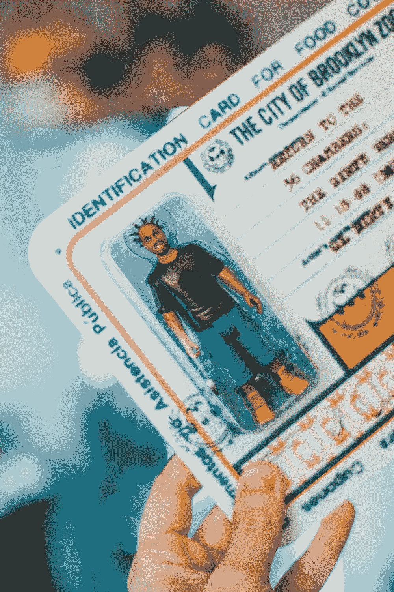
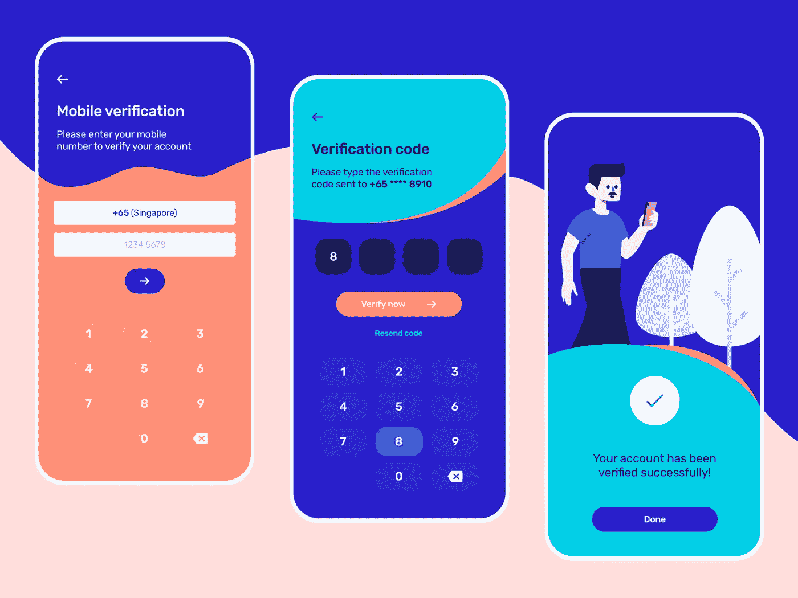
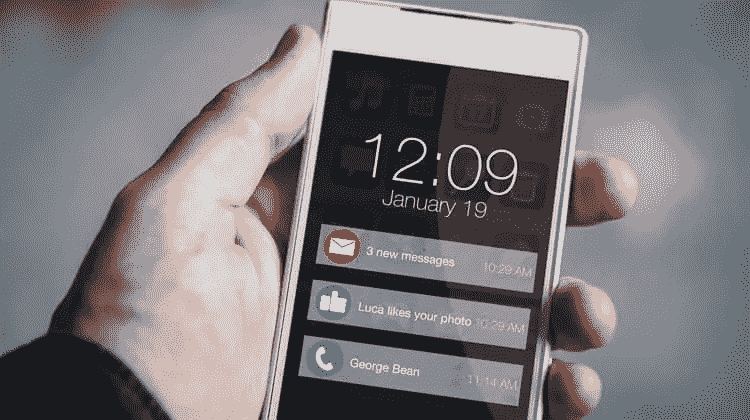
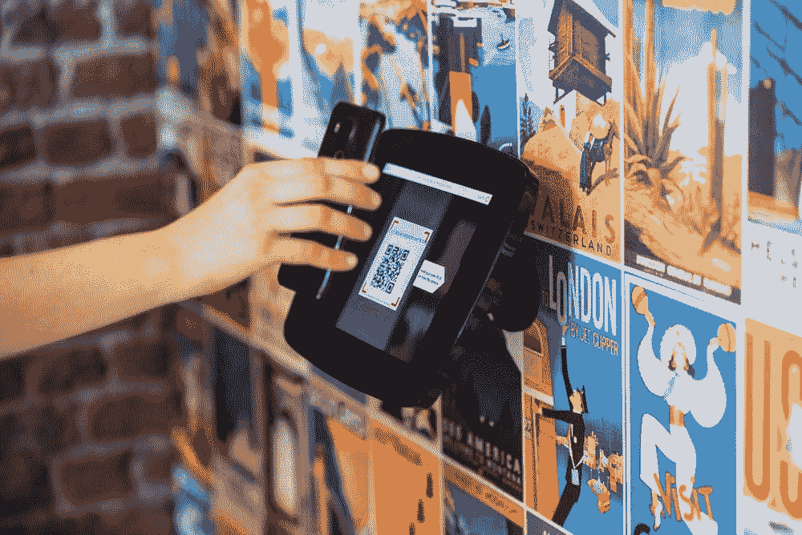
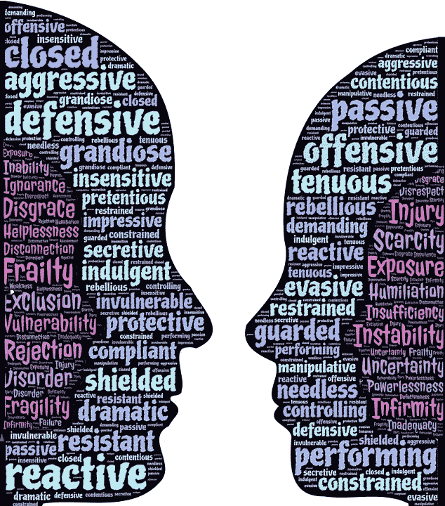
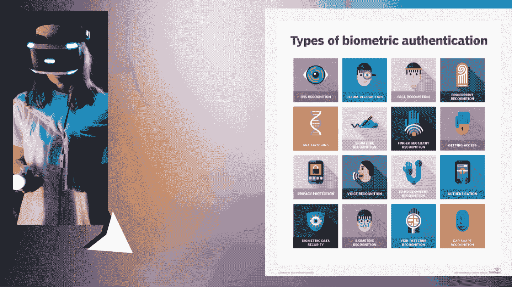

# 哪一种是最好的用户认证方法？

> 原文：<https://medium.com/codex/which-one-is-the-best-user-authentication-method-6b0ffbac8dd5?source=collection_archive---------0----------------------->

## 用户验证—用户最关心的安全问题。

来自 Unsplash 的 dogherine

安全一直是做决定时的一个主要方面，并且被认为是生活中要考虑的最重要的方面之一。如果我们打算买房子，选择房子的一个主要方面是房子所处的位置，希望那里的生活保障水平足够好。

类似地，当以数字方式执行许多任务时，安全性成为首要考虑的问题。银行、证券交易公司和企业投资了大量资金来使它们的安全系统高度安全和受到保护，以防止任何泄漏或故障。与其他安卓设备相比，人们在购买智能手机时更喜欢 iPhone，主要是出于安全考虑。随着对数据隐私和安全的需求越来越多，这就是**用户认证**发挥作用的地方。

在创建一个强大的安全系统时，**系统将如何分析和识别用户？**

为了解释这一点，让我们深入研究一下。

# **如何认证用户？**

[学分:来自 Unsplash 的 sigmund】](https://cdn-images-1.medium.com/max/800/0*0ZitewH_1jrjlGzl)

分析一个用户**或**你可能会说**识别那个事情的正确的人**是一个艰难的挑战。幸运的是，随着技术的进步，有许多方法可以分析和验证权利持有人，包括下面列出的一些方法:

*   密码/模式/个人识别码
*   生物识别:指纹/面部识别/声音
*   经核实的独特信息:CNIC/ NICOP/护照
*   OTP 代码
*   设备链接/推送通知
*   二维码
*   行为认证:(握持风格、打字风格、手势)
*   双因素认证

# 应该首选哪种方法？

[格伦·卡斯滕斯-彼得斯——昂斯普什](https://cdn-images-1.medium.com/max/800/0*ODIvlFSwYK28U-gv)

为了帮助用户做到这一点，答案很简单:*这取决于用户的&系统需求。答案可能不会令所有读者满意，但事实是，安全级别是根据使用条款来确定的。*想象一个人使用智能手机并解锁他的手机，他应用先进的加密方法解锁，或者一个百万富翁保持他的帐户 pin 1234。

因此，随着用户的需求，用户认证的方法被如此使用。

对于一个将小工具用于个人或基本用途的人来说，他/她可能会使用密码、pin、模式，现在甚至是指纹和面部识别，如果小工具能够这样做的话。

然而，对于注册或登录以执行操作时的账户验证，银行账户、网络系统和包括区块链(可用渠道:[Blockchain.com](https://medium.com/u/e4f5246afb5c?source=post_page-----6b0ffbac8dd5--------------------------------))的高级技术，验证用户的优选系统可能是 OTP SMS 代码以及通过双向认证甚至多因素认证方法进行检查的其他认证过程。

# 告诉我最合适的

[再接再厉——从:D 飞来的破浪](https://cdn-images-1.medium.com/max/800/0*b1GuminLF2G2FZmP)

嗯，选择可能看起来可行，但取决于每种方法的优缺点，这些可能会让你更密切地关注每个方面，并在选择时给你更多的便利。

为了寻找更深入的视角，让我们滚动一下您应该使用什么安全方法。

# 1) Pin /模式/密码

[密码、图案& Pin 锁——谷歌图片](https://cdn-images-1.medium.com/max/800/0*0O5eKCUU1dLESOZ9.jpg)

根据 [idrnd.ai](https://www.idrnd.ai/5-authentication-methods-that-can-prevent-the-next-breach/) 的说法，密码是最常用、最简单的身份验证方法。密码可以是一串字母、数字或特殊字符。为了保护您自己，您需要创建包含所有可能选项的强密码。

然而，密码容易受到网络钓鱼攻击和削弱有效性的不良卫生条件。一个普通人大约有 25 个不同的在线账户，但是只有 54%的用户使用不同的密码。

事实是有很多密码需要记住。因此，许多人选择方便而不是安全。大多数人使用简单的密码，而不是创建可靠的密码，因为它们更容易记住。

## 赞成的意见

1.  ***改善的用户体验:*** 取代密码认证立即消除了重复的可能性，并成倍地提高了您系统的安全性。
2.  ***减少管理开销:*** 忘记密码是一个主要的开销(也是烦恼！)联系您的帮助台。这样，一个密码允许您创建多个密码，并允许您在忘记密码时创建。
3.  ***改善用户体验:*** 识别用户，您可以使认证过程越容易，您的用户遇到的问题就越少——从而带来灵活和令人满意的体验。这对于面向客户的应用程序尤其重要。糟糕的登录体验会让用户望而却步，限制你的收入潜力。

## ***缺点***

1.  ***难以排除故障:*** 一个主要问题是重设密码，但这也相对简单。大多数情况下，用户在使用无密码身份验证时会遇到问题，不知道如何操作以及会发生什么。**如果用户丢失了硬件令牌，故障排除**会变得更加复杂(且成本高昂)。在向用户/客户提供替代品之前，您的支持团队将会提供一个解决方案。
2.  ***需要更高的安全性:*** 即使使用 pin、模式和密码创建长而复杂的密码，用户仍然需要有第二种方法，以防忘记或产品被盗。作为一个问题，安全问题和链接设备和其他方法被应用来提供多因素认证。

# 2) ***生物认证***

[图片来源:Unsplash](https://cdn-images-1.medium.com/max/800/0*J5JEnZxoXKYqBh13)

确认用户身份的另一种先进而有效的方法是通过他们的生物特征来识别他们。这些功能包括指纹扫描、面部识别和语音识别。与其他过程相比，这些提供了认证过程中的简易性的事实使其成为使用起来更优选和更安全的系统。

还不清楚？了解生物识别技术如何在身份和访问验证中发挥关键作用。

安全分析中的生物识别技术

虽然生物识别是一种现代化的趋势性用户身份认证方式，但它也有一定的局限性。

## 赞成的意见

1.  ***难以哄骗****——指纹、视网膜等生物识别特征，根据定义对每个个体都是独一无二的。这使得在有限的时间内识别每个个体特征变得独特而容易。*
2.  ****快速—*** 使用指纹和面部识别等生物特征的主要好处是可以在很短的时间内识别几个人。凭借其准确性和高效的机制，这使得认证和其他过程加载更快。*

4.  ******简单的*** —这个过程使用起来非常简单可行，不需要记忆密码和 pin 码，因为你可以随身携带这些功能。***

## ***骗局***

1.  *****隐私问题** —用户使用这种方法的主要问题之一是隐私问题。生物特征数据存储在可信环境中，经过加密，常规操作系统无法访问。***
2.  ****—事实上，应用视网膜、面部和指纹识别或现在的“语音识别”等机制非常昂贵，尤其是在大组织中应用时。****
3.  *******数据泄露*** —尽管我们已经使安全性更加有效和强大，但生物特征数据库很有可能遭到泄露和黑客攻击，从而使整个安全系统崩溃。****
4.  ******可能的错误** —错误包括认证尝试的错误接受和错误拒绝。****

# ****3)基于证书的认证****

****是的，我们通常随身携带的东西，由保存个人数据以确保安全的认证机构进行认证。该认证系统依赖于一种文档格式来显示用户的有效性，这些文档包括 CNIC、护照、Nicop 和驾照。****

********

****[埃里克·麦克林谈 Unsplash](https://cdn-images-1.medium.com/max/800/0*Wwj23Fw0B0xwn8bT)****

****证书包含用户的数字身份，包括公钥和证书颁发机构的数字签名。数字证书证明公钥的所有权，并且仅由证书颁发机构颁发。****

****用户在登录服务器时提供他们的数字证书。服务器验证数字签名和证书颁发机构的可信度。然后，服务器使用密码术来确认用户具有与证书相关联的正确私钥。****

## ****赞成的意见****

****基于证书的身份验证的最大优点是基于隐私。通过对您的通信(电子邮件、登录或网上银行交易)进行加密，数字证书可以保护您的私人数据，并防止信息被无意中看到。数字证书系统也是用户友好的，通常自动工作，需要发送者或接收者最少的行动或参与。****

****据微软称，证书服务器比其他用于加密的认证机构或系统更便宜，也更容易管理。****

## ****骗局****

****虽然数字证书的想法是阻止外人截取你的信息，但这个系统并不是绝对可靠的。由于证书颁发机构是负责颁发数字证书的机构(可以把它们想象成数字版的护照办公室)，黑客经常以这些机构为目标来操纵证书信息。因此，当证书颁发机构遭到破坏时，黑客可以创建看似真实的网站或发送看似通过认证测试 0 但实际上是欺诈性的电子邮件。****

****2013 年，[福布斯指出](http://www.forbes.com/sites/richardstiennon/2013/05/14/should-we-abandon-digital-certificates-or-learn-to-use-them-effectively/)电子证书已经成为黑客和其他网络罪犯的主要目标，因为它们保护的信息非常宝贵。该软件需要时刻保持警惕，以保护用户免受网络犯罪的侵害。****

# ****4) SMS - OTP 代码****

********

****短信认证参考:【https://bit.ly/3BpSsgI ****

****这是一种简单灵活的用户验证方法，同时向用户手机发送 SMS 代码，并包含用于未来在线支付的一次性密码。****

# ****赞成的意见****

1.  *******简单*** —非常简单，使用起来很方便灵活。****
2.  *******访问*** —在识别可疑活动的情况下，这些方法通过给出接收到的代码来确保交易有效性的验证。****
3.  *******适用*** —这是一个旧的和当时更新的认证系统，因为它用于双因素认证；与安全协议一起被用户接受。****

## ****骗局****

1.  *******网络要求*** —如果客户当时没有电话，则 OTP 可能无法被客户接收和使用。与此同时，SMS OTP 身份验证时间过程可能会用完。****
2.  ******合规** — SMS OTP 认证不完全符合 PSD2，例如，如果移动电话不在合法所有者手中，欺诈者可以在被盗设备上轻松接收 SMS OTP 并处理交易。****

# ****5)设备链接/推送通知****

****这个系统非常熟悉，当登录到谷歌或脸书账户时，系统抛出一些推送通知来处理来自其他来源的认证和登录。用户能够检查身份验证尝试的细节，并确认或拒绝请求验证。****

********

****[推送通知](https://usabilitygeek.com/wp-content/uploads/2018/04/push-notifications-nifty-nuisance-lead.jpg) —谷歌图片****

## ****赞成的意见****

1.  *******简单的*** —非常容易和友好地使用，通过您的多设备或通知进行简单的点击。****
2.  *******预算友好*** —这是一种削减成本的认证机制，具有最小化的维护工具&硬件成本。****
3.  *****—通过实施动态链接，这被证明可以有效防止网络钓鱼和 MITM(中间人)攻击。*****

## *****骗局*****

1.  *******数据访问** —通知通过数据网络发送，因此为了应用此方法，用户必须拥有数据访问权限。*****

*******2。安全问题** —风险因素是用户可能会意外批准欺诈性交易，因为我们自动批准接收通知的习惯会使整个保护系统易受黑客攻击。*****

*******3。依赖关系** —推送通知认证要求在用户设备上安装适当的 mToken 应用程序，并激活 mToken。*****

# *****6)二维码*****

**********

*****[Unsplash 上的 procyclick](https://images.unsplash.com/photo-1559131397-f94da358f7ca?ixid=MnwxMjA3fDB8MHxzZWFyY2h8Nnx8cXIlMjBjb2RlfGVufDB8fDB8fA%3D%3D&ixlib=rb-1.2.1&auto=format&fit=crop&w=500&q=60)*****

*****QR 码，也称为加密代码，是世界上最先进和最常用的方法之一。*****

## *****赞成的意见*****

1.  *******轻松创建:**二维码可以非常轻松地创建和生成。*****
2.  ********性价比高:*** 这是最便宜且预算友好的广告方式之一。二维码是一种简单的方法，可以引导受众了解更多关于产品、服务或促销的信息，同时确保您不会在不必要的细节上浪费宝贵的印刷空间。*****
3.  ******容易分析:**跟踪观众参与度的简单方法。您可以根据您的具体目标分配和跟踪任意数量的 QR 码。****
4.  *******集成:*** 二维码似乎更可取的事实是，它提供了与移动设备的无缝集成。通过使用移动设备拍摄二维码图像，消费者可以快速了解更多关于您的业务、产品或服务的信息，而无需付出额外的努力。****

## ****骗局****

*   ****可能会让一些客户感到困惑****
*   ****一些企业可能不需要增加登录页面****
*   ****其他交流方式可能更有益****

# ****7)行为认证****

****这对于许多人来说似乎是新的，但为了用简单的语言给出一个清晰的概念，根据[**【optimalidm.com】**](https://optimalidm.com/solutions/identity-access-management/behavioral-biometrics-authentication/)，行为生物认证基于一个人与平板电脑、智能手机或计算机(包括鼠标和键盘)等设备交互时所展示的**独特模式** 来识别一个人。…通过检查&从书写速度、与设备交互的认知方式和您的反应等方面分析这些模式，通过不同的选择实现真正的无摩擦认证，对用户来说是被动的，或侵入性较小。****

********

****[behvaeours](https://cdn-images-1.medium.com/max/800/0*PFUSnULDDJT793rp.jpg)****

## ******优点******

1.  ******高安全性和保证性—** 生物识别提供了“一个人拥有什么和现在是什么”的答案，并有助于验证身份****
2.  ******用户体验—** 方便快捷****
3.  ******不可转让—** 每个人都可以访问一组独特的生物特征****
4.  ******防欺骗—** 生物特征难以伪造或窃取****

## ****骗局****

1.  ******成本—** 安全生物识别技术需要大量投资****
2.  ******数据泄露—** 生物特征数据库仍可能遭到黑客攻击****
3.  ******跟踪和数据—** 面部识别系统等生物识别设备可能会限制用户的隐私****
4.  ******偏见—** 机器学习和算法必须非常先进，才能最大限度地减少生物统计学上的偏见****
5.  ******误报和错误—** 误拒绝和误接受仍然会发生，从而阻止特定用户访问系统****

****要查看更多信息，请查看文章末尾的链接。****

# ****8)多因素身份认证****

******多重身份验证**意味着使用两种或两种以上不同类型的授权方法来保护您的帐户。有一些方法可以增强安全性，这些方法可以分为:****

*   ******你知道的事情:**这包括一条信息，如密码或安全问题、模式或 pin。****
*   ****你拥有的东西:例如，护照、身份证、智能手机或其他物理设备。****
*   ****你是什么样的人:你身体独有的因素，如你的指纹或虹膜、声音等。****

****真正的双因素身份认证意味着您必须在登录前解锁来自不同因素的两张支票。如果你的账号被同因子的两把锁保护，这叫做**两步认证**。****

****例如，密码和安全问题都是已知的，这使得这种身份验证分为两步，而不是双因素。这仍然比单独使用密码提供更好的保护，但是适当的双因素身份验证更可取。****

********

## ****赞成的意见****

1.  ******它增加了第二层安全保护******

****推荐强密码已经有一段时间了，通常包括字母、数字和特殊字符的组合，但事实是它仍然只是一种保护形式。这样，添加了某些层来确保官方用户/所有者的真实性和使用验证。****

****2.**它增加了变异******

****安全级别的 100%提高仅适用于双因素身份认证，因为它通常结合了您使用的身份认证系统，因此在更大程度上提高了安全级别。这可能是指纹技术，视网膜扫描或声控系统。****

****3.**可以划算******

****通常，双因素身份认证系统并不昂贵。如果您决定引入二维码/短信/推送通知作为第二种方法，那么整体预算可能会更具成本效益。****

## ****骗局****

1.  ******时间:**两步式的流程在第二步会花费更多的时间，所以对于不重要的数据或账户，两步式认证系统是不必要的。—检验两个系统是否正确地对用户进行身份验证。****
2.  ******并非万无一失:**真实事实 **—** 不存在完全万无一失的安全系统——双因素身份认证流程肯定比单因素系统更有效，但坚定的黑客仍然可以实施任何数量的迂回方案和恶意软件威胁来访问您的敏感数据并在您的设备中传播病毒。****
3.  ******成本:**在考虑视网膜识别等认证系统时，行为或语音可能会导致较高的安全成本。此外，丢失关键个人数据和用户帐户的成本通常远远高于多因素身份认证的成本。****
4.  ******故障风险:**双因素认证系统越复杂，发生故障的可能性就越大。不太可能，但有可能，任何情况都会影响生产力。****

# ****你的问题的解决方案****

********

****[从**像素**到**像素**](https://images.pexels.com/photos/262488/pexels-photo-262488.jpeg?auto=compress&cs=tinysrgb&dpr=2&h=650&w=940)****

****所以，为了总结你在博客中实际寻找的东西，多因素已经为你涵盖了一切。****

****根据 MUO([Makeuseof.com](https://www.makeuseof.com/))的说法，他们解释了最佳身份认证系统的方案以及优先级，如下所示:****

****既然我们已经了解了双因素身份认证方法的优缺点，那么哪种方法是最好的呢？看你最看重什么了。****

******推荐:******

*   ******主要建议** — *使用认证器 app 的基于时间的一次性密码*最好。然而，应该保留备份代码，以防您丢失或损坏您的设备。使用 **Authy** (app) 并在多个设备上登录可以对此有所帮助。****
*   ****为了最大限度的安全和隐私， **U2F 钥匙**是最好的，因为它们不会被跟踪，也不需要任何信息。尽管 U2F 键可行，但它需要花钱，而且通常不方便。****
*   ****为了方便起见，**短信**竖起大拇指。它们有可能被截获，当你的接收效果不好时，它们就不起作用了。然而，它们快速、简单，并且比单步认证更好。****
*   ******推送通知**是另一个值得尝试的选项。所有你需要的是一个适当的稳定的互联网连接与你的提示进行检查。****

****如果你有选择的话，永远不要把安全问题作为双因素方法。当一个网站需要它们时，把它们当作第二个密码，并把你的答案存储在密码管理器中。不过，安全问题方法是最不可取的。****

****如前所述，安全方法取决于您的安全需求。希望这个博客能让你的黄金时光值得一读。现在，您肯定会应用最佳的安全方法来确保您的业务更加繁荣，并且没有任何风险。****