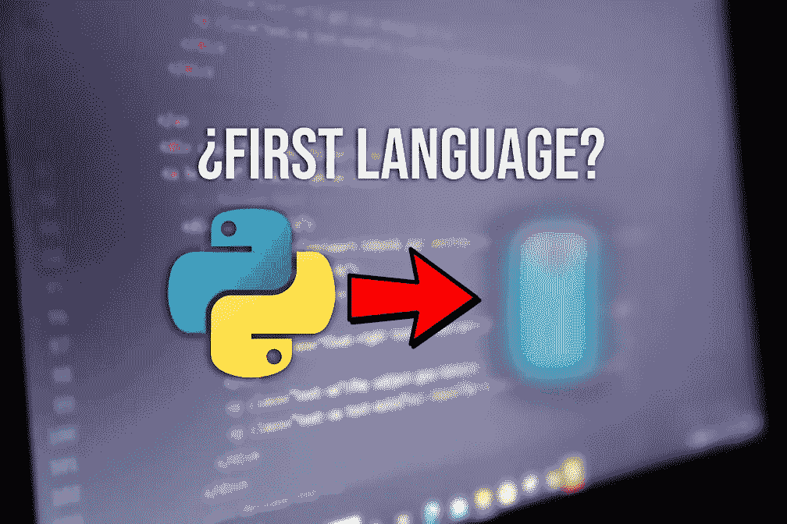

# 如果可以重来，我会先学哪种编程语言？

> 原文：<https://medium.com/codex/which-programming-language-would-i-learn-first-if-i-could-go-back-c0d314a5a8d8?source=collection_archive---------2----------------------->

## 你是编码领域的新手吗？我将发现一个简单的 3 步计划来学习如何选择正确的语言编码📋。

今天要学习的最重要的技能之一是**编码**。编程和开发的发展速度比以往任何时候都快，而且**有很多** …